# Log Analysis with SIEM

Learn how SIEM solutions can be used to detect and analyse malicious behaviour.


## Learning Objectives

Discover various data sources that are ingested into a .
Understand the importance of data correlation.
Learn the value of Windows, , Web, and Network logs during an investigation.
Practice analysing malicious behaviour.


## Benefits of SIEM for Analysis

### Centralization

Gather all information from all sources into a single location  
no switching among systems during an investitgation  

### Correlation

linking of separate events based on logs from different sources to increase the context of the overall event  

### Historical Events

Spote patterns or threats that may have started much earlier but weren't noticed at the time..  


### Benefits Questions

#### What is the process of linking data from multiple sources to identify relationships between individual events called?

#### What is the process of collecting and storing log data from multiple systems and sources into a single, unified location for easier analysis called?

## Log Sources

Logs from all or a few potential soruces create correlation  

### Host-Babsed Log Sources

Individual devices within the organiation  

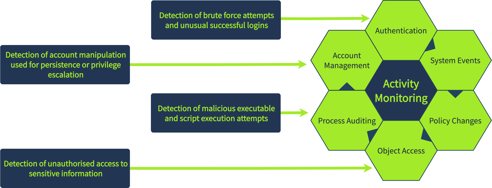  

### Network-Based Log Sources  

sources are network attached devices: firewalls, routers, IDS, IPS, et all.  
monitoring of traffic and connections  across the network  

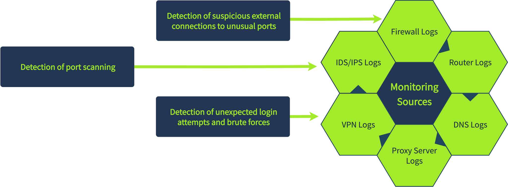  

### Web-Based Log Sources

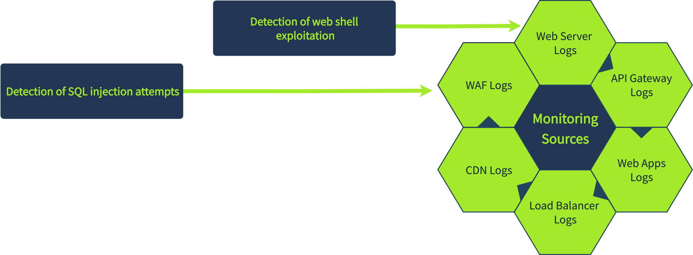  

#### Time Pitfalls

Logs arrive from systems in different time zones or with different regional settings. 
significantly impacts context of an event.  

#### Log Normalization

different logs arrive in various formats (JSON, XML, plaintext).  

normalization converts different formats into a single, consistent structure. 

### Log Source Questions

#### What is the process of converting logs from different formats into a single format for easier analysis in a SIEM?

Normalization 

#### Which log source type can be used to detect the execution of a malicious script?

web-based? or host-based? or web-server?

## Windows Logs

### Sysmon

logs a wide range of activity types  
high level of visibulity during analysis  
helps identify malicious process execution, network connectiosn, process injection, registry changes, file creation, et all.  

#### Malicous Process Execution

investigating a suspicious encoded PowerShell command  
splunk can detect a launched process (EventCode=1)

    ```splunk
    index=winenv EventCode=1 *powershell* AND *EncodedCommand*| table _time ComputerName ParentUser ParentImage ParentCommandLine Image CommandLine
    ```

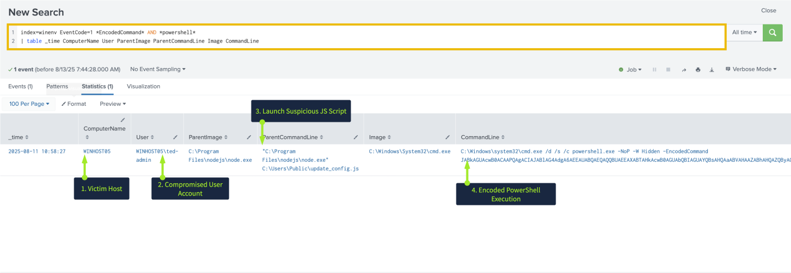  

Detects: WINHOST05
File: update_config.js
executed from: `C:\Users\Public`  

#### Suspicious Netowrk Connection

Investigate suspicious network connection on the same host  
EventCode=3  
log source will be syslog  

    ```splunk
    index=winenv EventCode=3 ComputerName=WINHOST05 | table _time ComputerName Image SourceIp SourcePort DestinationIp DestinationPort Protocol   
    ```

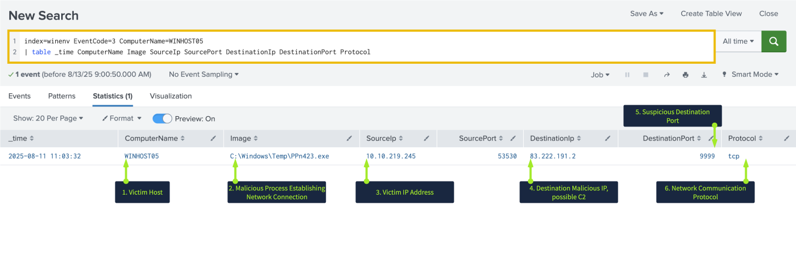  

Suspicious process: `PPn423.exe`  
execution location: `Temp` directory  
unusual port: `9999`  
Destination IP: `83.222.191.2  

### WinEventLogs

#### Windows Security Logs

The most commonly referenced logs  
contains user authentication, account creation / modification / deletion, access to files and reigstyry keys, process execution, system restarts, log clearing, and chagnes to audit or security policies  

investigating suspicious activity on a host  

    ```splunk
    index=winenv EventCode=4720 OR EventCode=4722
    | table _time EventCode ComputerName Subject_Account_Name Target_Account_Name New_Account_Account_Name Keywords
    ```

This is the creation of a persistence mechanism by creating backup user account.  
the account is enabled by `ted-admin` on `WINHOST05`  

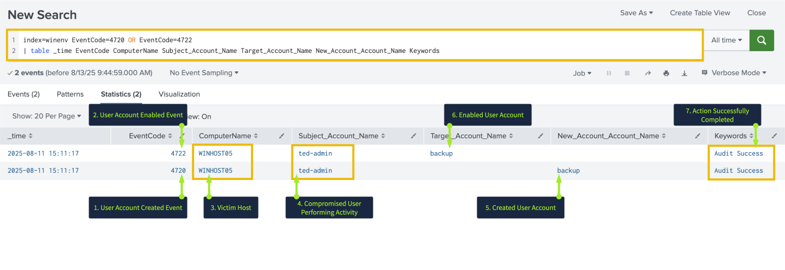  

#### Windows System Logs

records event generated by the opearing system and core services  
source of information about persistence or privilege escalation attemps using services.  

EventID codes 7045 and 7036 indicate service creation and service start/stop events  

    ```splunk
    index=winenv EventCode=7045 OR EventCode=7036 ComputerName=WINHOST05
    |  table _time EventCode ComputerName Service_Name Service_Account Service_File_Name Message
    ```

Victim host: `WINHOST05`  
Suspicious Service:  `User Updates`  
Executed process: `RNSfnsjdf.exe`  
Source directory: `Temp`  
Account used: `System`  

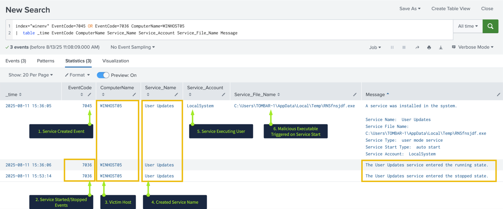  

### Windows Logs Questions 

#### Which IP address was the connection established with?

The malicious images was quick to find because it was in the temp file.
```splunk
index=* index=task4 EventCode=3 Image="C:\\Windows\\Temp\\SharePoInt.exe"
```

#### Which process initiated this suspicious connection?

Same as previous question

#### What is the MD5 hash of the malicious process from the previous question?

Identify only the image and then look on the left  

Easier to capture if you view the `raw` entry.

```splunk
index=task4 Image="C:\\Windows\\Temp\\SharePoInt.exe"
```

#### What is the name of the scheduled task that was created on the system?  

`index=task4 "schtasks"`

## Linux Logs

### Authentication Logs

How users interact with the system, particularly login attempts and privilege usage  

#### Unusual login activities

    ```splunk
    index=linux source="auth.log" *ubunut* process=sshd | search "Accepted password" OR "Failed password"  
    ```

97 events  
last events indicate successful login attempts  
likely a successful brute-force attack  

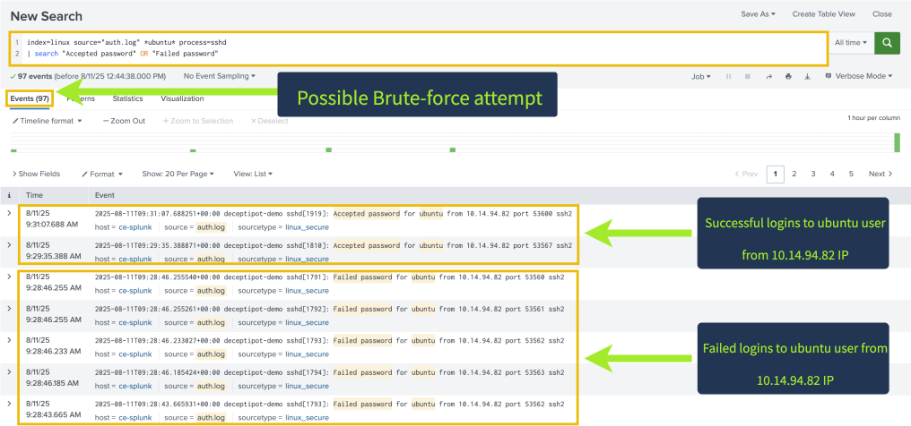  

#### Privilege Escalation behaviors

Root access typically required to access useful data, functions, and services  

    ```splunk
    index=linux source="auth.log" *su* | sort + _time
    ```

privilege escalation is shown, but the method is not available in authentication logs.  

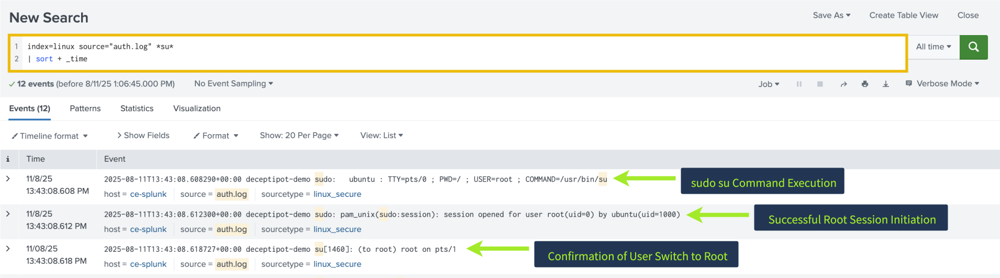  

### System Logs

system logs caputre events related to service activity, system restarts, and cronjobs.  
useful to identify unusual system behavior linked to persistence or privilege escalation  

#### Persistence Mechanisms

investigating persistence through cronjobs or services  

    ```splunk
    index=linux sourcetype=syslog ("CRON" OR "cron") 
    |  search ("python" OR "perl" OR "ruby" OR ".sh" OR "bash" OR "nc")
    ```

three interesting events  
suspicious execution: `pnr5433sw.sh`  
execution location: `/tmp`  
frequency: every 5 minutes  
process: perl reverse shell  
destination IP: 10.10.101.12  
suspicous port: 9999  


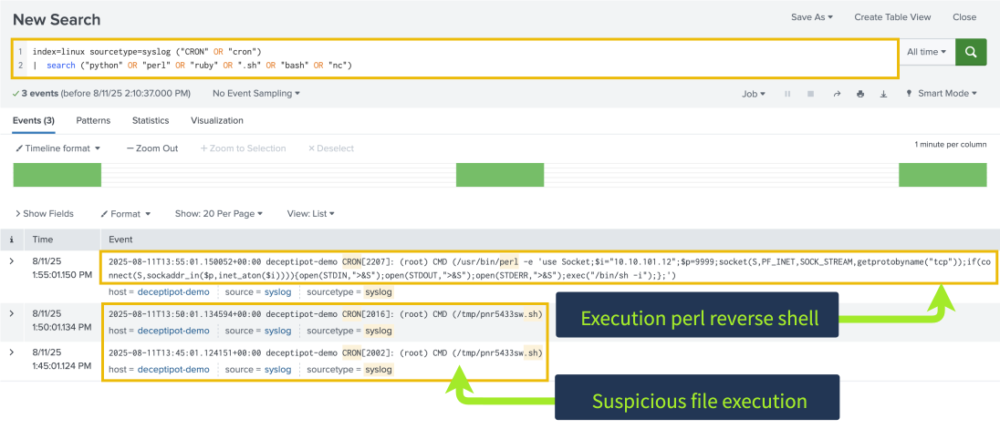  

### Linux Logs Scenario

 SOC Level 1 analyst receives and alert indicating possible persistence through creation of a new remote-ssh user on an ubuntu server.  

#### What was the timestamp of the remote-ssh account creation?
Answer Format Example: 2025-01-15 12:30:45  

`index=task5 useradd OR adduser`

#### Which user successfully escalated their privileges to root prior to the action from the first question?

`index=task5 *su* eventtype=su_root_session`

#### From which IP address did the user from the previous question successfully log in to the system?

`index=task5 "jack-brown" action=success`

#### How many failed login attempts occurred prior to this successful login? 

`index=task5 "jack-brown" action=failure`

Not all failed attempts count.

#### Which port is the persistence mechanism configured to connect to?  

`index=task5 source=syslog process=crontab OR process=cron`

## Web Application Logs

access logs detect requests to website resources  
often contain signs of malicious activity: scanning, DDoS attempts, ewb-based attacks, and web shells  
can provide insights to failures or other issues  

### Brute Force Activity

investigating potential brute force attempt targeting a WordPress login page.  
- start by investigating the login page: `/wp-login.php`  
- filter for `POST` requests
- identify a specific number of repeated attempts (25) within a specific time period (5 minutes)  
- Group results by `clientip` to pinpoint source of the activity.  

    ```splunk
    index=* method=POST uri_path="/wp-login.php"
    | bin _time span=5m
    | stats values(referer_domain) as referer_domain values(status) as status values(useragent) as UserAgent values(uri_path) as uri_path count by clientip _time
    | where count > 25
    | table referer_domain clientip UserAgent uri_path count status
    ```

source ip: `167.172.41.141`  
up to 160 requests to the login page  
user-agent: Hydra  

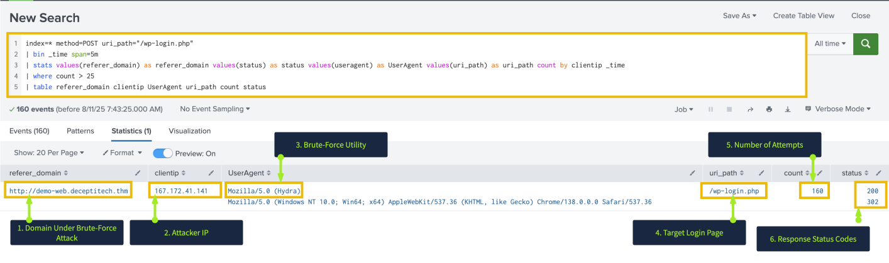  

### Possible Web Shell

invevstign potential web shell  
identify requests for script or an executable file type (.php, .asp. jsp, etc..)  
combine with POST and GET methods and status=200 resposnes.  
Web shell generate mutipe suspiis requests in a shrot time frame; use a threshold of >2  
Group the results by domain to dientify patterns and review fields in a table.  


    ```splunk
    index=* | search status=200 AND uri_path IN(*.php, *.phtm, *.asp, *.aspx, *.jsp, *.exe) AND (method=POST AND method=GET) | stats values(status) as status values(useragent) as UserAgent values(method) as Method | where count > 2 | table referer_domain count method status clientip UserAgent uri  
    ```

The query identifes multipl URIs  
505.php could be a webshell.  
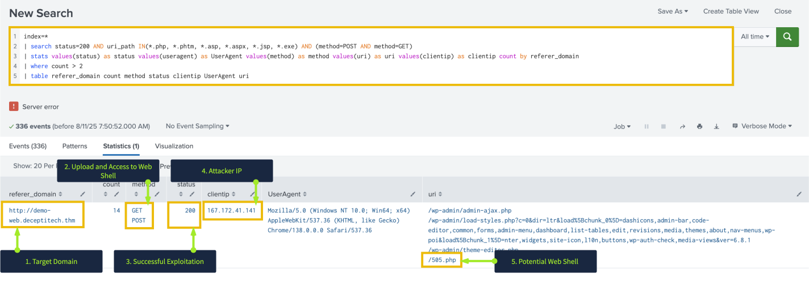  

### DDoS Activity  

Looking for status code 503 could mean a server is overloaded.  
Review for huge request counts in short period of tiem.  
review targeted domain, user-agent, and URI to identify pattenrs and fingerprints.

    ```splunk
    index=* status=503 
    | bin _time span=10m 
    | stats values(referer_domain) as referer_domain values(status) as status values(sueragent) as UserAgent values(uri_path) as uri_path count by clientip _time
    | where count >100000
    | table _time referer_domain clientip UserAgent uri_path count status
    ```

a targeted resource was unavailable for the last t10 minutes and recieved more than 1.5 million requests...  

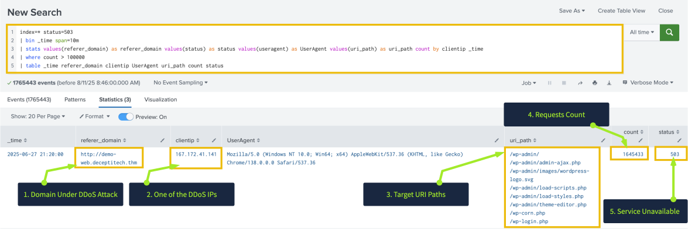  

### Web Log Practice Scenario  

an alert indicating a spike in activity on the organisation's web server.
Your task is to dive into the logs and determine exactly what happened.  

#### Which URI path had the highest number of requests?

`index=task6 |  stats count by uri_path`

#### Which IP address was the source of the activity?

`index=task6 uri_path="/wp-login.php" |  stats count by clientip`

#### How can this activity be classified?

#### Which tool did the threat actor use?