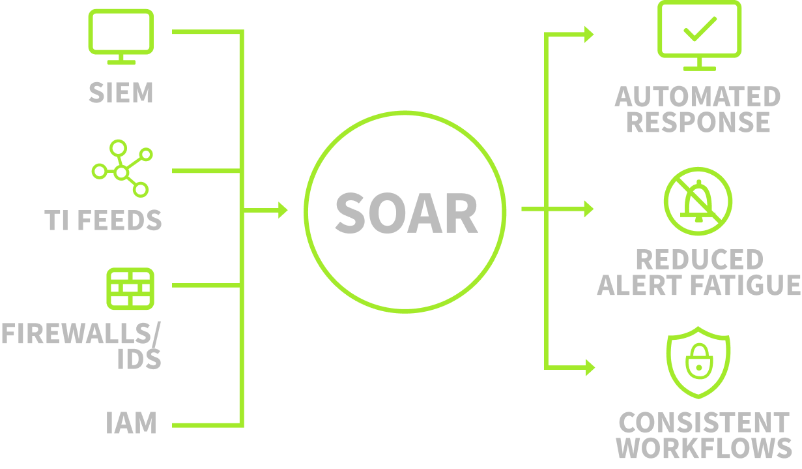
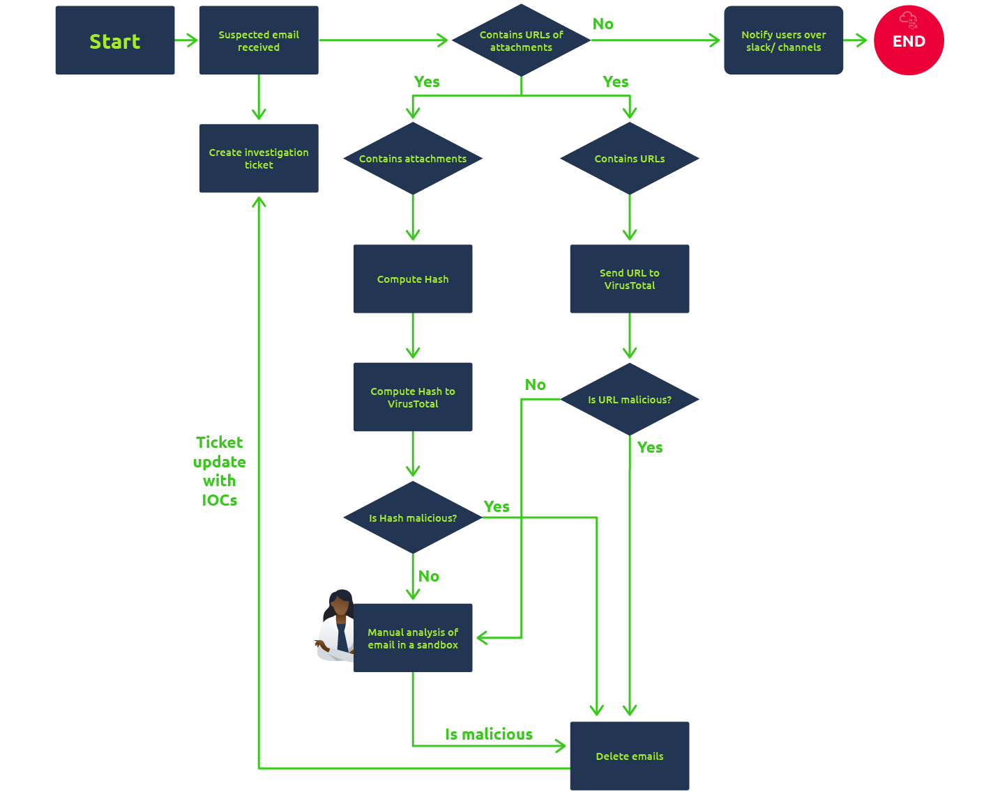
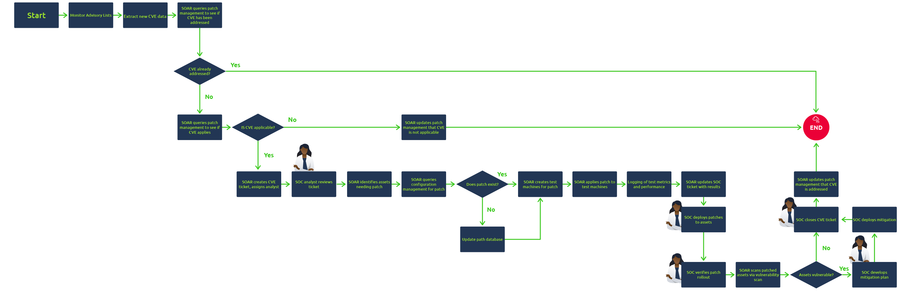

# Introduction to SOAR

## Traditional SOC and Challenges

### Overview

* Traditional Security Operations Centers (SOC) are centralized functions for monitoring and protecting digital assets.
* SOCs have evolved over time, with each generation adding new technology.
* Primary purpose of a SOC:

  * Improve security incident handling
  * Provide continuous monitoring and analysis
  * Align people, processes, and technology to business and security goals

### Core Capabilities

#### Monitoring and Detection

* Continuously scans for suspicious activity in the network environment
* Supports early awareness of emerging threats
* Helps prevent threats in early stages
* Monitoring is mainly performed through the SIEM
* Examples:

  * Numerous failed login attempts on a critical workstation
  * Login from an unknown location

#### Recovery and Remediation

* The SOC serves as a hub for recovery and remediation during incidents
* SOCmteams act as first responders to cyber threats
* Common actions:

  * Isolating infected endpoints
  * Shutting down infected endpoints
  * Removing malware
  * Stopping malicious processes
* Often uses supporting security tools such as:

  * EDR
  * Firewalls
  * IAM
* Examples:

  * Isolating an endpoint through EDR
  * Blocking an IP on the firewalls
  * Disabling a user on the IAM

#### Threat Intelligence

* Requires a constant flow of threat intelligence
* Provides teams with current threat data
* Typical data includes:

  * IP addresses
  * Hashes
  * Domains
  * Other indicators
* Example:

  * Blocking a malicious domain identified through threat intelligence feeds

#### Communication

* SOC teams coordinate with IT teams and management
* Communication supports effective incident handling
* Example:

  * Generating a ticket for IT to verify a recently deployed patch

### Operational Reality

* A SOC depends on multiple tools
* A SOC also depends on coordination across multiple teams
* These processes improve organizational protection but introduce operational challenges

## Challenges Faced by SOCs

### Alert Fatigue

* Numerous security tools generate large volumes of alerts in a SOC
* Many alerts are:

  * False positives
  * Inadequate for investigation
* Effect:

  * Analysts become overwhelmed
  * Serious events may be missed or delayed

### Too Many Disconnected Tools

* Security tools are often deployed without integration
* Teams must navigate separate logs and rules across tools
* Endpoint security and other logs are handled independently
* Effect:

  * Tool overload
  * Reduced efficiency

### Manual Processes

* Investigation procedures are often undocumented
* Threat handling frequently depends on tribal knowledge from experienced analysts
* Effect:

  * Slower investigations
  * Increased response times

### Talent Shortage

* SOC teams struggle to recruit and expand staff
* Security landscape and threats continue to grow in complexity
* Combined with alert overload, analysts become increasingly overwhelmed
* Effect:

  * Less efficient work
  * Longer incident response times
  * Greater opportunity for adversaries to cause harm

## Overcoming SOC Challenges with SOAR

### Definition

* Security Orchestration, Automation, and Response `<SOAR>`:

  * Unifies security tools used in a `<SOC>`
  * Reduces switching between tools during investigations
  * Provides:

    * Single interface
    * Ticketing
    * Case management
    * Structured incident tracking and resolution
  
    

### Primary Capabilities

#### 1. Orchestration

* Coordinates multiple security tools inside the `<SOAR>` platform
* Replaces manual switching between tools during investigations
* Uses predefined workflows called Playbooks
* Playbooks define how the `<SOAR>` should investigate specific alerts

##### Example: Brute Force Investigation

* Typical tools involved:

  * `<SIEM>` to check whether the user normally uses the source IP
  * Threat Intelligence platforms to verify IP reputation
  * `<Active Directory>` tool to disable the user if a login succeeds
  * Ticketing system to track the incident

##### Example Playbook Flow

* Receive alert from `<SIEM>`
* Query `<SIEM>` for normal user-IP behavior
* Check threat intelligence platforms for IP reputation
* Query `<Active Directory>` for successful logins
* Escalate to containment actions

##### Playbook Characteristics

* Predefined for specific alert types
* Dynamic
* Can branch based on results
* May stop early if risk is low

#### 2. Automation

* Automates playbook execution
* Removes manual analyst clicks for repetitive tasks
* `<SOAR>` executes investigation steps automatically

##### Example Automated Flow

* `<SOAR>` receives alert from `<SIEM>`
* Automatically queries `<SIEM>` for historical logins
* Automatically checks threat intelligence platforms
* If IP is malicious, automatically disables the user in `<Active Directory>`
* Automatically opens a ticket with investigation details

##### Effect

* Saves analyst time
* Improves scale
* Reduces burnout
* Enables handling of large alert volumes

#### 3. Response

* Enables action from one unified interface
* Supports automated containment and response actions

##### Example Response Actions

* Block IP on the `<firewall>`
* Disable user in `<Active Directory>`
* Open a ticket with incident details

### Claimed Benefits

* Addresses major SOC challenges by:

  * Connecting disconnected tools
  * Automating repetitive processes
  * Reducing alert fatigue

## Role of Analysts

### Analysts Still Required

* `<SOAR>` does not replace analysts
* Complex investigations still require human judgment
* Analysts provide:

  * Critical decision-making
  * Business-context understanding of threats
  * Playbook design and maintenance

### Conclusion

* `<SOAR>` reduces burden on `<SOC analysts>`
* `<SOAR>` automates repetitive work and organizes investigations
* Human analysts remain necessary for complex and context-dependent work

## Building SOAR Playbooks

## Playbooks for Recurring Alerts

### Overview

* Playbooks are predefined workflows that tell the tool what actions to take during specific investigations.
* `<SOC>` analysts create playbooks for recurring alert categories.
* Two examples:

  * `<Phishing>` playbook
  * Patching playbook

## `<Phishing>` Playbook

  

### Context

* `<Phishing>` attacks are a common breach vector.
* Email investigations are time-consuming.
* Manual tasks often include:

  * Analyzing attachments
  * Analyzing URLs
  * Verifying indicators with threat intelligence platforms
* `<SOAR>` solutions can execute many of these tasks through playbooks.
* Remediation can begin when a malicious email is confirmed.

### Example Investigation Logic

* Start with alert: `"Suspicious email received"`
* Initial actions:

  * Create a ticket
  * Check whether the email contains:

    * A URL
    * An attachment
* Decision points:

  * If neither is present:

    * Notify users
  * If a URL or attachment is present:

    * Follow additional investigation steps based on content type
* Structure:

  * Conditional workflow
  * "If this, then that" decision logic

### Purpose

* Standardizes phishing investigations
* Reduces manual work
* Guides junior analysts
* Supports automated response steps

## Patching Playbook

  

### Context

* A `<CVE>` is a publicly disclosed vulnerability assigned an identifier.
* As part of vulnerability management, the team must:

  * Track newly released CVEs
  * Verify whether they affect the environment
  * Patch affected systems
* Monitoring and remediating CVEs can be resource-intensive.
* Frequent CVE releases can create:

  * Backlogs
  * Delayed patching
  * Increased exposure

### Playbook Functions

* Analyze `<CVE>` details
* Assess risk threshold
* Create a patching ticket
* Test the patch
* Push the patch to production after validation

### Purpose

* Streamlines vulnerability handling
* Reduces workload
* Improves patch management speed and consistency

## Analyst Role

### Human Involvement Remains Necessary

* Most steps in both playbooks can be automated.
* `<SOC>` analysts still appear at key decision points.
* Analysts remain essential for:

  * Critical decisions
  * Verification steps
  * Oversight of automated processes

## Key Point

* `<SOAR>` reduces repetitive manual effort.
* It does not eliminate the need for analysts.

