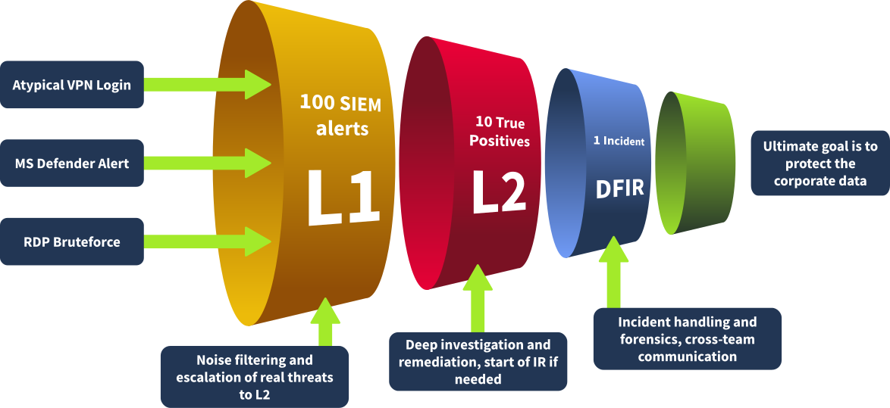
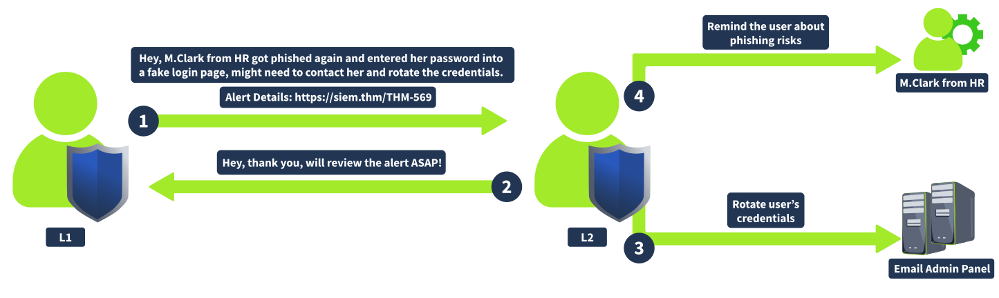
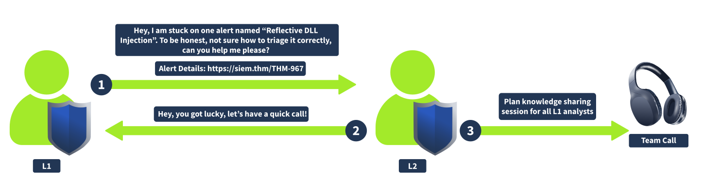
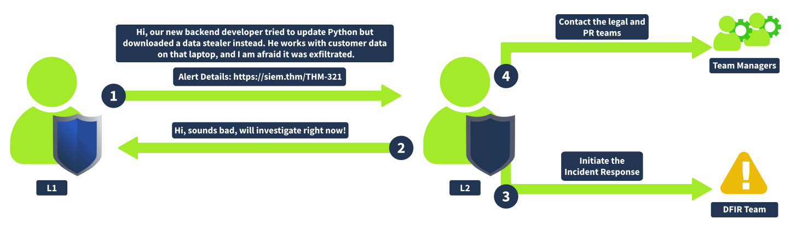

# SOC L1 Alert Reporting

## Alert Funnel

  

### Alert Reporting

- Reporting an alert before passing alert to L2  
- document invesgitagion in detaile to include relevant evidence  

### Alert Escalation

- The report from L1 provides context to the L2  

### Communication

- Communicating relevant information among other offices  
- HR might provide inforation on users  
- IT provides information on authroizations  

## Reporting Guide

| Alert Report Purpose           | Explanation                                                                                     |
|--------------------------------|-------------------------------------------------------------------------------------------------|
| Provide Context for Escalation | A well-written report saves time for L2 analysts and helps them quickly understand the incident |
| Preserve Findings for Records  | Raw logs are typically retained for 3–12 months, while alerts are stored long-term, so important context should be documented within the alert |
| Improve Investigation Skills   | Writing clear reports reinforces understanding; if something cannot be explained simply, it is not well understood |  

### Report Format

The Five W's  

    - Who: Which user logs in, runs the command, or downloads the file
    - What: What exact action or event sequence was performed
    - When: When exactly did the suspicious activity start and ended
    - Where: Which device, IP, or website was involved in the alert
    - Why: The most important W, the reasoning for your final verdict

## Escalation Guide

- The alert is an indicator of a major cyberattack requiring deeper investigation or
- Remediation actions like malware removal, host isolation, or password reset are required
- Communication with customers, partners, management, or law enforcement agencies is required
- You just do not fully understand the alert and need some help from more senior analysts  

### Escalation Steps

  

### Requesting L2 Support

  

### SOC Dashboard Escalation

1. Move the alert to "In Progress" status and perform analysis.
2. Write an alert report and set the verdict, such as true positive
3. If escalation is requird, assign th alert to your L2 on shift
4. L2 recevies a notification and starts from the L1 alert report

## SOC Communication

### Communication Cases

**Escalate and urgent, critical alert, but l2 unavailable and does not respond for 30 minutes**  
Ensure emergency contacts are known, including L2 > L3 > SOC manager  

**The alert about Slack/Teams account compomise requires you to validate the login with the affected user.**  
Do not cntact the user through the breached chat. Use out-of-band communciation  

**You receive an overwhelming number of alerts during a short period of time, some are critical**  
Prioritize alerts acccrding to workflow, but inform L2 on shift about situation

**After a few days, you relize you miscalssified the alert and likely missed a malicious action**  
Immeidately reach out to L2 and explain the concerns. Threat actors can remain silent for weeks before impact

**You cannot complete the laert triage since the SIEM los are not parsed correctly or are not searchable.**  
Do not skip the alert - investigate what you can and report the issue to L2 or SOC engineer  

### Communication by L2

  

