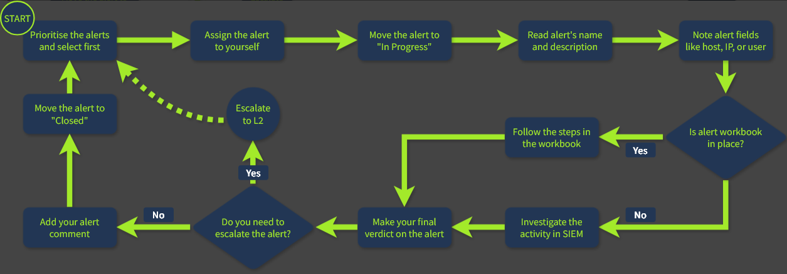

# SOC L1 Alert Triage

## Events and Alerts

### From Events to Alerts

1. Events occur  
2. a system logs the event (OS, firewall, cloud provider, et al.)  
3. logs are centralized to a SIEM or EDR  
4. Alerts are generated by a security solution for specific events or sequences of events.  

#### Alert Management Platforms

| Solution | Examples                     | Description                                                                 |
|----------|------------------------------|-----------------------------------------------------------------------------|
| SIEM System   | Splunk ES, Elastic                  | SIEM have solid alert management capabilities and are a perfect choice for most SOC teams |
| EDR or NDR | MS Defender, CrowdStrike | While EDR and NDR provide their own alert dashboards, it is preferred to use a centralized SIEM or SOAR |
| SOAR System   | Splunk SOAR, Cortex SOAR               | Bigger SOC teams can use SOAR to aggregate and centralize alerts from multiple solutions |
| ITSMSystem   | Jira, TheHive                | Some teams may have a custom ticket management (ITSM) setup using a dedicated solution |

### L1 Role in Alert Triage

| Role              | Responsibilities                                                                                  |
|-------------------|--------------------------------------------------------------------------------------------------|
| SOC L1 Analysts   | Review alerts, distinguish false positives from real threats, and escalate confirmed threats to L2 |
| SOC L2 Analysts   | Investigate escalated alerts, perform deeper analysis, and carry out remediation actions         |
| SOC Engineers     | Ensure alerts contain sufficient context and data for efficient triage and investigation         |
| SOC Manager       | Monitor the speed and quality of alert triage to ensure real threats are not missed              |

## Alert Properties

| № | Property           | Description                                                                 | Examples |
|---|--------------------|-----------------------------------------------------------------------------|----------|
| 1 | Alert Time         | Indicates when the alert was created; typically triggered shortly after the actual event | Alert Time: March 21, 15:35 Event Time: March 21, 15:32 |
| 2 | Alert Name         | Summarizes the detected activity, usually based on the detection rule name | Unusual Login Location Email Marked as Malware Windows Bruteforce Potential Data Exfiltration |
| 3 | Alert Severity     | Indicates the urgency of the alert; initially set by detection engineers and adjustable by analysts | 🟢 Low / Informational 🟡 Medium / Moderate 🟠 High / Severe 🔴 Critical / Urgent |
| 4 | Alert Status       | Shows the current state of the alert and whether it is being worked on or resolved | 🆕 New / Unassigned 🔄 In Progress / Pending ✅ Closed / Resolved Custom statuses may apply |
| 5 | Alert Verdict      | Also known as classification; determines whether the alert is a real threat or benign | 🔴 True Positive / Real Threat 🟢 False Positive / No Threat Custom verdicts may apply |
| 6 | Alert Assignee     | Identifies the analyst responsible for investigating the alert (also called alert owner) | Assigned analyst name Self-assigned ownership Responsible for handling the alert |
| 7 | Alert Description  | Provides details about the alert, including detection logic, risk context, and triage guidance | Detection rule logic Why the activity is suspicious Optional triage instructions |
| 8 | Alert Fields       | Contains key data and analyst notes related to the alert trigger | Affected Hostname Executed Command Line Additional contextual fields depending on alert |

## Alert Prioritization

### 1. Filter the Alerts

don't take the alert another anlyst has already reviewed, is being investigated
take new, unseen and unresolved alerts  

### 2. Sort by Severity

Critical > High < Medium < low

### 3. Sort byTime

oldest alerts first

## Alert Triage

### Initial Actions

1. assign alert to yourself
2. move alert to `In Progress`
3. familairze yourself with alert details

### Investigation

4. Understand who is under threat (user, hostname, cloud, network, or website)  
5. Note the action described in the laert (suspiciou login, malware, phishing, et al.)  
6. Review Surrounding evnts, to identify suspiciioius actions before and after the alert  
7. use threat intelligence platforms to verify findings / throughts.

### Final Actions

8. Escalation
9. Commenting
10. Closing