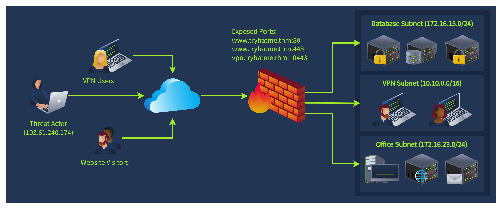

# SOC Workbooks and Lookups

useful corporate resources to help you structure and simplify L1 alert triage.

## Scenario

Imagine having a night shift and looking into an alert saying that G.Baker logged into the HQ-FINFS-02 server. Then, the user downloaded the "Financial Report US 2024.xlsx" file from there and shared it with R.Lund. To correctly triage the alert and understand if the activity is expected, you will have to find answers to many questions:

    Who is G.Baker? What are their working hours and role in the company?
    What is the purpose and location of HQ-FINFS-02? Who can access it?
    Why could R.Lund need access to the corporate financial records?

## Assets & Identities

### Identity Inventory

catalog of people, services, and associated attributes (privileges, roles, contacts)

| Full Name        | Username      | Email                | Role                        | Location       | Access               |
|-----------------|---------------|---------------------|----------------------------|----------------|--------------------|
| Gregory Baker    | G.Baker       | g.baker@tryhatme.thm   | Chief Financial Officer     | Europe, UK     | VPN, HQ, FINANCE         |
| Raymond Lund     | R.Lund        | r.lund@tryhatme.thm    | US Financial Adviser        | US, Texas      | VPN, FINANCE             |
| Kate Danner      | K.Danner      | k.danner@tryhatme.thm  | Chief Technology Officer    | Europe, UK     | VPN, DA, HQ, AWS              |
| svc-veeam-06     | svc-veeam-06  | N/A                 | Backup Service Account      | N/A            | VEEAM, HQ, DMZ           |
| svc-nginx-pp     | svc-nginx-pp  | N/A                 | Web App Service Account     | N/A            | DMZ                    |

### Sources of Identities

| Solution            | Examples                         | Description                                                                                   |
|--------------------|---------------------------------|-----------------------------------------------------------------------------------------------|
| Active Directory    | On-prem AD, Entra ID               | AD Itself is an identity database, and it is commonly used by SOC.                        |
| SSO Providers           | Okta, Google Workspace          | Cloud alternative for AD, an easy way to manage and search users.                                    |
| HR Systems          | BambooHR, SAP, HiBob            | Limited to employees only, but usually provides full employee data.                           |
| Custom Solution     | CSV or Excel Sheets             | Common for IT or security teams to maintain their own solutions.                              |

### Assset Inventory

list of computing resrouces within the IT environment

| Hostname      | Location       | IP Address    | OS                  | Owner             | Purpose                                |
|---------------|----------------|---------------|-------------------|-----------------|----------------------------------------|
| HQ-FINFS-02   | UK Datacenter  | 172.16.15.89 | Windows Server 2022 | Central IT       | File server for financial records      |
| HQ-ADDC-01    | UK Datacenter  | 172.16.15.10 | Windows Server 2019 | Central IT       | Primary AD domain controller              |
| PC-891D       | London Office  | 192.168.5.13 | Windows 11 Pro      | Tech Support     | Stationary PC for accountants          |
| L007694       | Remote         | N/A           | MacOS 13            | A. Kelly, DevOps         | Corporate laptop                        |
| L005325       | Remote         | N/A           | MacOS 13            | J. Eldridge, HR  | Corporate laptop                        |

### Sources of Asssets

| Solution           | Examples                     | Description                                                                                   |
|-------------------|------------------------------|-----------------------------------------------------------------------------------------------|
| Active Directory   | On-premAD , Entra ID             | AD Not only an identity system but also a solid asset inventory database.                         |
| SIEM or EDR        | Elastic, CrowdStrike          | Collect information about the monitored hosts.                                                |
| MDM Solution       | MS Intune, Jamf MDM           | A dedicated class of solutions created to list and manage assets.                              |
| Custom Solution    | CSV or Excel Sheets           | Similar to identity inventory, custom solutions are common.                                    |

## Network Diagrams

Continuing identity and asset inventory topics, you might also need to look at the alert from a network point of view, especially in bigger companies. Consider the scenario where you are investigating a chain of related alerts based on logs and want to give some meaning to the

you see:

    08:00: An IP 103.61.240.174 is repeatedly connecting to a corporate firewall via port TCP/10443
    08:23: Firewall logs show that the IP 103.61.240.174 was translated to an internal 10.10.0.53 IP
    08:25: The IP 10.10.0.53 is scanning the 172.16.15.0/24 network range but does not find open ports
    08:32: The same IP is now scanning the 172.16.23.0/24 network range, and the attack seems to be ongoing

To investigate the case above, you will have to find out what service is running at the 10443 port and why anyone would connect there. Then, identify the subnet the 10.10.0.53 IP belongs to and why it would ever try to connect to other subnets. A network diagram, a visual schema presenting existing locations, subnets, and their connections, is an answer to your questions:  

  

to help understand suspicious network activity. In our scenario, you can refer to the network diagram and reconstruct the attack path as follows:

    Threat actor behind the 103.61.240.174 IP performed VPN brute force, targeting .tryhatme.
    After a successful brute force and VPN login, the threat actor was assigned an IP from the VPN Subnet
    Then, the adversary tried to scan the Database Subnet, but was likely blocked by the firewall rules
    Seeing no success, the threat actor switches to the Office Subnet, looking for their next target  

## Workbooks Theory

make a verdict on whther the activity is safe or not.  

### SOC Workbooks

playbook, runbook, or workflow  
structured  
defines steps required to investigate and remediate specific  threats  

### Workbook Examples

  

typically supplemented with detailed text-base gudie and linkes to mentioned resourcde

### Logical Groups

    Enrichment: Use Threat Intelligence and identity inventory to get information about the affected user
    Investigation: Using the gathered data and SIEM logs, make your verdict if the login is expected
    Escalation: Escalate the alert to L2 or communicate the login with the user if necessary

