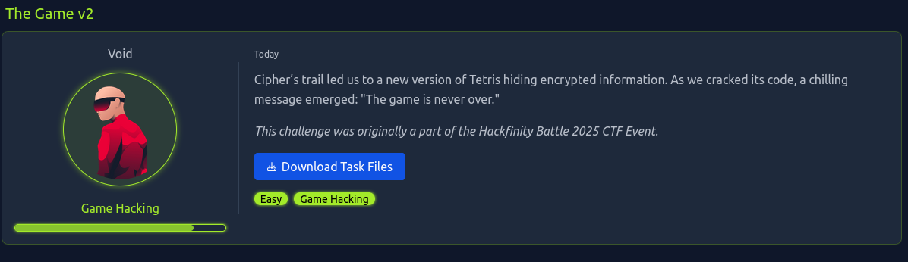

# The Game 2

> Converted from cybersecurity DOCX notes into a structured markdown outline and study reference.



## STEP 1: Examine the Archive

```bash
strings TetrixFinal.exe-1741991867073.zip | grep -i THM
```

ThMS

tHmoo|{

ntHM

*rthM

ThmD

.thm

THm[{

thmf1

tHM}

THMk

&tHm

9ThM9

`tHmI

## STEP 2: Unzip the Archive

```bash
unzip TetrixFinal.exe-1741991867073.zip
```

## STEP 3: Inspect the windows executable

```bash
strings TetrixFinal.exe | grep -i THM
```

- Incorrect Flag: THM{GAME_MASTER_HACKER}

- Interesting String: Florian Kothmeier (Dragoncraft89)

## STEP 4: Output the strings to a file

```bash
strings TetrixFinal.exe > tetrix.text
```

## STEP 5: Assume we are looking for an MD5 Cipher text and search for strings with specific size. Use grep and regex

```bash
grep -E '^[a-zA-Z0-9]{32}$' tetrix.txt
```

Returned outputs, but nothing that looks like an MD5 hash
