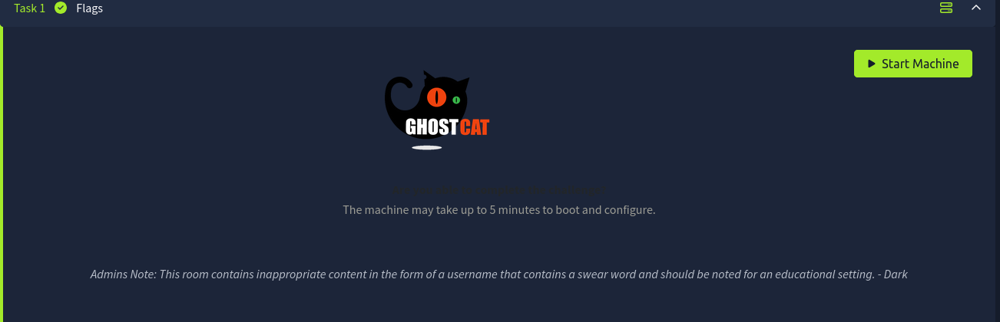

# Tomghost

> Converted from cybersecurity DOCX notes into a structured markdown outline and study reference.



- https://steflan-security.com/tryhackme-tomghost-walkthrough/

## Step 1: View Web Page

- No web page loaded

## Step 2: Nmap 1

```bash
nmap -Pn 10.10.147.251
Starting Nmap 7.94 ( https://nmap.org ) at 2023-08-05 18:33 EDT
Nmap scan report for 10.10.147.251
Host is up (0.21s latency).
Not shown: 996 closed tcp ports (conn-refused)
PORT STATE SERVICE
22/tcp open ssh
53/tcp open domain
8009/tcp open ajp13
8080/tcp open http-proxy
```

## Step 3: Nmap for vulnerabilities

- command: nmap -Pn -A -oN vulns.txt <ip address> --script vuln

- CVE-2020-1938 hist version 7.5. there are others but they target older version; go with this one first

## Step 4: Visit the webpage

## Step 2 revealed the website is on a different port

```bash
http://10.10.147.251:8080/
```

- Reveals Apache Tomcat/9.0.30 is isntalled

- Manager interfaces is not accessible: "By default the Manager is only accessible from a browser running on the same machine as Tomcat. If you wish to modify this restriction, you'll need to edit the Manager's context.xml file. "

- Several examples of websocket applets

## Step 5: Review ajp13

- https://tomcat.apache.org/connectors-doc-archive/jk2/common/AJPv13.html

- Apache JServ Protocol version 1.3

## Step 6: Enumerate subdomains and Directories

```bash
dirb http://10.10.147.251:8080 /usr/share/wordlists/dirb/common.txt""
```

- revealed no results which cannot be found by following links: docs, examples, favicon.ico, host-manager, manager

## Step 7: Search Exploit-db

- CVE-2020-1938 has a Metasploit

- https://www.exploit-db.com/exploits/49039

## Step 8: Exploit Ghostcat in Metasploit

- start the database: "msfdb run"

- "search ghostcat"

- found one result

- "show options"

- change a couple parameters

- output: skyfuck:8730281lkjlkjdqlksalks

## Step 9: Try SSh with credentials identified in step 8

- was able to log into ssh

- two interesting files: credential.pgp, tryhackme.asc

- tryhackme.asc: PGP Private Key, Version BCPG v1.63

- up to the home directory and there is a user: merlin

- user.txt is in merlin's folder

## Step 10: Bring interesting files to attacking machine

- on skyfuck profile start a python server: 'python3 -m http.server 8000'

```bash
wget http://10.10.147.251:8000/tryhackme.asc
wget http://10.10.147.251:8000/credential.pgp
```

## Step 11: Use John to crack the credentials

- extract the hashes from tryhackme.asc: gpg2john tryhackme.asc > hashes.txt

- hashes.txt: tryhackme:$gpg$*17*54*3072*713ee3f57cc950f8f89155679abe2476c62bbd286ded0e049f886d32d2b9eb06f482e9770c710abc2903f1ed70af6fcc22f5608760be*3*254*2*9*16*0c99d5dae8216f2155ba2abfcc71f818*65536*c8f277d2faf97480:::tryhackme <stuxnet@tryhackme.com>::tryhackme.asc

- crack the hash: john --wordlist=/usr/share/wordlists/rockyou.txt hashes.txt

- found username:password -- alexandru (tryhackme)

## Step 12: Use GPG to Decrypt the credentials in the intersting files

- command: "gpg --import tryhackme.asc"

- requires input of a passphrase: alexandru

- Command: "gpg --decrypt credentials.pgp

- requires input of a passphrase: alexandru

- reveals merlins password: merlin:asuyusdoiuqoilkda312j31k2j123j1g23g12k3g12kj3gk12jg3k12j3kj123j

## Step 13: switch user to merlin

- command: "su merlin" with the password

- worked but still can't get into the root directly

## Step 14: search for escalation routes

- "sudo -l" indicates:

- User merlin may run the following commands on ubuntu:

- (root : root) NOPASSWD: /usr/bin/zip

- GTFOBIns shows a method for sudo exploitation of the zip command

- https://gtfobins.github.io/gtfobins/zip/

- the zip exploit leads to root access but did not need to use the third line.

Compromise this machine and obtain user.txt

- **Answer:** THM{GhostCat_1s_so_cr4sy}

Escalate privileges and obtain root.txt
