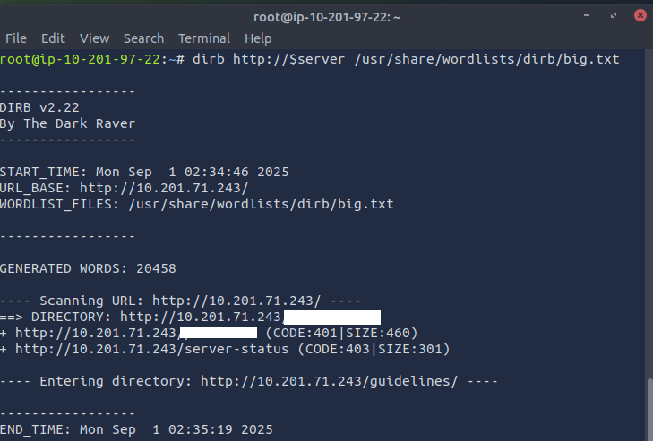

# ToolsRus

## 1. What directory can you find, that begins with a "g"?

 First set up an environment variable to type commands more quickly.  

 `:> export server='10.201.71.243`

 Second, what targets are available  

 `:> nmap $server`  

 

 What runs on the identified ports.  

 `:> nmap $server -sV`

 

 Start with port 80  

 `:> dirb http://$server /usr/share/wordlists/dirb/big.txt`

 

## 2. Whose name can you find from this directory?

 Download and see what is received.  

 `:> wget http://$server/guidlines/`  

   

 Check the contents  

 `:> cat guidelines`  

   

## 3. What directory has basic authentication?

## 4. What is bob's password to the protected part of the website?

## 5. What other port that serves a webs service is open on the machine?

## 6. What is the name and version of the software running on the port from question 5?

## 7. Use Nikto with the credentials you have found and scan the /manager/html directory on the port found above.

### How many docume0

## 8. What is the server version?

## 9. What version of Apache-Coyote is this service using?

## 10. Use Metasploit to exploit the service and get a shell on the system.

## 11. What user did you get a shell as?

## 12. What flag is found in the root directory?