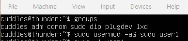
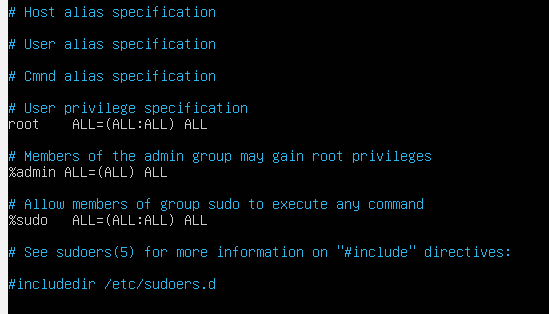
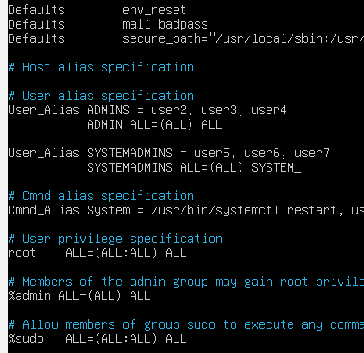

# Hardening Basics

Learn how to harden an Ubuntu Server! Covers a wide range of topics

spooky:tryhackme

Source Material: [Mastering Linux Security and Hardening](https://www.oreilly.com/library/view/mastering-linux-security/9781788620307/)  

- [Securing User Accounts](#securing-user-accounts)
  - [Sudo](#sudo)
  - [Disabling Root](#disabling-root)
  - [Locking Home Directories](#locking-home-directories)
  - [Configuring Password Complexity](#configuring-password-complexity)
  - [The lxd Group](#the-lxd-group)
- [Firewall Basics](#firewall-basics)
  - [iptables](#iptables)
  - [iptables Configuration](#iptables-configuration)
  - [Uncomplicated Firewall](#uncomplicated-firewall)

## Securing User Accounts

### Sudo

When sudo is configured correctly, it greatly increases the security of your Linux environment:  

Slowing hackers down. Since the root login will most likely be disabled and your users are properly granted sudo, any attacker will not know which account to go after, thus slowing them down. If they are slowed down enough, they may stop the attack and give up.  

Allow non-privileged users to perform privileged tasks by entering their own passwords.  
Keeps in line with the principle of least privilege by allowing administrators to assign certain users full privileges, while assigning other users only the privileges they need to complete their daily tasks

#### Adding Users to a Predefined Admin group

#### usermod

`:> groups` : identify available groups
`:> usermod -aG sudo <username>`  : add <username> to the `sudo` group  

  

#### visudo

opens the sudo policy file  
The sudo policy file is stored in /etc/sudoers.  
can only be edited by the root user  

`:> sudo visudo`  

  

This gives the same information as sudo -l but it has one difference; the "%sudo" indicates that it's for the group, sudo.  
There are other groups in this file such as "admin". This is where administrators can set what programs a user in a certain group can perform and whether or not they need a password.  
You may have seen sometimes %sudo ALL=(ALL:ALL) ALL NOPASSWD: ALL. That NOPASSWD part says that the user that is part of the sudo group does not need to enter their local password to use sudo privileges. Generally, this is not recommended - even for home use.

#### User Alias

If managing users in a network across multiple flavors of Linux (CentOS, Red Hat, etc.), where the sudo group may be called something different, this method may be more preferable.  
Add a User Alias to the policy file and add users to that alias (below), or add lines for individual users.  
The first image below creates the ADMIN User Alias and assigns 3 users to it and then says that this Alias has full sudo powers.

[User alias](assets/ubuntu-103.png)  
Managing user aliases in a larget network becomes unwieldy very quickly.  

#### Assinging Command Aliases

Ensure that users are assigned to the groups they belong to and only are allowed access to the programs they need to complete their daily tasks.  
This is how sudo aligns with the principle of least privilege.  

Set Command Aliases in the sudo policy file  

  

The SYSTEMADMINS User Alias assignes three users to its group.
The SYSTEM ADMINS allows assigned users to execute whatever commands are assigned to "SYSTEM" with elevated privileges. 
The SYSTEM Command Alias allows the user to run systemctl restart, systemctl restart ssh and chmod.  

### Disabling Root

### Locking Home Directories

### Configuring Password Complexity

### The lxd Group

## Firewall Basics

### iptables

### iptables Configuration

### Uncomplicated Firewall