# Windows Forensics with KAPE

_Source timestamp: Wednesday, January 24, 2024, 4:03 PM_

> Converted from a OneNote Word export into Markdown for rapid cybersecurity reference. Commands and lab steps are preserved from the source notes; use only in authorized lab or assessment environments.

## Introduction to KAPE

### Introduction to KAPE:

- Kroll Artifact Parser and Extractor (KAPE)

- parses and extracts Windows forensics artifacts.

- collect files

- process the collected files as per the provided options.

TARGETS and MODULES

- Targets: forensic artifacts that need to be collected.

- Modules: programs that process the collected artifacts and extract information from them.

### How it works

- highly configurable

- first pass: copies accessible file that are not locked by the OS

- second pass: uses raw disk reads to bypass OS locks

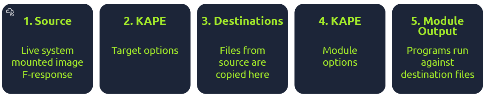

- KAPE can extract targets from a Live system, a mounted image, or the [F-response](https://www.f-response.com/) utility.

- KAPE does not need to be installed.

- Can work from network locations or USB drives.

To proceed further, click the Start Machine button on the top-right corner to start the attached VM in split-screen mode.

Alternatively, you can log in to the machine using the following credentials:

Username: thm-4n6

Password: 123

In the attached VM, you will find KAPE on the Desktop in the folder titled KAPE.In this folder, you will find the following files and directories:

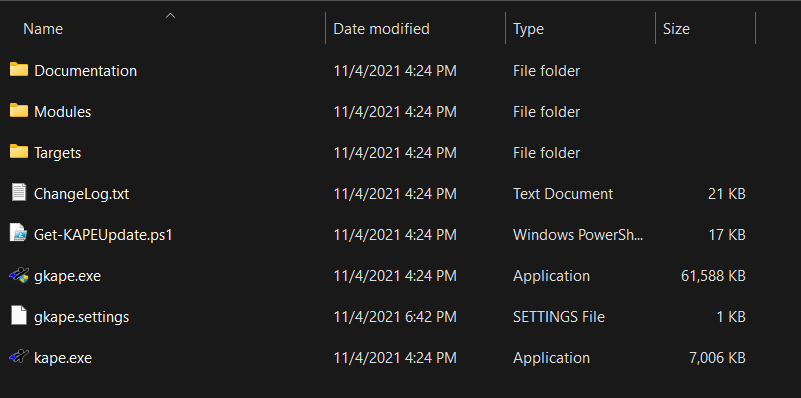

You can see two binaries in this directory, kape.exe and gkape.exe. The first is the CLI version of KAPE, and the second is a GUI version (symbolized by the 'g' prefix).

gkape.settings stores the default settings of the GUI version.

```text
Get-KAPEUpdate.ps1, as the name suggests, is a Powershell script that checks and downloads updates.
```

ChangeLog.txt and Documentation are self-explanatory. We will explore Targets and Modules in the following tasks.

## Target Options

In KAPE's lexicon, Targets are the artifacts that need to be collected from a system or image and copied to our provided destination.

For example, as we learned in the last room, Windows Prefetch is a forensic artifact for evidence of execution so that we can create a Target for it.

Similarly, we can also create Targets for the registry hives.

In short, Targets copy files from one place to another.

When we open the Targets directory of KAPE, this is what we will see:

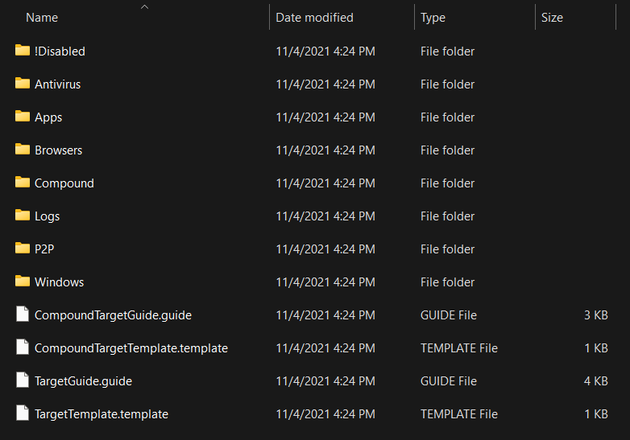

The last four files at the bottom are guides and templates to create Targets and Compound Targets of our own.

We will discuss Compound Targets later in this task.

As you can see, the targets are grouped into different directories.

Let's check out the Windows directory to see what we have:

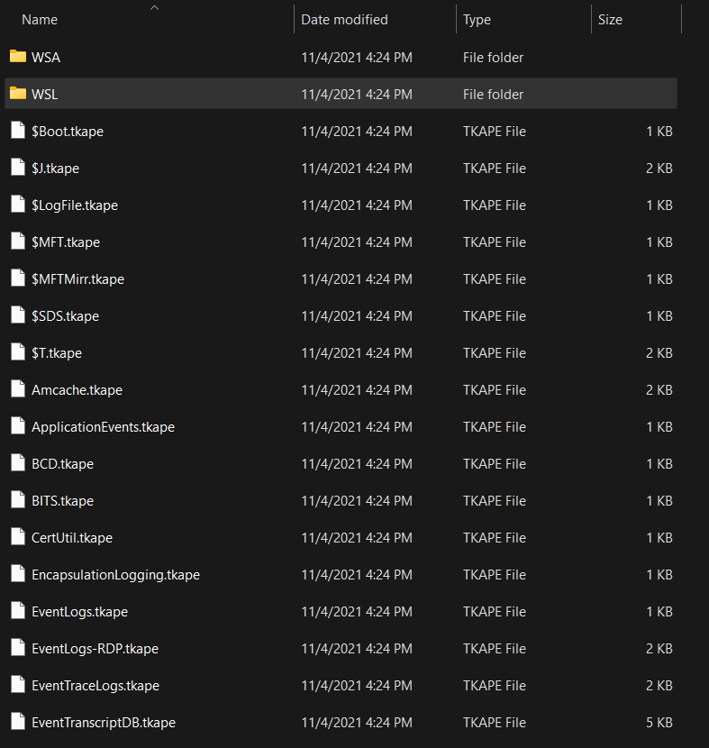

We can see different .tkape extension files.

This is how a Target is defined for KAPE.

A TKAPE file contains information about the artifact that we want to collect, such as the path, category, and file masks to collect.

As an example, below is how the Prefetch Target is defined.

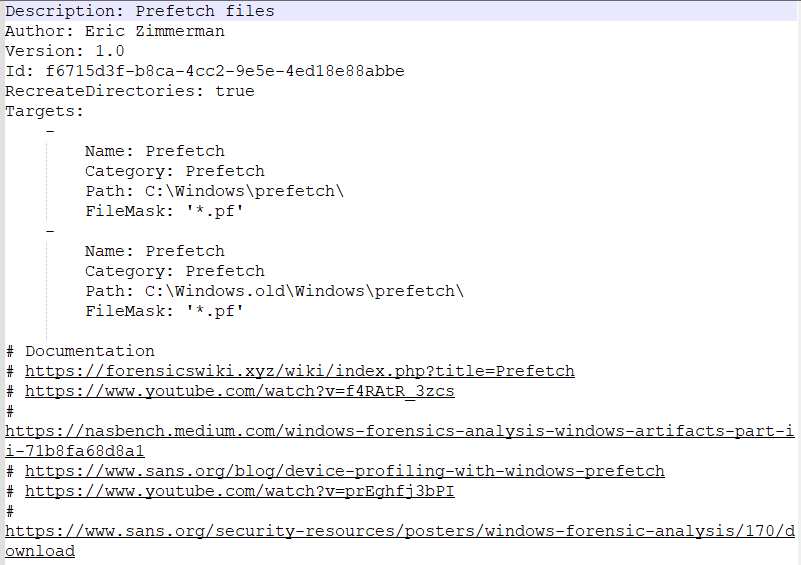

This TKAPE file tells KAPE to collect files with the file mask *.pf from the path C:\Windows\prefetch and C:\Windows.old\prefetch.

Notice that we have the C:\Windows.old path listed here as well.

This path contains files retained after Windows has updated to a new version.

For forensic analysis, we can also find interesting historical artifacts from this directory.

### Compound Targets:

KAPE also supports Compound Targets.

These are Targets that are compounds of multiple other targets.

As mentioned in the previous tasks, KAPE is often used for quick triage collection and analysis.

The purpose of KAPE will not be fulfilled if we have to collect each artifact individually.

Therefore, Compound Targets help us collect multiple targets by giving a single command.

Examples of Compound Targets include !BasicCollection, !SANS_triage and KAPEtriage.

We can view the Compound Targets on the path KAPE\Targets\Compound.

The following image shows what a Compound Target for evidence of execution looks like:

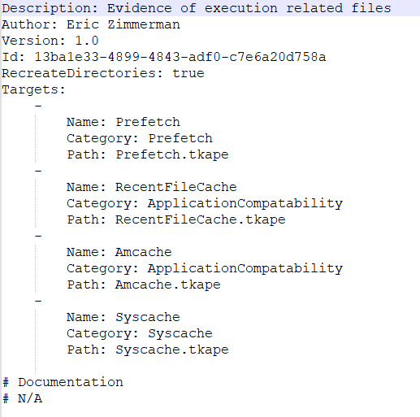

The above Compound Target will collect evidence of execution from Prefetch, RecentFileCache, AmCache, and Syscache Targets.

### !Disabled

This directory contains Targets that you want to keep in the KAPE instance, but you don't want them to appear in the active Targets list.

### !Local

If you have created some Targets that you don't want to sync with the KAPE Github repository, you can place them in this directory.

These can be Targets that are specific to your environment.

Similarly, anything not present in the Github repository when we update KAPE will be moved to the !Local directory.

## Module Options

Modules, in KAPE's lexicon, run specific tools against the provided set of files.

Their goal is not to copy files from one place to another but rather run some command and store the output.

Generally, the output is in the form of CSV or TXT files.

This is what the Modules directory looks like in KAPE:

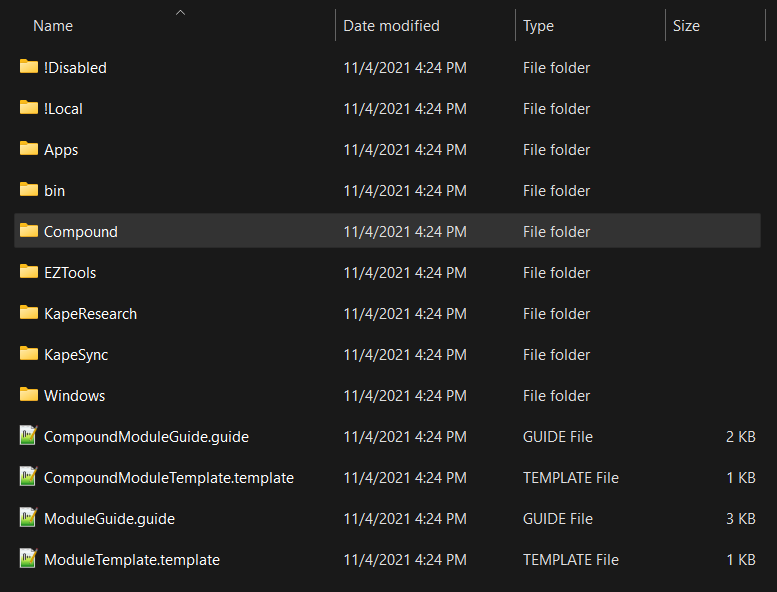

Similar to the previous task, we see guides and templates for creating Modules and Compound Modules.

We also see the !Disabled, !Local and Compound directories, which are similar to what we saw in the previous task.

We will not discuss these again, as we discussed them in the last task.

We see that most of the Modules are grouped together in different directories.

One thing we find different is the bin directory. We will discuss that in a bit.

For now, let's open the Windows directory and see what we have there:

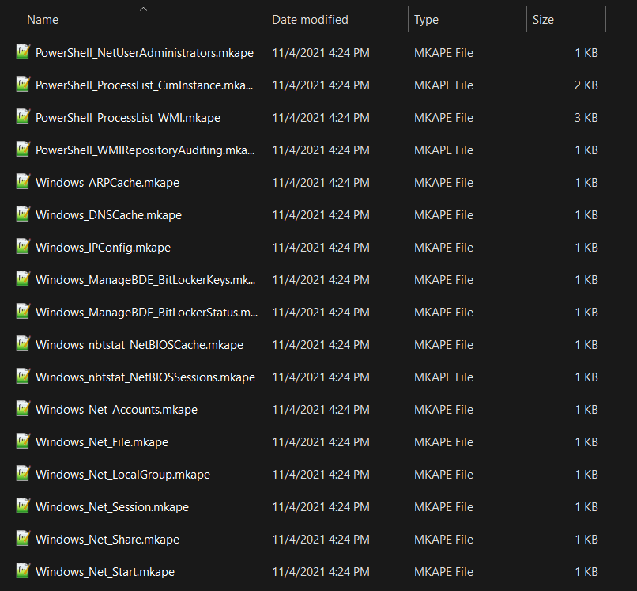

Here we see files with the .mkape extension.

These are understood as Modules by KAPE.

Let's open an MKAPE file and see how it is structured. The following image shows the Windows_IPConfig MKAPE file.

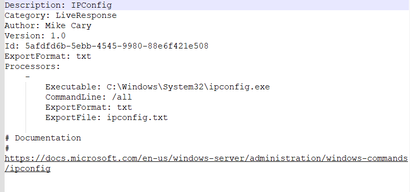

Notice that the MKAPE file tells KAPE about the executable that has to be run, the command line parameters of the executable file, the output export format, and the filename to export to.

But what if the executable that we want to run is not present on the system?

This brings us to the bin directory.

### The bin directory:

The bin directory contains executables that we want to run on the system but are not natively present on most systems.

KAPE will run executables either from the bin directory or the complete path.

An example of files to be kept in the bin directory are Eric Zimmerman's tools, which are generally not present on a Windows system.

We used them extensively in the Windows Forensics rooms.

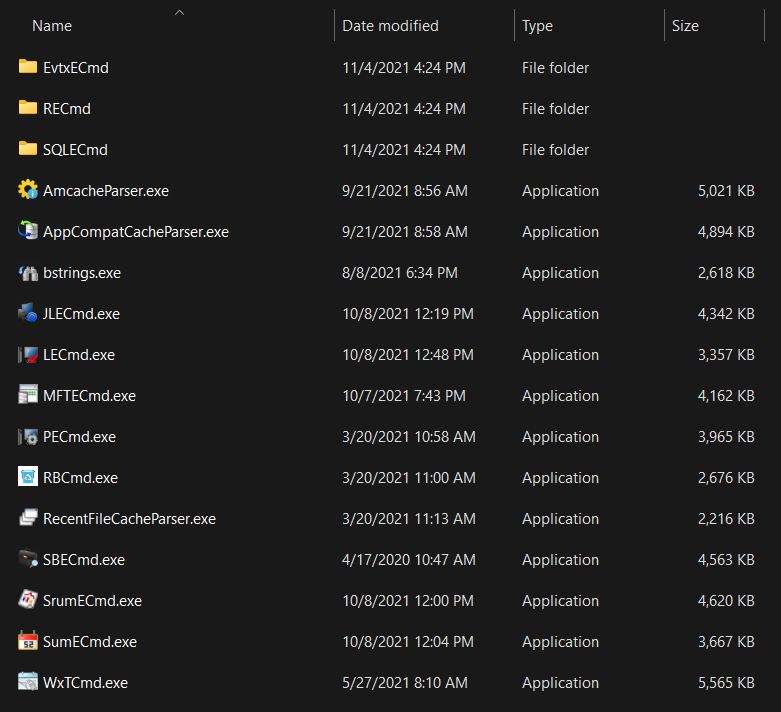

Notice that most of the binaries present here are from Eric Zimmerman's Tools.

## KAPE GUI

Now that we have learned about the different components of KAPE let's take it for a test drive.

In the attached VM, double-click to open the gkape.exe file.

You will see the following Window:

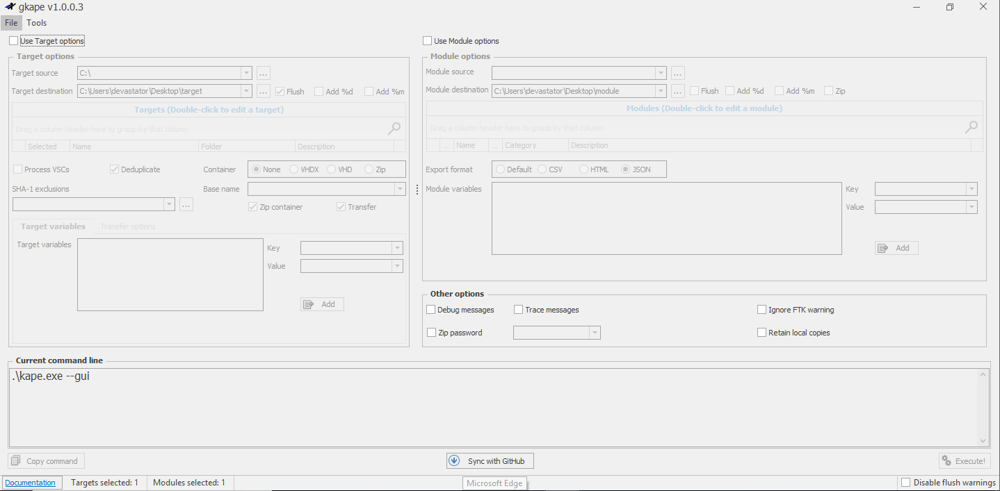

Tip: If the Window is not correctly visible in the split-screen, you can open it in a full browser tab by clicking this button:

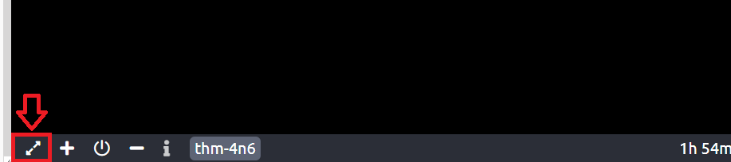

Here you can see that there are different options, but most are disabled.

To collect Targets We will go ahead by enabling the Use Target Options checkbox.

This will enable the options present in the left half of the Window:

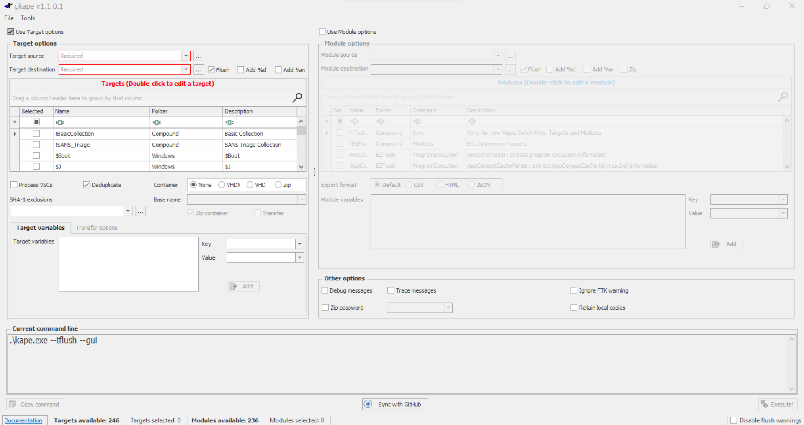

If we want to perform forensics on the same machine on which KAPE is running, we will provide C:\ for the Target source.

We can select the target destination of our choice.

All the triage files will be copied to the Target destination that we provide.

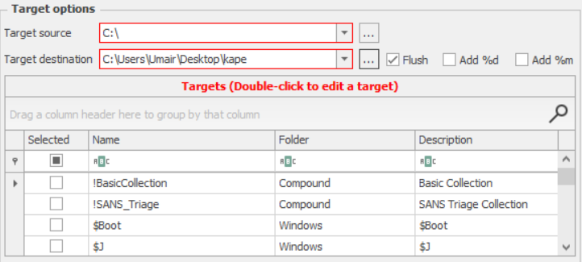

Here, the Flush checkbox will delete all the contents of the Target destination, so we have to be careful when using that.

We have disabled the Flush checkbox so that it does not delete data already present in the directories.

Add %d will append date info to the directory name where the collected data is saved.

Similarly, Add %m will append machine info to the Target destination directory.

We can select our desired Target from the list shown above.

The Search bar helps us search for the names of the desired Targets quickly.

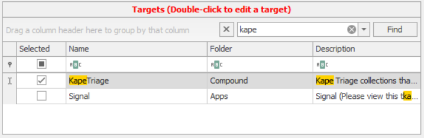

We can select if we want to process Volume Shadow Copies by enabling Process VSCs.

We can select the transfer checkbox if we want to transfer the collected artifacts through an SFTP server or an S3 bucket.

For transfer, the files must be enclosed in a container, which can be Zip, VHD, or VHDX.

Similarly, we can provide exclusions based on SHA-1, and KAPE will not copy the excluded files.

When enclosing in a container, we will need to give a Base name that will be used for all the created files.

It is not required if we are not transferring files or enclosing them in a container.

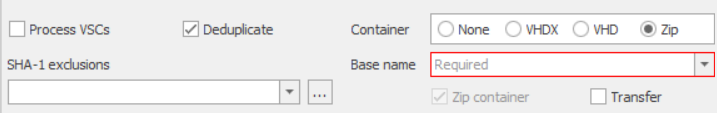

In the Current command line tab, we can see the command line options being added or removed while configuring the UI.

This Window will show more options in the command line as we add options.

Please note that the destination path in your case will be different from the one shown in the image.

Notice the --tflush flag here. It means that when this command line was created, the Flush checkbox was still checked.

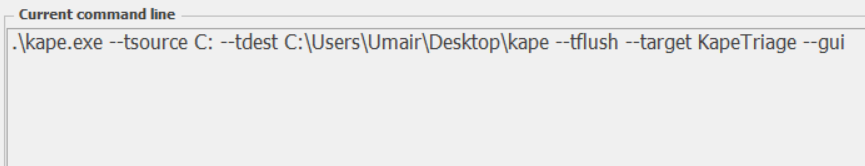

By checking the Use Module Options checkbox, the right side of the KAPE Window will also be enabled.

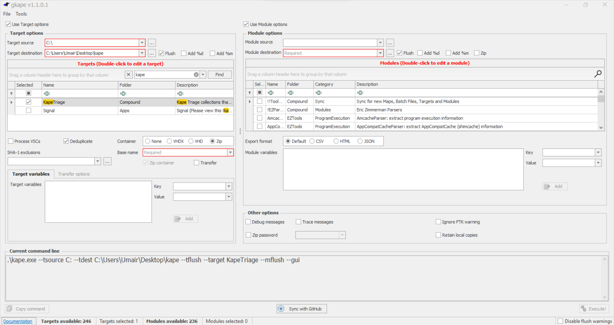

When using both Target and Module Options, providing Module Source is not required.

The selected Modules will use the Target destination as the source.

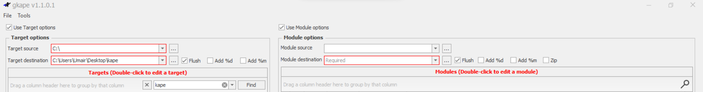

The rest of the options for Modules are similar to the ones for Targets, so we won't go into details for them.

Below you will see what the configuration looks like when we have KAPE all set up for collecting Targets and processing them using Modules.

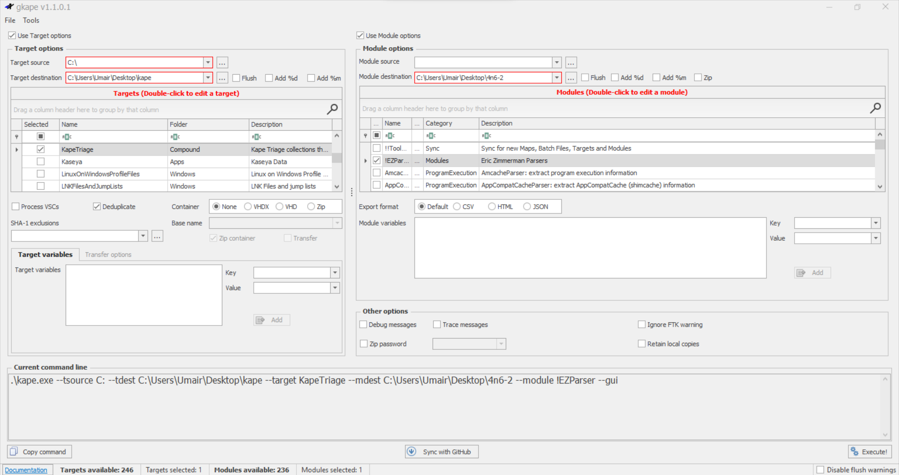

We have selected the KapeTriage compound Target and !EZParser Compound Module.

The command line below shows the CLI command that will be run.

The Execute! button in the bottom right corner will execute the command.

The Disable flush warnings checkbox underneath it will not warn us when we are using the Flush flags.

When we press Execute! We will see a command line window open and show us the logs as KAPE performs its tasks.

It will take a few minutes to execute since it will be collecting all the data and then running the module processes on it.

Once it completes, it will show us the total execution time, and we can press any key to terminate the command window.

----------

```text
D:\Kape\kape.exe
```

KAPE version 1.1.0.1 Author: Eric Zimmerman (kape@kroll.com)

KAPE directory: D:\KAPE
Command line: --tsource C: --tdest C:\Users\Umair\Desktop\kape --target KapeTriage --mdest C:\Users\Umair\Desktop\4n6-2 --module !EZParser --gui

System info: Machine name: UMAIR-THINKBOOK, 64-bit: True, User: Umair OS: Windows10 (10.0.22000)

Using Target operations
Found 14 targets. Expanding targets to file list...
Target 'ApplicationEvents' with Id '2da16dbf-ea47-448e-a00f-fc442c3109ba' already processed. Skipping!
Target 'ApplicationEvents' with Id '2da16dbf-ea47-448e-a00f-fc442c3109ba' already processed. Skipping!
Target 'ApplicationEvents' with Id '2da16dbf-ea47-448e-a00f-fc442c3109ba' already processed. Skipping!
Target 'ApplicationEvents' with Id '2da16dbf-ea47-448e-a00f-fc442c3109ba' already processed. Skipping!
Target 'ApplicationEvents' with Id '2da16dbf-ea47-448e-a00f-fc442c3109ba' already processed. Skipping!
Found 3,059 files in 4.257 seconds. Beginning copy...
 Deferring 'C:\Windows\System32\winevt\logs\Application.evtx' due to IOException...
 Deferring 'C:\Windows\System32\winevt\Logs\Microsoft-Windows-Windows Defender%4Operational.evtx' due to IOException...
 Deferring 'C:\Windows\System32\winevt\Logs\Microsoft-Windows-Windows Defender%4WHC.evtx' due to IOException...
 Deferring 'C:\ProgramData\Microsoft\Windows Defender\Support\MPDetection-20220126-183133.log' due to IOException...
 Deferring 'C:\ProgramData\Microsoft\Windows Defender\Support\MPDeviceControl-20211016-164735.log' due to IOException...
 Deferring 'C:\ProgramData\Microsoft\Windows Defender\Support\MPLog-10172021-040927.log' due to IOException...
 Deferring 'C:\ProgramData\Microsoft\Windows Defender\Support\MpWppTracing-20220210-070038-00000003-ffffffff.bin' due to IOException...
 Deferring 'C:\Windows\System32\winevt\logs\HardwareEvents.evtx' due to IOException...
 Deferring 'C:\Windows\System32\winevt\logs\IntelAudioServiceLog.evtx' due to IOException...
 Deferring 'C:\Windows\System32\winevt\logs\Internet Explorer.evtx' due to IOException...
.
.
.
.
Executing remaining modules...
 Running 'EvtxECmd\EvtxECmd.exe': -d C:\Users\Umair\Desktop\kape --csv C:\Users\Umair\Desktop\4n6-2\EventLogs
 Running 'JLECmd.exe': -d C:\Users\Umair\Desktop\kape --csv C:\Users\Umair\Desktop\4n6-2\FileFolderAccess -q
 Running 'LECmd.exe': -d C:\Users\Umair\Desktop\kape --csv C:\Users\Umair\Desktop\4n6-2\FileFolderAccess -q
 Running 'PECmd.exe': -d C:\Users\Umair\Desktop\kape --csv C:\Users\Umair\Desktop\4n6-2\ProgramExecution -q
 Running 'RBCmd.exe': -d C:\Users\Umair\Desktop\kape --csv C:\Users\Umair\Desktop\4n6-2\FileDeletion -q
 Running 'RECmd\RECmd.exe': -d C:\Users\Umair\Desktop\kape --bn BatchExamples\Kroll_Batch.reb --nl false --csv C:\Users\Umair\Desktop\4n6-2\Registry -q
 Running 'SBECmd.exe': -d C:\Users\Umair\Desktop\kape --csv C:\Users\Umair\Desktop\4n6-2\FileFolderAccess -q
 Running 'SQLECmd\SQLECmd.exe': -d C:\Users\Umair\Desktop\kape --csv C:\Users\Umair\Desktop\4n6-2\SQLDatabases
 Running 'SrumECmd.exe': -d C:\Users\Umair\Desktop\kape -k --csv C:\Users\Umair\Desktop\4n6-2\SystemActivity
 Running 'SumECmd.exe': -d C:\Users\Umair\Desktop\kape\Windows\System32\LogFiles\SUM --csv C:\Users\Umair\Desktop\4n6-2\SUMDatabase
Executed 18 processors in 192.2738 seconds

Total execution time: 258.1812 seconds

Press any key to exit

-------------

Notice that at the backend, KAPE is running the kape.exe in a command line. We can check out the files created by KAPE once it completes processing them. The below snapshot shows our Module destination. Notice how KAPE has processed the files according to different categories.

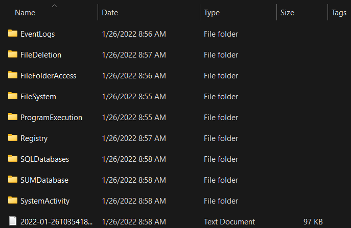

Let's collect triage data using the KAPETriage package, process it using !EZParser module, and answer the questions below. Then we can proceed to learn about the KAPE CLI in the next task.

## KAPE CLI

Though we used the GUI in the previous task, KAPE is a command-line tool.

Therefore, it is pertinent to know how to use KAPE through the command line to make full use of it.

For a list of all the different switches that can be used with KAPE, open an elevated PowerShell (Run As Administrator), go to the path where the KAPE binary is located, and type kape.exe.

You will see something like this as an output.

Administrator: Command Prompt

```text
kape.exe
```

We can see from the above screenshot that while collecting Targets, the switches tsource, target and tdest are required.

Similarly, when processing files using Modules, module and mdest are required switches.

The other switches are optional as per the requirements of the collection.

With this information, let's build a command to perform the same task we performed in the previous task. i.e., collect triage data using the KapeTriage Compound Target and process it using the !EZParser Compound Module.

Since we are not using the GUI version, we will start with typing:

```text
kape.exe
```

To add a Target source, let's append --tsource and that Target path: kape.exe --tsource C:

The --target flag will be used for selecting the Target the --tdest flag for the Target destination.

For the sake of simplicity, we will set the Target destination to a directory named target on the Desktop. KAPE will create a new directory if it doesn't already exist.

Our command line now looks like this:

```text
kape.exe --tsource C: --target KapeTriage --tdest C:\Users\thm-4n6\Desktop\target
```

Running the above command will collect triage data defined in the Kape Triage Target and save it to the provided destination.

However, it will not process it or perform any other activity on the data.

If we want to flush the Target destination, we can add --tflush to do that. For now, let's move on to adding the Module options.

If we were using a Module source, we would have used a >--msource flag in a similar manner to the --tsource flag.

But in this case, let's use the Target destination as the Module source.

By doing this, we will not need to add it explicitly, and we can move on to adding the Module destination using the --mdest flag:

```text
kape.exe --tsource C: --target KapeTriage --tdest C:\Users\thm-4n6\Desktop\Target --mdest C:\Users\thm-4n6\Desktop\module
```

We have just used a directory named module for the Module destination.

To Process the Target destination using a Module, we need to provide the Module name using the --module flag.

To process it using the !EZParser Module, we will append --module !EZParser, making our command look like this:

```text
kape.exe --tsource C: --target KapeTriage --tdest C:\Users\thm-4n6\Desktop\Target --mdest C:\Users\thm-4n6\Desktop\module --module !EZParser
```

Please note that we will need to run this command in an elevated shell (with Administrator privileges) for KAPE to collect the data.

We can modify the command as per our needs and the switches provided by KAPE.

When we run this command, we will see a similar window as in the previous task.

You can check out the files collected by KAPE Targets and Modules once it completes.

### Batch Mode:

KAPE can also be run in batch mode.

What this means is that we can provide a list of commands for KAPE to run in a file named _kape.cli.

Then we keep this file in the directory containing the KAPE binary.

When kape.exe is executed as an administrator, it checks if there is _kape.cli file present in the directory.

If so, it executes the commands mentioned in the cli file.

This mode can be used if you need someone to run KAPE for you, you will keep all the commands in a single line, and all you need is for the person to right-click and run kape.exe as administrator.

For example, if we have to perform the same task as we did earlier in this task using batch mode, we will have to create a _kape.cli file with the following content:

```text
--tsource C: --target KapeTriage --tdest C:\Users\thm-4n6\Desktop\Target --mdest C:\Users\thm-4n6\Desktop\module --module !EZParser
```

When we run kape.exe, it will perform the same tasks as when we ran it through CLI above.

## Hands-on Challenge

So, now that we have learned how to use KAPE let's put it into practice.

For this task, you will need to utilize your skills gained in this room and the previous [Windows Forensics 1](https://tryhackme.com/room/windowsforensics1) and [Windows Forensics 2](https://tryhackme.com/room/windowsforensics2) rooms.

Organization X has an Acceptable Use Policy for their Portable Devices, including Laptops.

This policy forbids users from connecting removable or Network drives, installing software from unknown locations, and connecting to unknown networks.

It looks like one of the users has violated this policy.

Can you help Organization X find out if the user violated the Acceptable Use Policy on their device?

The user's machine is attached to the room as a VM.

Navigate to the KAPE directory placed on the Desktop in the attached VM.

Run KAPE with your desired Target and Module options, and answer the following questions.

Hint: You can use EZviewer placed in the EZtools folder on Desktop to open CSV files.

Answer the questions below

Two USB Mass Storage devices were attached to this Virtual Machine.

One had a Serial Number 0123456789ABCDE.

What is the Serial Number of the other USB Device?

7zip, Google Chrome and Mozilla Firefox were installed from a Network drive location on the Virtual Machine.

What was the drive letter and path of the directory from where these software were installed?

What is the execution date and time of CHROMESETUP.EXE in MM/DD/YYYY HH:MM?

What search query was run on the system?

When was the network named Network 3 First connected to?

KAPE was copied from a removable drive. Can you find out what was the drive letter of the drive where KAPE was copied from?
