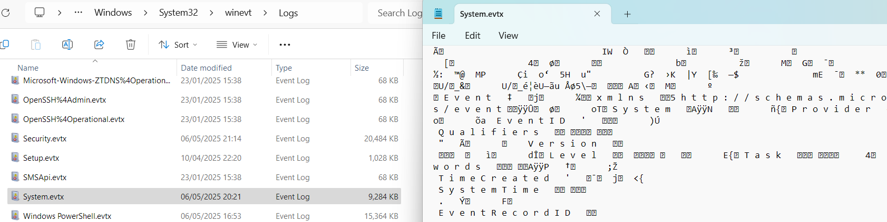
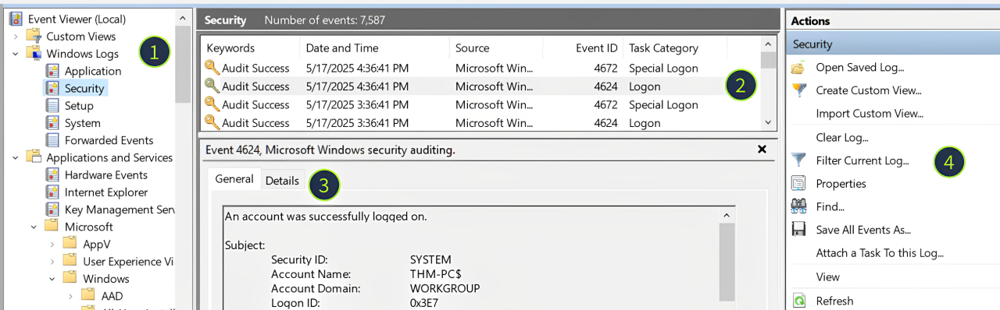

# Windows Logging for SOC

## Learning Objectives

- Understand how to find and interpret important Windows event logs
- Learn invaluable for monitoring log sources like sysmon and powershell
- Prepare for using the mentioned logs in SOC-SIM and the following rooms
- Practice your log analysis skills on multiple event log datasets

## What is Logged

Actions taken on a device result in an antry to some journal, by the OS.  
Includes time, action details, and user.  

Logging supports:
- incdient Response: Log show when and how an attack occurred
- Threat Hunting: Logs permit searching for signs of malicious activity
- Alerting and Triage: Logs are the building block of any alert or detection rule  

### Anatomy of a Log Entry

Windows logs are stored in binary at `C:\Windows\System32\winevt\Logs`  

  

Each EVTX file corresponde to a specfiic log category.

### Reading Event Logs

Open "Event Viewer" using Windows Search; use `Win+R` and type `eventvwr` and press enter.  

1. **Log Sources**: Every EVTX file correspondes to a single item on the left panel
2. **Log List**: Each row is a signle event contaiing event properties
3. **Log Details**: Actual content of the log, in plaintext or XML format  
4. **Filters Menu**: Use a variety of parameters to filter logs.  

  

### Logged Questions  

#### Looking at the last screenshot, which event ID describes a successful login? (Answer format: LogSource / ID, e.g. Application / 8194)

`Security/4624`

## Security Log: Authentication

## Security Log: User Management

## Sysmon: Process monitoring

## Sysmon: Files and Network

## PowerShell: Logging Commands