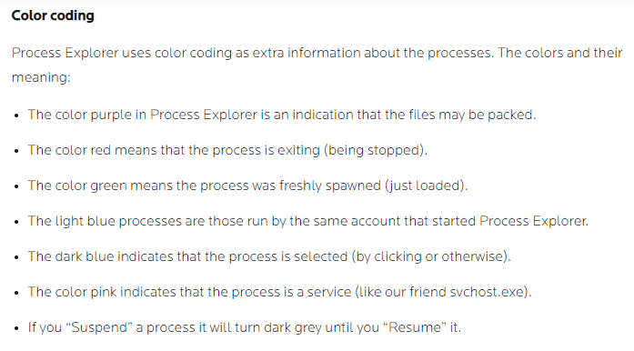

# Windows Sysinternals

_Source timestamp: Wednesday, May 3, 2023, 11:33 AM_

> Converted from a OneNote Word export into Markdown for rapid cybersecurity reference. Commands and lab steps are preserved from the source notes; use only in authorized lab or assessment environments.

SYSINTERNALS

- compilation of 70+ windows-based tools

- Categories: File and Disk utilities; Networking utilities; process utilites; security utilities; system information; miscellaneous

- Sysinternals Utilities Index page, https://docs.microsoft.com/en-us/sysinternals/downloads/

- PowerShell command: Download-SysInternalsTools C:\Tools\Sysint

- Sysinternals Live URL, https://live.sysinternals.com/.

## SYSINTERNALS Live

- web-based execution of systinternals

- no downloads

- enter the live path into windows explorer or command prompt:

live.sysinternals.com/<toolname> or [\\live.sysinternals.com\tools\<toolname>](file://live.sysinternals.com/tools/%3ctoolname%3e)"

- Requires installation of WebDAV client

- WebDAV allows local machine to access remote machine running WebDAV share

- pre-installed on windows 10 but may not be running

- CLI: "start-service webclient"

- Install with powershell: "Install-WindowsFeature WebDAV-Redirector -Restart"

- Requires "Network Discovery" to be enabled in the "network and sharing Center"

## File and Disk Utilities

- https://docs.microsoft.com/en-us/sysinternals/downloads/file-and-disk-utilities

## SIGCHECK (File and Disk Utilities)

- command line utility

- shows file version number, timestamp information, and digital signature details

- also shows certificate chains

- allows option to check file's status on VirusTotal

- check for unsigned files in sytem32 folder: sigcheck -u -e C:\Windows\System32

- "-u": use virustotal if avaialble, otherise show unsigned files

- '-e': scan executable images only (regardless of extension

## STREAMS (File and Disk Utility)

- NTFS file system allows applications to craete alternate data streams

- default file streams are unnamed

- "$DATA" is environmental variable for an application's data stream

- "[file:stream](file://stream)" allows creation of alternate stream

- Alternate Data Streams (ADS): file attribute specific to Windows NTFS; not natively displyed to the user, requires third party exectuables

- Powershell allows viewing of ADS for files

- ADS used by malware to hid data in an endpoint

- command: "streams <file path> -accepteula"

### SDELETE (Secure Delete, file and disk utilities)

- cleanses freespace on a logical disk

- Windows implementation of DoD 5220.22-M Clearing and Sanitizing Protocol

- Pass 1: write a zero and verifies the write

- Pass 2: wire a one and verify the write

- Pass 3: write random character and verify the write

- Documentation: https://www.lifewire.com/dod-5220-22-m-2625856

- Associated with MITRE techniques T1485 (Data Destruction), T1070.004 (Indicator Removal on Host: File Deletion)

- Sdelte Mitre ID S0195: https://attack.mitre.org/software/S0195/

## Networking Utilities

TCPView

- shows detailed lists of all TCP and UDP endpoints on your system

- local and remote addresses

- state of TCP Connections

- CLI:"\\live.sysinternals.com\tools\tcpview"

- filtering capabilites included

- "Resource Monitor": built-in windows utlity performing same functionaity

### Process Utilities

- reference: https://docs.microsoft.com/en-us/sysinternals/downloads/process-utilities

AUTORUNS

- comprehensive knowledge of auto-starting location

- what programs are configured to run during system bootup or login

- when user starts build-in applications (IE, media players, etc..)

- includes startup folder, Run, RunOnce, and other registry keys

- reports Explorer shell extensions, toolbars, browser helper objects, Winlogon notirications, auto-start services, et al.

- use for searching for and identifying malicious entries created in the local machine which may establish persistence

- CLI: "[\\live.sysinternals.com\tools\autoruns](file://live.sysinternals.com/tools/autoruns)"

- Includes "Image Hijacks"

PROCDUMP

- monitors application for CPU spikes

- generates crash dumps used by administrator to determine cause

- reference: https://docs.microsoft.com/en-us/sysinternals/downloads/procdump

### Process Explorer

- consists of two windows

- windows one shows lists of currently active processes and owning accounts

- window two displays information based on whether Process Explores is in handle mode or DLL mode

### Process Monitor

- shows real-time file system, registry, and process/threat activity

- allows for rich and non-destructive filtering

- comprehensive event properties

- reliable process information

- core utility for system troubleshooting and malware hunting

- includes option to capture events or not

- using filters and configuring them well is integral

- useful guide: https://adamtheautomator.com/procmon/

PSEXEC

- light-weight telnet-replacement

- allows execution of processes on other systems

- provides complete and full interactivity for console applications

- no installation of client software

- most powerful and comprehensive method for launching interactive co0mmand-prompots on remost sytesms and remote-enabluing tools like IpConfig and other tools

- powerful target for threat actors

- sysinternals page: https://docs.microsoft.com/en-us/sysinternals/downloads/psexec

- reference: https://adamtheautomator.com/psexec-ultimate-guide/

### Security Utilities

- https://docs.microsoft.com/en-us/sysinternals/downloads/security-utilities

### System Monitor (sysmon)

- once installed, remains resident across system reboots

- monitors and logs system activities to Windows event log

- provides detailed information abut process creations, network creations; changes to file creation time

- supports identirication of malicious activites

WINOBJ

- 32-bit Windows NT program

- uses native Windows NT API (provided by NTDLL.DLL)

- accesses and displays information on the NT Object Manager's name space

- live launch: [\\live.sysinternals.com\tools\winobj](file://live.sysinternals.com/tools/winobj) -accepteula

- other system information tools: https://docs.microsoft.com/en-us/sysinternals/downloads/system-information

BGINFO

- displays relevant information on the desktops background

- includes machine information as well as network information

- becomes part of desktop, not simply a windows

- live launch: [\\live.sysinternals.com\tools\bginfo](file://live.sysinternals.com/tools/bginfo) -accepteula

REGJUMP

- command-lin applet

- registry query tool

- accepts a registry path as an argument and opens the path

- opens the registry editor and drills ot the path directly, without navigation
